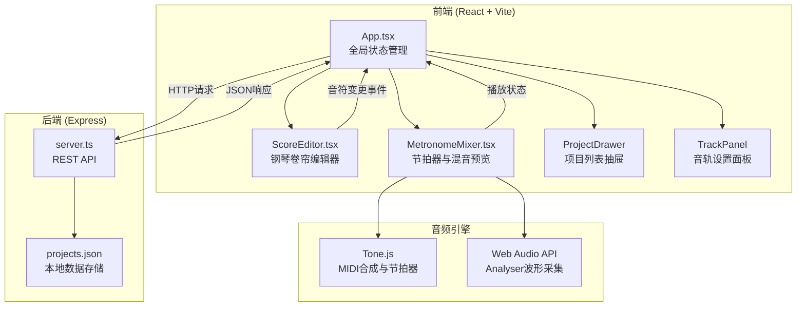
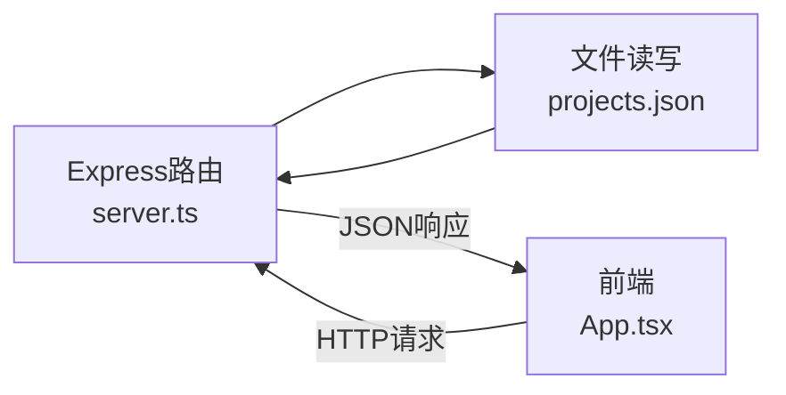
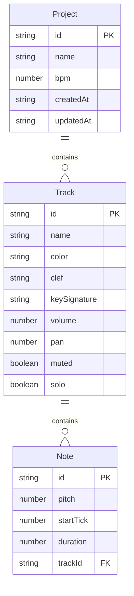

## 1. 架构设计



## 2. 技术说明

- 前端：React@18 + TypeScript + Vite + Tailwind CSS
- 初始化工具：vite-init（react-express-ts模板）
- 后端：Express@4 + TypeScript + cors + body-parser
- 音频：Tone.js（MIDI合成与节拍器） + Web Audio API（波形分析）
- 导出：midi-writer-js（MIDI文件生成）
- 数据存储：本地JSON文件（projects.json）
- 状态管理：Zustand

## 3. 路由定义

| 路由 | 用途 |
|------|------|
| / | 主编辑页面（单页应用，所有功能集成） |

## 4. API定义

### 4.1 TypeScript类型定义

```typescript
interface Note {
  id: string;
  pitch: number;       // MIDI音高 60-84 (C4-C6)
  startTick: number;   // 起始tick（1/16拍精度）
  duration: number;    // 持续tick数
  trackId: string;
}

interface Track {
  id: string;
  name: string;        // 乐器名称
  color: string;       // 颜色标识
  clef: string;        // 谱号
  keySignature: string;// 调号
  volume: number;      // 0-100，初始80
  pan: number;         // -1到1，初始0
  notes: Note[];
  muted: boolean;
  solo: boolean;
}

interface Project {
  id: string;
  name: string;
  bpm: number;
  tracks: Track[];
  createdAt: string;
  updatedAt: string;
}
```

### 4.2 请求/响应模式

| 方法 | 路径 | 请求体 | 响应 |
|------|------|--------|------|
| GET | /api/projects | - | Project[] |
| POST | /api/projects | { name: string } | Project |
| PUT | /api/projects/:id | Project | Project |
| DELETE | /api/projects/:id | - | { success: boolean } |

## 5. 服务器架构图



## 6. 数据模型

### 6.1 数据模型定义



### 6.2 数据存储

- 使用本地 `projects.json` 文件存储所有项目数据
- 文件路径：项目根目录下 `data/projects.json`
- 读写操作通过Node.js `fs` 模块同步/异步完成

## 7. 文件结构与调用关系

```
├── package.json                    # 依赖与启动脚本
├── vite.config.ts                  # Vite构建配置
├── tsconfig.json                   # TypeScript配置
├── index.html                      # 入口HTML
├── data/
│   └── projects.json               # 项目数据存储
├── src/
│   ├── backend/
│   │   └── server.ts               # Express服务端 → 读写projects.json
│   ├── frontend/
│   │   ├── App.tsx                 # React根组件 → 加载/保存项目，分发状态
│   │   ├── main.tsx                # React入口
│   │   ├── index.css               # 全局样式
│   │   ├── store.ts                # Zustand状态管理
│   │   ├── types.ts                # TypeScript类型定义
│   │   └── components/
│   │       ├── ScoreEditor.tsx     # 钢琴卷帘编辑器 → 接收音轨数据，输出音符变更
│   │       ├── MetronomeMixer.tsx  # 节拍器与混音 → 接收音符序列，输出播放状态
│   │       ├── ProjectDrawer.tsx   # 项目列表抽屉 → 加载/删除项目
│   │       ├── TrackPanel.tsx      # 音轨设置面板 → 调整音轨属性
│   │       ├── TransportBar.tsx    # 播放控制栏 → BPM/播放/暂停
│   │       └── WaveformDisplay.tsx # 波形显示组件 → Canvas绘制波形
│   └── shared/
│       └── types.ts                # 前后端共享类型
```

### 数据流向

1. **加载流程**：前端App.tsx → GET /api/projects → server.ts读取projects.json → 返回JSON → 更新Zustand store → 分发到子组件
2. **保存流程**：子组件变更 → App.tsx收集状态 → PUT /api/projects/:id → server.ts写入projects.json → 返回确认
3. **编辑流程**：ScoreEditor接收音轨数据 → Canvas渲染 → 用户交互 → 输出音符变更事件 → App.tsx更新store
4. **播放流程**：MetronomeMixer获取音符序列 → Tone.js合成音频 → Web Audio AnalyserNode采集波形 → WaveformDisplay绘制Canvas
5. **导出流程**：App.tsx收集当前项目数据 → midi-writer-js生成MIDI / JSON.stringify生成JSON → 触发浏览器下载
