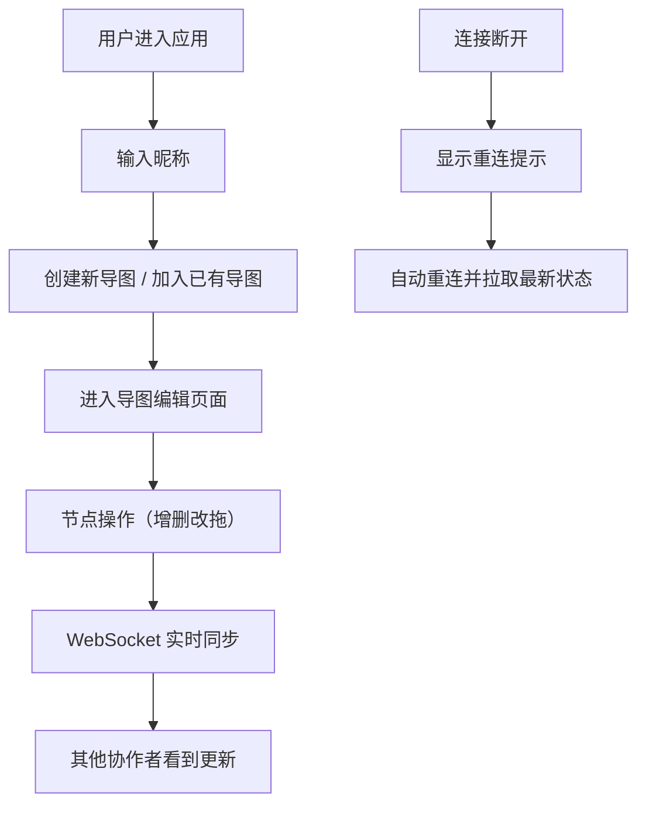

## 1. 产品概述

支持多用户实时协作编辑的思维导图应用，用户可在浏览器中创建、共享并协同编辑思维导图，所有修改实时同步给协作伙伴。

- 核心价值：提供高效的团队协作工具，让多人可以同时进行头脑风暴和思路梳理
- 目标用户：团队协作场景下的知识工作者、学生、项目管理者

## 2. 核心功能

### 2.1 用户角色
| 角色 | 注册方式 | 核心权限 |
|------|----------|----------|
| 协作用户 | 输入用户名加入 | 创建、编辑、删除思维导图节点，实时协作 |

### 2.2 功能模块
1. **导图编辑页面**：思维导图画布、节点操作、工具栏
2. **协作入口**：创建新导图、加入已有导图、用户昵称输入
3. **实时协作**：多用户光标同步、操作实时同步、连接状态提示

### 2.3 页面详情
| 页面名称 | 模块名称 | 功能描述 |
|---------|----------|----------|
| 导图编辑页 | 工具栏 | 添加节点、删除节点、撤销、重做、主题切换 |
| 导图编辑页 | 画布区域 | 节点渲染、拖拽移动、连线绘制、双击创建/编辑 |
| 导图编辑页 | 协作入口 | 创建新导图、输入文档ID加入、用户昵称设置 |
| 导图编辑页 | 连接状态 | 断开重连提示横幅 |
| 导图编辑页 | 多用户光标 | 显示其他协作者的彩色光标和名称标签 |

## 3. 核心流程

用户创建思维导图时获得唯一文档ID，其他用户通过输入该ID加入协作。所有节点的增删改查和位置移动都通过 WebSocket 实时同步给所有协作者。

## 4. 用户界面设计

### 4.1 设计风格
- **主色调**：支持三种主题色 - 森林绿(#2e7d32)、海洋蓝(#1976d2)、日落橙(#f57c00)
- **背景色**：工具栏深灰(#2c2c2c)，画布浅灰(#f8f8f8)
- **节点样式**：白色背景(#ffffff)，浅灰边框(#ddd)，圆角矩形，微弱内阴影
- **选中效果**：主题强调色边框，发光效果
- **字体**：Sans-serif 无衬线字体
- **动画**：统一 200ms ease-in-out 过渡

### 4.2 页面设计概述
| 页面名称 | 模块名称 | UI 元素 |
|---------|----------|---------|
| 导图编辑页 | 工具栏 | 深灰背景，白色图标按钮，悬浮变主题色 |
| 导图编辑页 | 画布区域 | 浅灰背景，节点圆角矩形，平滑曲线连线 |
| 导图编辑页 | 协作入口 | 模态框样式，输入框，主题选择 |
| 导图编辑页 | 多用户光标 | 彩色圆点 + 用户名称标签 |

### 4.3 响应式
- 桌面优先设计，1024px 以上屏幕正常使用
- 画布区域始终占满剩余高度
- 工具栏固定在左上方

### 4.4 动效设计
- 节点拖拽时半透明跟随鼠标
- 连线实时更新带弹性动画
- 删除节点时缩小变红消失动画
- 选中连线时虚线动画
- 连接状态横幅平滑显示/隐藏
