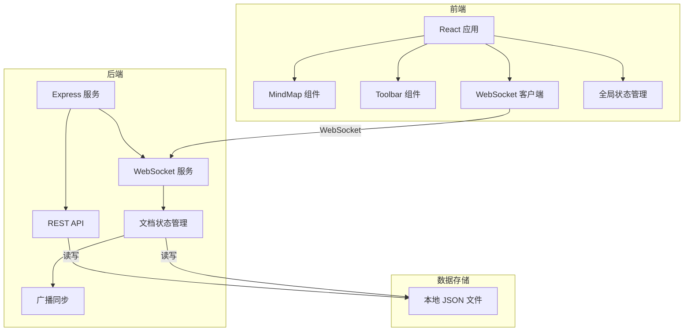
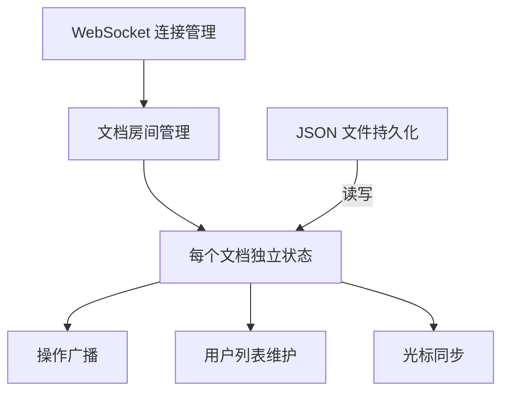

## 1. 架构设计



## 2. 技术描述

- **前端**：React 18 + TypeScript + Vite
- **构建工具**：Vite 4 + @vitejs/plugin-react
- **后端**：Express 4 + ws (WebSocket)
- **数据存储**：本地 JSON 文件
- **核心依赖**：uuid (生成唯一ID)、cors (跨域)

## 3. 文件结构

```
project-root/
├── package.json
├── vite.config.js
├── tsconfig.json
├── index.html
├── src/
│   ├── main.tsx          # React 应用入口
│   ├── App.tsx           # 根组件，全局状态和WebSocket
│   ├── components/
│   │   ├── MindMap.tsx   # 思维导图核心组件
│   │   └── Toolbar.tsx   # 工具栏组件
│   └── types/
│       └── index.ts      # TypeScript 类型定义
└── src/server/
    └── index.ts          # Express + WebSocket 服务端
```

## 4. 类型定义

```typescript
interface MindMapNode {
  id: string;
  text: string;
  x: number;
  y: number;
  parentId: string | null;
}

interface MindMapDocument {
  id: string;
  title: string;
  theme: string;
  nodes: MindMapNode[];
  createdAt: number;
  updatedAt: number;
}

interface UserCursor {
  userId: string;
  userName: string;
  color: string;
  x: number;
  y: number;
}

type OperationType = 'add' | 'delete' | 'move' | 'edit';

interface Operation {
  type: OperationType;
  nodeId: string;
  payload: any;
  timestamp: number;
}
```

## 5. API 定义

### REST API

| 方法 | 路径 | 描述 |
|------|------|------|
| POST | /api/documents | 创建新思维导图 |
| GET | /api/documents/:id | 获取思维导图数据 |

### WebSocket 消息

| 消息类型 | 方向 | 描述 |
|---------|------|------|
| join | 客户端→服务端 | 加入文档协作 |
| leave | 客户端→服务端 | 离开文档 |
| cursor | 客户端→服务端 | 同步光标位置 |
| operation | 客户端→服务端 | 发送操作（增删改移） |
| doc-state | 服务端→客户端 | 完整文档状态 |
| operation-broadcast | 服务端→客户端 | 广播操作给其他用户 |
| user-join | 服务端→客户端 | 通知有新用户加入 |
| user-leave | 服务端→客户端 | 通知有用户离开 |
| cursor-broadcast | 服务端→客户端 | 广播其他用户光标位置 |

## 6. 数据模型

### 思维导图文档 (documents/:id.json)
```json
{
  "id": "uuid",
  "title": "思维导图标题",
  "theme": "forest",
  "nodes": [
    {
      "id": "node-uuid",
      "text": "中心主题",
      "x": 400,
      "y": 300,
      "parentId": null
    }
  ],
  "createdAt": 1234567890,
  "updatedAt": 1234567890
}
```

## 7. 服务端架构



## 8. 性能优化

- 使用 Canvas 或 SVG 绘制节点和连线
- 拖拽时使用 requestAnimationFrame 优化帧率
- 操作合并减少重绘次数
- WebSocket 消息节流（光标位置 60fps 限制）
- 历史记录限制 50 步
