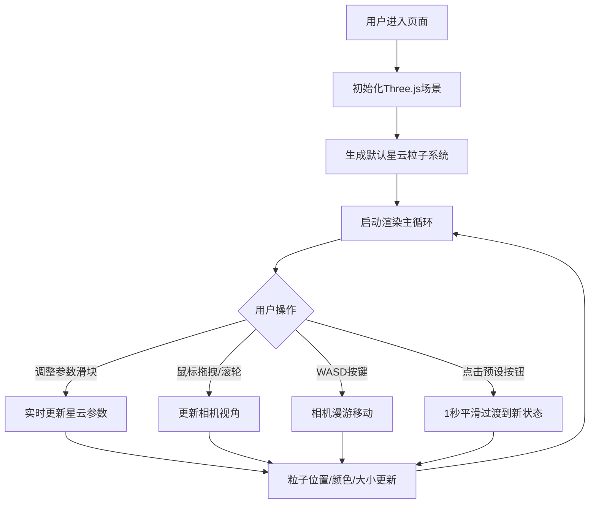

## 1. 产品概述

交互式三维星云粒子系统生成器，用户可通过参数面板实时调整粒子数量、颜色分布、旋转速度和扩散范围，在浏览器中生成并漫游风格各异的星云效果。

- 主要用途：为设计师、艺术家和爱好者提供可视化的3D星云生成与探索工具
- 目标用户：创意设计师、3D艺术爱好者、前端开发者
- 市场价值：提供直观、高性能的浏览器端3D粒子系统体验，无需复杂软件即可创建精美的星云视觉效果

## 2. 核心功能

### 2.1 功能模块

1. **3D渲染区域**：全屏Three.js渲染画布，展示星云粒子系统
2. **参数控制面板**：左侧浮动面板，包含粒子参数、颜色参数、控制参数三组控件
3. **相机控制系统**：鼠标拖拽旋转、滚轮缩放、WASD键盘漫游
4. **预设风格系统**：4种预设星云风格一键切换，带1秒平滑过渡动画

### 2.2 页面详情

| 页面名称 | 模块名称 | 功能描述 |
|-----------|-------------|---------------------|
| 主页面 | 3D渲染区域 | 全屏Three.js渲染，支持鼠标拖拽视角旋转、滚轮缩放、WASD漫游 |
| 主页面 | 参数面板 | 半透明毛玻璃风格，可折叠/展开，包含所有参数滑块和按钮 |
| 主页面 | 粒子参数组 | 粒子数量(1000-50000)、粒子大小(0.1-5.0)、扩散半径(5-50)、旋转速度(0-5) |
| 主页面 | 颜色参数组 | 颜色模式(单色/双色渐变/三色渐变)、分布形状(球形/椭球形)、背景色(深空黑/深蓝/深紫) |
| 主页面 | 控制参数组 | 漫游速度(0.5-5.0)、重置视角按钮 |
| 主页面 | 预设风格按钮 | 星云玫瑰、螺旋星系、极光星云、星空碎片，一键切换带过渡动画 |

## 3. 核心流程

## 4. 用户界面设计

### 4.1 设计风格

- **主色调**：深色主题，背景色可选深空黑(#0a0a14)、深蓝(#0a1628)、深紫(#140a20)
- **强调色**：淡蓝色#4FC3F7用于滑块高亮、按钮发光效果
- **面板背景**：rgba(20,20,30,0.85)，配合backdrop-filter: blur(8px)毛玻璃效果
- **按钮风格**：圆角胶囊风格，悬停上浮+发光效果，200ms过渡动画
- **字体**：标签文字使用等宽字体(Consolas, 'Courier New', monospace)
- **滑块样式**：自定义圆角滑块，渐变轨道

### 4.2 页面设计

| 页面名称 | 模块名称 | UI元素 |
|-----------|-------------|-------------|
| 主页面 | 3D渲染区域 | 全屏Canvas，无多余装饰，纯净展示星云效果 |
| 主页面 | 参数面板 | 固定宽度320px，左侧悬浮，顶部标题"星云发生器"，可折叠按钮，分组参数控件 |
| 主页面 | 预设按钮组 | 4个胶囊按钮横向排列，悬停发光，点击反馈 |
| 主页面 | 滑块控件 | 圆角轨道渐变，圆形滑块手柄，实时数值显示 |

### 4.3 响应式设计

- Desktop优先设计，参数面板固定320px宽度
- 窗口缩放时3D渲染区域自适应
- 触摸设备支持双指缩放、单指拖拽

### 4.4 3D场景指导

- **环境**：纯深色背景，营造宇宙深空氛围
- **光照**：粒子自发光(PointsMaterial的size和opacity控制)，无额外光源
- **相机设置**：PerspectiveCamera，初始距离30，FOV 75度
- **相机运动**：OrbitControls风格阻尼旋转(0.1系数)，WASD第一人称漫游
- **粒子系统**：BufferGeometry + PointsMaterial，支持透明度衰减(中心亮边缘淡)
- **性能**：30000粒子稳定30FPS以上，避免每帧重建对象
