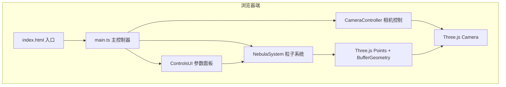

## 1. 架构设计



## 2. 技术说明

- **前端框架**：原生TypeScript + Three.js (无React/Vue，纯3D渲染应用)
- **构建工具**：Vite
- **语言**：TypeScript (严格模式)
- **3D引擎**：Three.js r160+
- **后端**：无，纯前端应用

## 3. 项目文件结构

| 文件/目录 | 说明 |
|-----------|------|
| package.json | 依赖配置：typescript, three, vite, @types/three |
| vite.config.js | Vite配置，base: './' |
| tsconfig.json | TypeScript严格模式配置 |
| index.html | 入口HTML，包含3D容器和参数面板容器 |
| src/main.ts | 场景初始化、相机、渲染器、主循环、事件绑定 |
| src/nebulaSystem.ts | 粒子系统核心类，生成/更新/销毁粒子 |
| src/controls.ts | 参数面板UI创建与事件监听 |
| src/utils.ts | 工具方法：颜色转换、随机数、缓动函数 |

## 4. 核心模块设计

### 4.1 NebulaSystem 类

```typescript
interface NebulaParams {
  particleCount: number;      // 粒子数量 1000-50000
  particleSize: number;       // 粒子大小 0.1-5.0
  spreadRadius: number;       // 扩散半径 5-50
  rotationSpeed: number;      // 旋转速度 0-5
  colorMode: 'single' | 'dual' | 'triple';  // 颜色模式
  distribution: 'sphere' | 'ellipsoid';     // 分布形状
  primaryColor: THREE.Color;  // 主色
  secondaryColor: THREE.Color; // 次色
  tertiaryColor: THREE.Color;  // 第三色
  backgroundColor: string;    // 背景色
}

class NebulaSystem {
  constructor(scene: THREE.Scene, params: NebulaParams);
  update(deltaTime: number): void;       // 每帧更新：旋转、过渡动画
  setParams(params: Partial<NebulaParams>, animate?: boolean): void;  // 设置参数，可选1秒过渡
  destroy(): void;                        // 释放资源
}
```

### 4.2 ControlsUI 类

```typescript
interface ControlCallbacks {
  onParamsChange: (params: Partial<NebulaParams>) => void;
  onPreset: (presetName: string) => void;
  onResetCamera: () => void;
  onMovementSpeedChange: (speed: number) => void;
}

class ControlsUI {
  constructor(container: HTMLElement, callbacks: ControlCallbacks);
  setParams(params: NebulaParams): void;  // 同步面板显示
  togglePanel(): void;                    // 折叠/展开
}
```

### 4.3 相机控制

- 鼠标拖拽：绕场景原点球面坐标旋转，阻尼系数0.1
- 滚轮：缩放相机距离
- WASD：相机局部坐标系平移
- 自定义实现，无需OrbitControls依赖

### 4.4 预设定义

```typescript
const PRESETS = {
  'nebulaRose': {
    particleCount: 20000, particleSize: 0.8, spreadRadius: 25,
    rotationSpeed: 0.5, colorMode: 'dual', distribution: 'ellipsoid',
    primaryColor: '#ff6b9d', secondaryColor: '#c44dff',
    tertiaryColor: '#ffcc00', backgroundColor: '#140a20'
  },
  'spiralGalaxy': {
    particleCount: 40000, particleSize: 0.5, spreadRadius: 40,
    rotationSpeed: 1.2, colorMode: 'triple', distribution: 'ellipsoid',
    primaryColor: '#ffffff', secondaryColor: '#4fc3f7',
    tertiaryColor: '#ffb74d', backgroundColor: '#0a0a14'
  },
  'auroraNebula': {
    particleCount: 25000, particleSize: 1.0, spreadRadius: 30,
    rotationSpeed: 0.3, colorMode: 'dual', distribution: 'sphere',
    primaryColor: '#00ff88', secondaryColor: '#00bcd4',
    tertiaryColor: '#7c4dff', backgroundColor: '#0a1628'
  },
  'starDust': {
    particleCount: 50000, particleSize: 0.3, spreadRadius: 45,
    rotationSpeed: 0.8, colorMode: 'single', distribution: 'sphere',
    primaryColor: '#ffffff', secondaryColor: '#aaaaaa',
    tertiaryColor: '#666666', backgroundColor: '#0a0a14'
  }
};
```

## 5. 性能优化策略

- 使用BufferGeometry存储所有粒子数据，避免每帧创建对象
- 粒子位置/颜色通过TypedArray直接操作GPU缓冲区
- 过渡动画使用requestAnimationFrame驱动，1秒内完成线性插值
- PointsMaterial开启transparent + alphaTest优化
- 粒子纹理使用Canvas动态生成径向渐变光点
- 相机控制使用阻尼系数实现平滑运动，避免频繁矩阵运算
