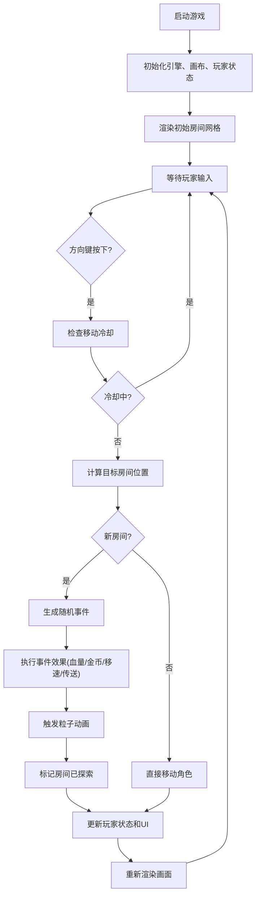

## 1. 产品概述

离散房间迷宫探索模拟器 - 一款roguelike风格的交互式地图探索游戏。玩家在随机生成的房间网格中移动探索，每个房间包含不同的地形事件（陷阱、宝箱、传送门等），触发后产生即时视觉反馈和属性变化。

- 目标用户：roguelike游戏爱好者、游戏机制探索者
- 产品价值：展示基于网格的房间探索系统、随机事件触发机制、粒子动画效果的实现

## 2. 核心功能

### 2.1 功能模块
1. **主游戏界面**：游戏画布渲染、房间网格、角色绘制、粒子效果
2. **角色控制系统**：WASD/方向键移动、移动冷却、朝向显示
3. **房间生成系统**：随机事件生成、已访问/未访问状态管理
4. **事件触发系统**：陷阱伤害、金币获取、减速效果、随机传送
5. **粒子效果系统**：金币喷泉、火焰闪烁、传送漩涡、沼泽波纹
6. **状态面板UI**：角色头像、血量条、金币数、状态显示
7. **迷你地图**：实时显示探索进度和当前位置

### 2.2 功能详情
| 功能模块 | 子模块 | 功能描述 |
|---------|-------|---------|
| 房间导航 | 键盘控制 | WASD/方向键移动，0.3秒冷却防连点 |
| 房间导航 | 视觉反馈 | 当前房间浅黄边框，已访问半暗色，未访问深灰色 |
| 随机事件 | 尖刺陷阱(20%) | 血量-10，房间红色闪烁0.5秒 |
| 随机事件 | 金币宝箱(15%) | 获得5-15金币，金币粒子喷涌 |
| 随机事件 | 减速沼泽(10%) | 移速-50%持续3秒，绿色波纹动画 |
| 随机事件 | 传送门(5%) | 传送到任意已访问房间，漩涡粒子效果 |
| 状态面板 | 角色信息 | 圆形像素头像、血量条、金币、当前状态 |
| 状态面板 | 血量警告 | 血量<30%时红色脉动(1秒周期) |
| 迷你地图 | 实时显示 | 80x80像素，2x2像素方块，白色=当前，灰色=已探索，黑色=未探索 |

## 3. 核心流程

玩家启动游戏 → 初始化游戏状态和房间网格 → 玩家使用方向键移动 → 进入新房间触发随机事件 → 应用效果并播放粒子动画 → 更新状态面板和迷你地图 → 继续探索

## 4. 用户界面设计

### 4.1 设计风格
- **配色方案**：暗黑哥特风格
  - 背景色：#1a1a2e（深灰蓝）
  - 网格线：#2d2d5e（暗紫色）
  - 房间边框：#000000（黑色2px）
  - 当前房间：浅黄色边框
  - 角色：白色像素风小剑士
  - UI面板：rgba(30,30,30,0.85)（深色半透明）
- **按钮/元素风格**：圆角4px，功能性简洁设计
- **字体**：sans-serif 无衬线字体
- **布局**：主画布居左，状态面板右侧固定(220px宽)，迷你地图左上角

### 4.2 页面设计
| 页面 | 模块 | UI元素 |
|-----|-----|-------|
| 主游戏 | 游戏画布 | 房间网格(64x64px/间,2px黑色边框)、角色绘制、粒子动画 |
| 主游戏 | 状态面板 | 圆形像素头像、红色渐变血量条、金色金币数、状态文字 |
| 主游戏 | 迷你地图 | 80x80像素，2x2方块，无边框 |
| 主游戏 | 事件提示 | 浮层文字提示(获得金币、受到伤害等) |

### 4.3 响应式设计
- 桌面优先设计，适配1366x768及以上分辨率
- 画布等比缩放适配窗口大小
- UI面板位置固定，不溢出屏幕
- 粒子效果随画布缩放

## 5. 性能要求
- 游戏主循环稳定60FPS
- 同时活跃粒子数≤200个
- 房间生成耗时≤5ms
- 内存占用稳定无泄漏
