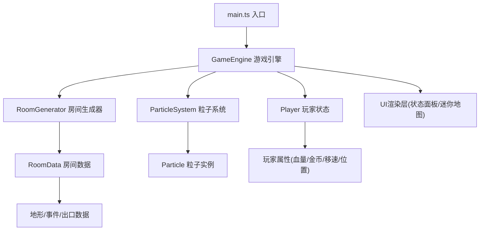

## 1. 架构设计

纯前端单页游戏应用，采用TypeScript + 原生Canvas + Vite构建，无后端依赖。



## 2. 技术描述

- **构建工具**：Vite@5
- **语言**：TypeScript@5（严格模式，target ES2020）
- **渲染引擎**：HTML5 Canvas 2D API（原生）
- **状态管理**：GameEngine单例内部状态
- **无框架**：不使用React/Vue等前端框架，纯Canvas + DOM UI

## 3. 文件结构与职责

| 文件路径 | 职责 | 调用关系 |
|---------|-----|---------|
| package.json | 项目配置、依赖、启动脚本 | - |
| vite.config.js | Vite构建配置(base:'./', outDir:'dist') | - |
| tsconfig.json | TypeScript编译配置(严格模式,ES2020) | - |
| index.html | 入口HTML，画布和UI容器 | - |
| src/main.ts | 游戏入口，初始化、绑定事件、启动主循环 | 读取gameConfig → 创建GameEngine → 启动update/render循环 |
| src/gameEngine.ts | 核心引擎，状态管理、房间生成、移动、事件 | 接收键盘输入 → 更新Player → 调用RoomGenerator → 执行RoomEffect → 触发ParticleSystem |
| src/roomGenerator.ts | 房间生成器，随机地形和事件 | 接收seed/difficulty → 输出RoomData → 传递给gameEngine |
| src/particleSystem.ts | 粒子系统，动画管理和渲染 | 接收事件类型和位置 → 创建粒子数组 → update/render |
| src/types.ts | 全局类型定义 | 被所有模块引用 |
| src/player.ts | 玩家类，属性和状态管理 | 被GameEngine调用 |
| src/uiRenderer.ts | UI渲染(状态面板、迷你地图) | 被GameEngine调用，读取Player状态 |
| src/avatarGenerator.ts | 像素风格随机头像生成器 | 被uiRenderer调用 |
| src/constants.ts | 游戏常量配置 | 被所有模块引用 |

## 4. 数据模型定义

```typescript
// 玩家位置
interface Position {
  x: number;
  y: number;
}

// 方向枚举
type Direction = 'up' | 'down' | 'left' | 'right';

// 房间事件类型
type RoomEventType = 'empty' | 'spike' | 'treasure' | 'swamp' | 'portal';

// 房间数据
interface RoomData {
  position: Position;
  eventType: RoomEventType;
  explored: boolean;
  eventTriggered: boolean;
}

// 玩家状态
interface PlayerState {
  position: Position;
  hp: number;
  maxHp: number;
  coins: number;
  speed: number;
  baseSpeed: number;
  direction: Direction;
  slowUntil: number;
}

// 粒子类型
type ParticleType = 'coin' | 'fire' | 'portal' | 'swamp';

// 粒子数据
interface Particle {
  x: number;
  y: number;
  vx: number;
  vy: number;
  life: number;
  maxLife: number;
  color: string;
  size: number;
  type: ParticleType;
}

// 游戏配置
interface GameConfig {
  gridWidth: number;
  gridHeight: number;
  roomSize: number;
  roomBorder: number;
  moveCooldown: number;
  maxHp: number;
  eventProbabilities: Record<RoomEventType, number>;
}
```

## 5. 核心数据流

```
键盘事件 → main.ts → GameEngine.handleInput()
    ↓
GameEngine.update()
    ├─→ Player.updatePosition()
    ├─→ RoomGenerator.getOrCreateRoom()
    │   └─→ 新房间 → 随机事件概率判定
    ├─→ GameEngine.triggerRoomEvent()
    │   ├─→ Player 状态更新(hp/coins/speed)
    │   └─→ ParticleSystem.emit()
    └─→ 迷你地图状态更新
    ↓
GameEngine.render()
    ├─→ Canvas 绘制房间网格
    ├─→ ParticleSystem.render()
    ├─→ Canvas 绘制角色
    └─→ uiRenderer 更新DOM面板
```
