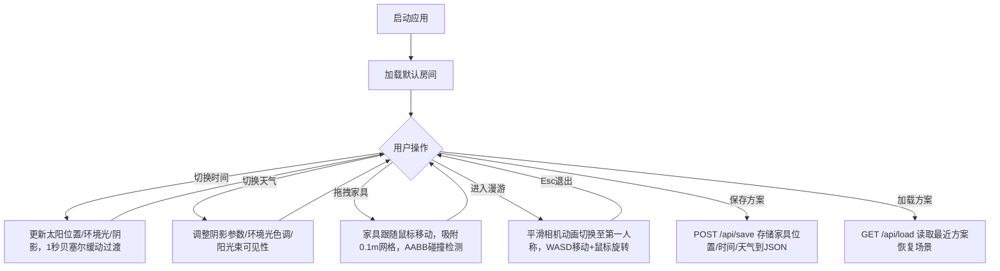

## 1. 产品概述

交互式三维建筑内部空间光影模拟与漫游工具，面向建筑师和室内设计师，允许在浏览器中快速搭建房间模型、添加家具、模拟不同时间和天气下的自然光影效果，并以第一人称视角自由漫游体验光影。

## 2. 核心功能

### 2.1 用户角色
| 角色 | 注册方式 | 核心权限 |
|------|----------|----------|
| 设计师 | 无需注册 | 创建房间、添加家具、切换光影、漫游、保存/加载方案 |

### 2.2 功能模块
1. **主编辑页面**：三维房间预览、家具添加、光影参数控制、漫游模式切换、方案保存/加载

### 2.3 页面详情
| 页面名称 | 模块名称 | 功能描述 |
|----------|----------|----------|
| 主编辑页面 | 三维场景区 | 展示6m×4m×3m房间透视预览，含墙壁、地板、天花板、窗户、家具，实时渲染光影效果 |
| 主编辑页面 | 控制面板 | 时间切换（早晨/中午/傍晚/夜晚）、天气切换（晴天/阴天）、方案保存/加载按钮 |
| 主编辑页面 | 家具面板 | 四种可拖拽家具（木桌、椅子、双人沙发、落地灯），拖拽放置到3D场景，碰撞检测 |
| 主编辑页面 | 漫游模式 | WASD移动+鼠标旋转，第一人称视角漫游，实时光影更新，Esc退出 |

## 3. 核心流程

## 4. 用户界面设计

### 4.1 设计风格
- 主色调：深灰背景(#2c2c2c)，蓝色强调色(#4A90D9)，白色卡片(#ffffff)
- 按钮风格：圆角8px，蓝色填充，悬停深蓝(#357ABD)，点击缩放scale(0.95) 0.1s
- 字体：14px无衬线字体，分组标题灰色(#666)
- 布局风格：左侧70% 3D场景 + 右侧30%固定参数面板，卡片分组
- 图标风格：时间按钮带对应色调小图标（日出/太阳/日落/月亮）

### 4.2 页面设计概述
| 页面名称 | 模块名称 | UI元素 |
|----------|----------|--------|
| 主编辑页面 | 三维场景区 | Three.js Canvas渲染，透视相机，深灰背景 |
| 主编辑页面 | 控制面板 | 白色卡片分组，时间4按钮（图标+文字），天气切换按钮，保存/加载按钮 |
| 主编辑页面 | 家具面板 | 白色卡片，4个可拖拽家具div，已放置灰色标注 |
| 主编辑页面 | 漫游模式 | 顶部十字准星，左上角帧率警告（低于20FPS时显示） |

### 4.3 响应式
- 桌面优先设计：左侧3D 70% + 右侧面板30%
- 屏幕宽度<900px：右侧面板收起为底部抽屉，点击底部按钮展开（300ms滑入动画），3D场景全屏

### 4.4 3D场景指南
- 环境：室内房间场景，窗户透光
- 光照：方向光模拟太阳光（位置随时间变化），环境光（颜色随时间/天气变化），窗户光束效果（SpotLight/体积光近似）
- 相机：编辑模式-透视预览相机（斜上方45度），漫游模式-第一人称相机（高度1.6m）
- 构图：房间居中，窗户朝南，家具在地面层
- 交互：拖拽放置家具，WASD漫游，碰撞检测
- 后期处理：阴影边缘模糊度随天气动态调整
- 性能预算：编辑模式≥30FPS，漫游模式≥24FPS，低于20FPS自动降级阴影

## 5. 非功能性需求
- 性能：编辑模式≥30FPS，漫游模式≥24FPS
- 自动降级：帧率<20FPS时关闭阴影投射并降低环境光贴图分辨率
- 数据存储：本地JSON文件
- 浏览器兼容：现代浏览器（Chrome/Firefox/Edge最新版）
