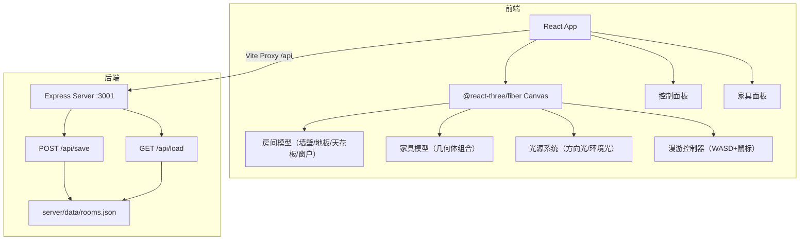
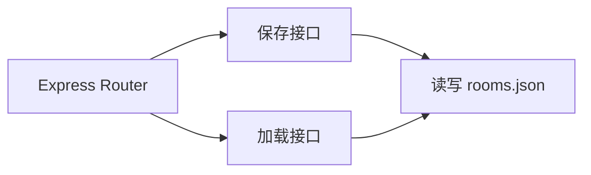
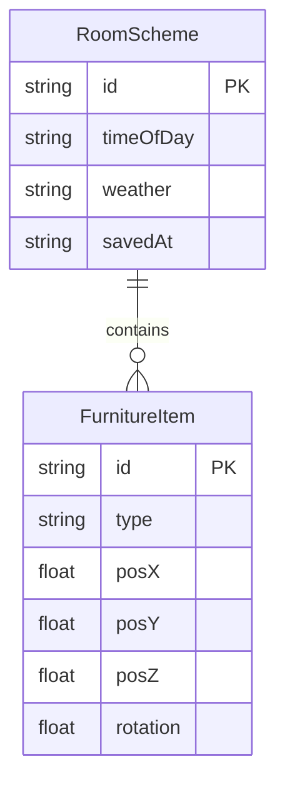

## 1. 架构设计



## 2. 技术说明
- 前端：React@18 + TypeScript + Three.js + @react-three/fiber + @react-three/drei + Vite
- 状态管理：Zustand
- 样式：Tailwind CSS
- 后端：Express@4 + TypeScript + cors
- 数据库：本地JSON文件（server/data/rooms.json）
- 初始化工具：vite-init（react-express-ts模板）

## 3. 路由定义
| 路由 | 用途 |
|------|------|
| / | 主编辑页面，包含3D场景、控制面板、家具面板 |

## 4. API定义

### 4.1 TypeScript类型定义

```typescript
interface FurnitureItem {
  id: string;
  type: 'table' | 'chair' | 'sofa' | 'lamp';
  position: { x: number; y: number; z: number };
  rotation: number;
}

type TimeOfDay = 'morning' | 'noon' | 'evening' | 'night';
type Weather = 'sunny' | 'overcast';

interface RoomScheme {
  id: string;
  furniture: FurnitureItem[];
  timeOfDay: TimeOfDay;
  weather: Weather;
  savedAt: string;
}
```

### 4.2 请求/响应Schema

**POST /api/save**
- Request Body: `{ furniture: FurnitureItem[], timeOfDay: TimeOfDay, weather: Weather }`
- Response: `{ success: boolean, id: string }`

**GET /api/load**
- Response: `RoomScheme | null`

## 5. 服务器架构



## 6. 数据模型

### 6.1 数据模型定义



### 6.2 数据定义语言
- 存储文件：`server/data/rooms.json`
- 格式：JSON数组，每个元素为一个RoomScheme对象
- 初始数据：空数组 `[]`
