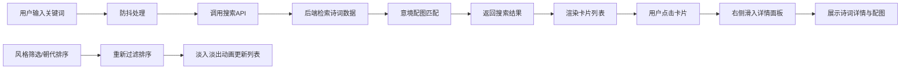

## 1. 产品概述

本产品是一个在线古诗词检索与意境配图生成应用，面向古诗词爱好者，提供诗句搜索、韵律分析、风格标签展示及意境配图自动生成功能。通过输入诗句关键词或完整诗句，用户可以快速找到匹配的诗词作品，了解其平仄韵律、风格分类，并获得与诗句意境相匹配的合成配图。

产品核心价值在于将传统诗词文化与现代数字技术结合，为诗词爱好者提供沉浸式的鉴赏体验，降低古诗词学习门槛，提升文化传播效率。

## 2. 核心功能

### 2.1 用户角色
| 角色 | 注册方式 | 核心权限 |
|------|----------|----------|
| 普通用户 | 无需注册 | 诗词搜索、详情查看、韵律分析、意境配图生成、风格筛选 |

### 2.2 功能模块
1. **诗词搜索模块**：关键词搜索、加载状态展示、搜索结果卡片列表
2. **诗词详情模块**：完整诗句展示、平仄韵律标注、押韵位置高亮、风格标签展示
3. **意境配图模块**：诗句意象提取、图片库匹配、合成配图生成（背景渐变、水墨元素、诗句水印）
4. **筛选排序模块**：风格标签筛选、朝代排序（升序/降序）、过渡动画效果

### 2.3 页面详情
| 页面名称 | 模块名称 | 功能描述 |
|----------|----------|----------|
| 首页 | 侧边栏 | 风格筛选标签（全部、豪放、婉约、山水、边塞、咏物、田园）、朝代排序控件 |
| 首页 | 搜索栏 | 关键词输入框、搜索按钮、防抖处理、加载动画（旋转墨滴SVG） |
| 首页 | 结果列表 | 诗词卡片网格布局、卡片悬停动画、淡入淡出过渡效果 |
| 详情面板 | 诗词详情 | 仿宋字体标题、完整诗句（等宽字体）、逐句平仄标注、押韵位置菱形标记 |
| 详情面板 | 配图展示 | 500x300px意境大图、半透明诗句水印 |

## 3. 核心流程

用户在搜索栏输入关键词（如"明月"、"思乡"），系统通过防抖处理后触发搜索请求，后端API检索诗词数据并进行意境配图匹配，返回结果列表。用户点击诗词卡片，右侧滑入详情面板，展示完整诗句、平仄韵律分析、风格标签及合成配图。用户可通过左侧边栏进行风格筛选和朝代排序，结果列表以淡入淡出动画过渡。

## 4. 用户界面设计

### 4.1 设计风格
- **主色调**：浅米色（#f5f0e8）背景，深灰色（#2c2c2c）文字
- **强调色**：深棕色（#8b6f47）选中状态，浅棕色（#d4c9b8）未选中状态
- **韵律标注**：平声红色圆点（#e74c3c），仄声蓝色圆点（#3498db）
- **按钮风格**：圆角矩形（8px圆角），点击时95%→100%缩放动画
- **字体**：标题使用仿宋，诗句使用 Source Han Serif SC 等宽字体，水印使用宋体斜体
- **布局风格**：左侧15%固定侧边栏，右侧自适应卡片列表，详情面板右侧滑入
- **质感**：米白色纸质纹理背景，水墨风格元素，书卷质感

### 4.2 页面设计概述
| 页面名称 | 模块名称 | UI元素 |
|----------|----------|--------|
| 首页 | 侧边栏 | 竖向细线装饰、圆角标签、排序下拉框、浅灰色背景 |
| 首页 | 搜索栏 | 输入框、搜索按钮（最小44x44px）、旋转墨滴加载动画 |
| 首页 | 结果列表 | 卡片网格（间距16px）、白色背景浅灰色阴影、悬停时上移4px加深阴影 |
| 详情面板 | 内容区 | 米白色纸质纹理背景、仿宋标题、等宽诗句、平仄圆点、菱形押韵标记、500x300px配图 |
| 详情面板 | 配图 | 背景色渐变、水墨风格元素、右下角半透明诗句水印（#333） |

### 4.3 响应式设计
- **桌面优先**：1920px基准设计，侧边栏固定15%宽度
- **移动端适配**：侧边栏转为顶部横向滚动标签栏，详情面板改为底部滑入或全屏展示
- **触摸优化**：按钮最低高度40px，点击区域至少44x44px，确保移动端可用
- **滚动条**：webkit-scrollbar-width: 6px，细条样式

### 4.4 动画与交互
- **搜索加载**：旋转墨滴SVG动画，位于输入框下方
- **卡片悬停**：300ms ease-out 上移4px，阴影加深
- **详情面板**：300ms cubic-bezier(0.22, 1, 0.36, 1) 右侧滑入，主内容向左挤压
- **筛选排序**：200ms淡入淡出动画过渡
- **标签点击**：95%→100%轻微缩放动画
