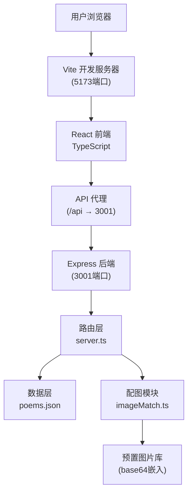
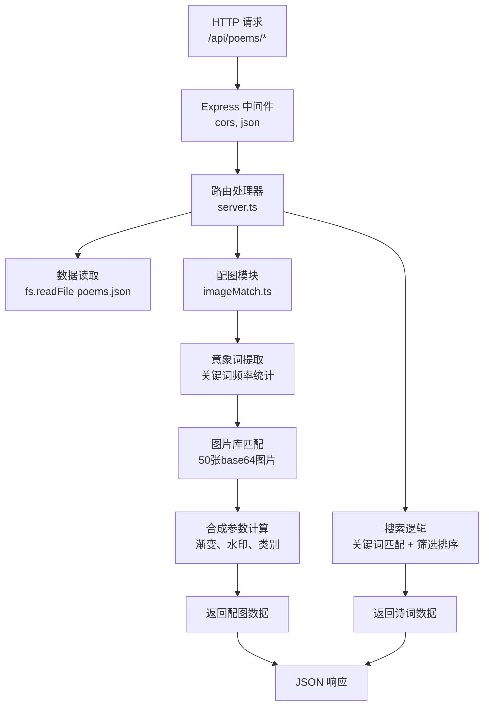
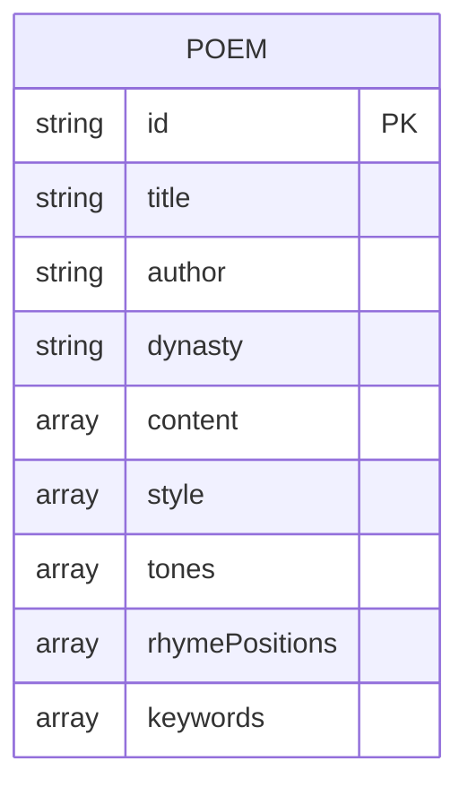

## 1. 架构设计



## 2. 技术描述

- **前端**：React@18 + TypeScript@5 + Vite@5
- **前端构建**：Vite + @vitejs/plugin-react
- **后端**：Express@4 + TypeScript
- **跨域处理**：cors 中间件 + Vite 代理
- **数据存储**：本地 JSON 文件（src/backend/data/poems.json）
- **样式方案**：CSS Modules / 内联样式 + CSS 变量
- **HTTP客户端**：原生 fetch API

## 3. 文件结构与调用关系

```
project-root/
├── package.json                          # 项目依赖与脚本
├── vite.config.js                        # Vite配置，代理/api到3001端口
├── tsconfig.json                         # TypeScript严格模式配置
├── index.html                            # 入口HTML
└── src/
    ├── backend/
    │   ├── server.ts                     # Express服务，REST API端点
    │   ├── imageMatch.ts                 # 配图生成模块
    │   └── data/
    │       └── poems.json                # 诗词数据（含韵律、风格标签）
    └── frontend/
        ├── App.tsx                       # React主组件
        ├── main.tsx                      # 入口文件
        └── components/
            ├── SearchBar.tsx             # 搜索栏组件
            ├── PoemCard.tsx              # 诗词卡片组件
            ├── Sidebar.tsx               # 侧边栏组件
            ├── DetailPanel.tsx           # 详情面板组件
            └── ToneMarker.tsx            # 平仄标注组件
```

**调用关系与数据流向**：
1. `App.tsx` → 状态管理 → 调用 `SearchBar.tsx`、`Sidebar.tsx`、`PoemCard.tsx`、`DetailPanel.tsx`
2. `SearchBar.tsx` → 用户输入 → 防抖 → 触发父组件搜索事件
3. `App.tsx` → fetch `/api/poems/search` → `server.ts` 路由
4. `server.ts` → 读取 `poems.json` → 调用 `imageMatch.ts` → 返回 JSON
5. `imageMatch.ts` → 关键词提取 → 标签匹配 → 返回图片数据
6. `PoemCard.tsx` → 点击 → 触发详情展开 → fetch `/api/poems/detail/:id`

## 4. API 定义

### 4.1 TypeScript 类型定义

```typescript
// 诗词数据类型
interface Poem {
  id: string;
  title: string;
  author: string;
  dynasty: string;
  content: string[];        // 每句为数组元素
  translation?: string;
  appreciation?: string;
  style: string[];          // 风格标签：豪放、婉约、山水等
  tones: string[][];        // 逐字平仄：'平' | '仄'
  rhymePositions: number[]; // 押韵句的索引
  keywords: string[];       // 意象关键词
}

// 配图数据类型
interface ImageMatchResult {
  imageUrl: string;         // base64 图片数据
  category: string;         // 图片类别：山水、花鸟、月色等
  gradient: string;         // 背景渐变 CSS
  watermarkText: string;    // 水印文字
}

// 搜索请求参数
interface SearchRequest {
  keyword: string;
  style?: string;
  sortOrder?: 'asc' | 'desc';
}

// 搜索响应
interface SearchResponse {
  poems: (Poem & { thumbnail: ImageMatchResult })[];
  total: number;
}

// 详情响应
interface DetailResponse {
  poem: Poem;
  fullImage: ImageMatchResult;
}
```

### 4.2 REST API 端点

| 方法 | 路径 | 描述 | 请求参数 | 响应 |
|------|------|------|----------|------|
| GET | `/api/poems/search` | 诗词搜索 | `keyword`: string, `style?`: string, `sortOrder?`: 'asc' \| 'desc' | `SearchResponse` |
| GET | `/api/poems/detail/:id` | 获取诗词详情 | `id`: string (路径参数) | `DetailResponse` |

## 5. 后端架构



## 6. 数据模型

### 6.1 诗词数据结构（poems.json）



### 6.2 预置图片库结构（imageMatch.ts 内）

```typescript
interface PresetImage {
  id: string;
  category: '山水' | '花鸟' | '月色' | '江雪' | '边塞' | '田园';
  base64: string;
  gradient: string;      // CSS渐变，如 'linear-gradient(135deg, #e8d5b7 0%, #c9a86c 100%)'
  tags: string[];        // 匹配标签，如 ['山', '水', '自然']
}
```

### 6.3 诗词数据示例（poems.json）

```json
[
  {
    "id": "1",
    "title": "静夜思",
    "author": "李白",
    "dynasty": "唐",
    "content": ["床前明月光", "疑是地上霜", "举头望明月", "低头思故乡"],
    "style": ["婉约", "思乡"],
    "tones": [
      ["平", "平", "平", "仄", "平"],
      ["平", "仄", "仄", "仄", "平"],
      ["仄", "平", "仄", "平", "仄"],
      ["平", "平", "平", "仄", "平"]
    ],
    "rhymePositions": [0, 1, 3],
    "keywords": ["明月", "霜", "故乡", "思乡"]
  }
]
```

## 7. 性能优化策略

1. **搜索性能**：
   - 诗词数据启动时加载到内存，避免重复IO
   - 使用预构建的倒排索引加速关键词匹配
   - 800ms端到端响应时间目标

2. **动画性能**：
   - 使用 CSS transform 和 opacity 属性实现动画，触发 GPU 加速
   - 详情面板滑入使用 `will-change: transform` 优化
   - 50fps 动画帧率目标

3. **配图生成性能**：
   - 图片库预加载到内存
   - 使用预计算的 base64 数据，避免实时编解码
   - 200ms 配图处理时间目标

4. **前端优化**：
   - React.memo 优化组件重渲染
   - 搜索输入防抖（300ms）
   - 列表虚拟滚动（如数据量大时）
