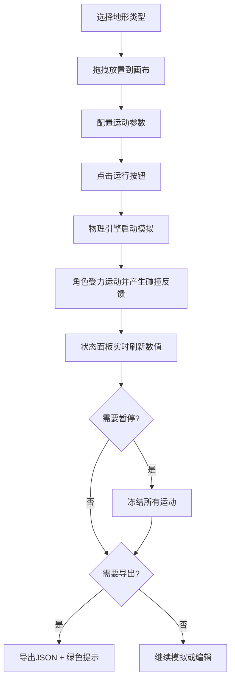

## 1. 产品概述
2D角色物理碰撞与动态地形交互测试工具，帮助游戏设计师快速验证角色在移动平台、传送带、可破坏墙壁等复杂地形上的物理表现。
- 解决现有游戏编辑器对动态地形与角色物理交互缺乏实时可视化反馈的痛点
- 目标用户为游戏设计师、关卡策划、物理引擎调试人员

## 2. 核心功能

### 2.1 用户角色
本应用无多角色区分，所有功能面向单一用户开放。

### 2.2 功能模块
1. **2D场景编辑器**：地形块拖拽放置、网格吸附、类型选择与参数配置
2. **物理模拟引擎**：实时碰撞检测、刚体运动积分、地形-角色交互（反弹/携带/推动）
3. **状态监控面板**：实时物理数值显示、运行/暂停控制
4. **布局管理**：场景JSON序列化导出、文件导入恢复

### 2.3 页面详情
| 页面名称 | 模块名称 | 功能描述 |
|---------|---------|---------|
| 主界面 | 2D场景画布 | 左侧70%区域，Canvas渲染场景，网格显示，地形块放置与编辑，角色运动轨迹与拖尾效果 |
| 主界面 | 控制面板 | 右侧30%区域，深蓝灰色背景，包含运行/暂停按钮、地形类型选择器、物理状态数值列表、导出导入按钮 |
| 主界面 | 提示层 | 导出成功绿色淡入提示、FPS低于55时左上角红色计数器 |

## 3. 核心流程
用户从右侧选择地形类型 → 在画布区域拖拽放置（半透明跟随、网格吸附）→ 配置地形运动参数 → 点击运行按钮 → 角色从固定起点进入场景 → 物理引擎实时计算碰撞与运动 → 右侧面板显示实时状态数值 → 用户可随时暂停/继续 → 满意后导出场景布局JSON

## 4. 用户界面设计

### 4.1 设计风格
- **主色调**：暗色主题，背景色#1a1a2e，右侧面板#16213e
- **地形块颜色**：移动平台#e94560（红粉）、传送带#0f3460（深蓝）、砖墙#533483（紫）
- **强调色**：青色（#00ffff）用于数值变化闪烁效果、绿色（#00ff88）用于成功提示、红色（#ff4444）用于FPS警告
- **按钮样式**：圆角矩形，悬停背景变亮 + 缩放1.05，0.2s过渡动画
- **字体**：状态数值使用等宽字体（monospace），整体使用无衬线现代字体
- **布局风格**：左主右辅分栏，画布占70%，面板占30%

### 4.2 页面设计概览
| 页面名称 | 模块名称 | UI元素 |
|---------|---------|--------|
| 主界面 | 场景画布 | 40px间距极淡灰网格线、彩色地形块带微弱光晕、白色圆形角色带黑色描边与半透明运动拖尾、拖拽预览半透明元素 |
| 主界面 | 控制面板 | 圆角控制按钮组、类型选择下拉/标签、等宽字体数值列表（位置/速度/加速度/地面状态）、导出导入文件按钮 |
| 主界面 | 浮层提示 | 导出成功绿色提示（淡入，2秒后淡出）、FPS红色计数器（<55FPS时显示） |

### 4.3 响应式
桌面端优先，Canvas按容器自适应尺寸，面板最小宽度300px，窗口缩放时按比例分配空间。

### 4.4 动画细节
- 数值变化：0.1s白色→青色→白色闪烁
- 按钮悬停：背景亮度增加 + transform: scale(1.05)，transition: all 0.2s
- 提示消息：opacity 0→1 淡入，2秒后1→0淡出
- 角色拖尾：半透明圆形逐渐淡出
- 帧稳定：主循环维持60FPS，deltaTime驱动物理积分
