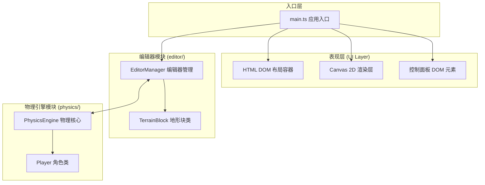

## 1. 架构设计


## 2. 技术说明
- **前端框架**：无框架，纯原生TypeScript + HTML5 Canvas
- **构建工具**：Vite (vite.config.js base='./', outDir='dist')
- **编程语言**：TypeScript 严格模式 (strict: true, esModuleInterop: true)
- **渲染技术**：Canvas 2D Context，每帧requestAnimationFrame重绘
- **状态管理**：EditorManager内聚管理场景状态，PhysicsEngine内聚物理状态
- **数据交换**：编辑器模块与物理引擎模块通过TerrainBlock数据接口通信

## 3. 文件结构
```
auto147/
├── package.json          # 依赖: typescript, vite; 脚本: dev, build
├── vite.config.js        # Vite构建配置
├── tsconfig.json         # TS严格模式配置
├── index.html            # 入口页面
└── src/
    ├── main.ts           # 应用入口，主循环
    ├── editor/
    │   ├── editorManager.ts    # 编辑器管理类
    │   └── terrainBlock.ts     # 地形块类
    └── physics/
        ├── physicsEngine.ts    # 物理引擎核心
        └── player.ts           # 角色类
```

## 4. 数据模型与接口定义

### 4.1 地形块类型定义
```typescript
type TerrainType = 'movingPlatform' | 'conveyor' | 'brickWall';

interface TerrainBlockData {
  id: string;
  type: TerrainType;
  x: number;
  y: number;
  width: number;
  height: number;
  // 移动平台参数
  moveAxis?: 'x' | 'y';
  moveRange?: number;
  moveSpeed?: number;
  movePhase?: number;
  // 传送带参数
  conveyorDirection?: 1 | -1;
  conveyorSpeed?: number;
  // 砖墙参数
  health?: number;
  destroyed?: boolean;
}
```

### 4.2 角色状态定义
```typescript
interface PlayerState {
  x: number;
  y: number;
  vx: number;
  vy: number;
  ax: number;
  ay: number;
  radius: number;
  onGround: boolean;
  trail: { x: number; y: number; alpha: number }[];
}
```

### 4.3 模块接口
**PhysicsEngine 对外接口：**
- `update(deltaTime: number): void` - 单步物理模拟
- `setTerrain(blocks: TerrainBlock[]): void` - 设置地形块列表
- `getPlayerState(): PlayerState` - 获取角色当前状态
- `reset(): void` - 重置模拟

**EditorManager 对外接口：**
- `init(canvas: HTMLCanvasElement, physicsEngine: PhysicsEngine): void`
- `addBlock(type: TerrainType, x: number, y: number): TerrainBlock`
- `removeBlock(id: string): void`
- `serialize(): string` - 导出JSON
- `deserialize(json: string): void` - 导入JSON
- `handleMouseEvent(event: MouseEvent): void`

### 4.4 颜色常量
```typescript
const COLORS = {
  background: '#1a1a2e',
  panel: '#16213e',
  movingPlatform: '#e94560',
  conveyor: '#0f3460',
  brickWall: '#533483',
  player: '#ffffff',
  playerStroke: '#000000',
  grid: 'rgba(255,255,255,0.04)',
  text: '#e0e0e0',
  accent: '#00ffff',
  success: '#00ff88',
  warning: '#ff4444',
};
```

## 5. 核心算法

### 5.1 圆形-矩形碰撞检测
1. 找出矩形上距圆心最近的点（clamp到矩形边界）
2. 计算圆心与该点的距离平方
3. 若距离 < 半径平方则发生碰撞
4. 沿最短分离轴方向推出圆角色，反射速度分量（带能量损耗系数）

### 5.2 移动平台携带
角色在平台上方接触时，将平台本帧的位移差叠加到角色位置上。

### 5.3 传送带推动
角色在传送带上方接触时，将传送带速度的水平分量叠加到角色水平速度上。

### 5.4 砖墙破坏
角色垂直速度超过阈值撞击砖墙时，砖墙health减少，health≤0时标记destroyed并移除碰撞。

### 5.5 主循环 (60FPS)
```
requestAnimationFrame →
  calculate deltaTime →
  if running: update physics →
  update terrain movements →
  render all (grid, terrain, player, trail) →
  update status panel DOM →
  check FPS performance →
  loop
```
