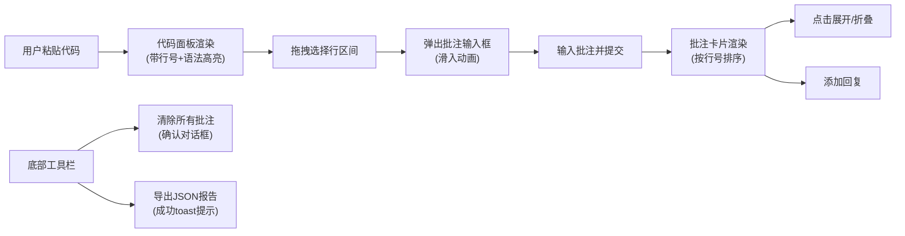

## 1. 产品概述

在线代码片段审查工具，为前端开发者提供轻量级可视化代码批注能力。用户可粘贴代码片段后框选任意行区域添加批注，支持多层讨论和审查报告导出，解决团队协作中代码审查缺少可视化标注工具的痛点。

## 2. 核心功能

### 2.1 功能模块

1. **代码输入与展示面板**：代码粘贴、行号显示、语法高亮、行区间选择
2. **批注管理系统**：批注创建、展示、展开/折叠、回复功能
3. **工具栏操作区**：清除所有批注、导出审查报告
4. **响应式布局**：左右分栏/上下布局自适应

### 2.2 页面详情

| 页面名称 | 模块名称 | 功能描述 |
|-----------|-------------|---------------------|
| 主页面 | 代码输入区 | 支持粘贴任意代码文本，自动识别JavaScript/Python语法高亮 |
| 主页面 | 代码展示面板 | 显示带行号的代码块，支持鼠标拖拽选择连续行区间 |
| 主页面 | 批注输入框 | 选中行后弹出悬浮输入框，支持输入批注文本并提交 |
| 主页面 | 批注列表区 | 按行号排序显示批注卡片，每张卡片显示行号范围、摘要、作者、时间 |
| 主页面 | 批注详情区 | 支持展开/折叠完整批注文本，包含回复输入框和回复列表 |
| 主页面 | 底部工具栏 | 清除所有批注（带确认对话框）、导出审查报告（JSON格式） |

## 3. 核心流程

用户粘贴代码 → 代码面板显示带行号代码 → 用户拖拽选择行区间 → 弹出批注输入框 → 输入并提交批注 → 批注卡片显示在右侧列表 → 点击展开查看详情/回复 → 导出或清除批注

## 4. 用户界面设计

### 4.1 设计风格
- **主色调**：深蓝灰 #2C3E50（代码面板背景）
- **选区高亮**：半透明蓝色 rgba(52,152,219,0.3)
- **代码字体**：Fira Code（等宽字体）
- **布局风格**：左右分栏布局，中间可拖拽分隔条
- **卡片设计**：批注卡片带阴影，支持弹性展开动画

### 4.2 页面设计概述

| 页面名称 | 模块名称 | UI元素 |
|-----------|-------------|-------------|
| 主页面 | 代码面板 | 深蓝灰背景、灰色行号侧条、Fira Code字体、行号区域row-resize光标 |
| 主页面 | 批注卡片 | 默认折叠状态、显示行号范围+内容摘要+作者+相对时间、点击弹性展开 |
| 主页面 | 批注输入框 | 从右上角滑入动画（translateX 0.3s）、半透明蓝色高亮选区 |
| 主页面 | 分隔条 | 可拖拽调整宽度、悬停反馈 |
| 主页面 | 对话框/Toast | 确认对话框（取消/确定按钮）、导出成功提示（0.5s渐变消失） |

### 4.3 响应式
- **桌面端（≥768px）**：左右分栏布局，代码面板70%，批注列表30%
- **移动端（<768px）**：上下布局，代码面板占50%高度，批注列表占50%高度
- **触摸优化**：增大点击区域，支持触摸拖拽选择

### 4.4 交互反馈
- 行号区域光标变为 `row-resize`
- 选区高亮实时跟随鼠标
- 批注输入框滑入动画
- 卡片展开/折叠弹性动画
- 清除批注前确认对话框
- 导出成功Toast提示

## 5. 性能约束

- 支持10万字符以内代码内容
- 行号生成和选区高亮 ≤ 50ms
- 批注展开/折叠动画帧率 ≥ 30FPS
