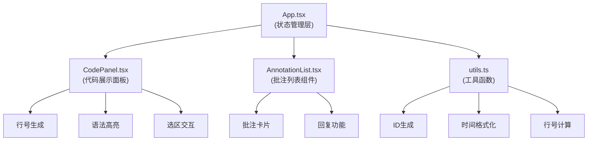

## 1. 架构设计



**数据流向**：
1. 用户粘贴代码 → `App.tsx` 存储 code 状态
2. `App.tsx` 将 code 和 annotations 传递给 `CodePanel` 和 `AnnotationList`
3. 用户选择行区间 → `CodePanel` 触发回调 → `App.tsx` 添加批注
4. 用户回复批注 → `AnnotationList` 触发回调 → `App.tsx` 更新批注
5. 导出/清除操作 → `App.tsx` 处理 → 更新状态

## 2. 技术描述

- **前端框架**：React@18 + TypeScript
- **构建工具**：Vite@5 + @vitejs/plugin-react@4
- **依赖库**：
  - react@18, react-dom@18
  - uuid@9（ID生成）
  - date-fns@3（时间格式化）
- **样式方案**：CSS Modules + CSS Variables
- **语法高亮**：Prism.js（轻量级）
- **开发服务器端口**：5173

## 3. 核心类型定义

```typescript
interface Reply {
  id: string;
  author: string;
  content: string;
  createdAt: Date;
}

interface Annotation {
  id: string;
  startLine: number;
  endLine: number;
  author: string;
  content: string;
  createdAt: Date;
  replies: Reply[];
  isExpanded: boolean;
}

interface Selection {
  startLine: number;
  endLine: number;
  isActive: boolean;
}

interface ExportReport {
  code: string;
  exportedAt: string;
  annotations: Array<{
    id: string;
    lineRange: string;
    author: string;
    content: string;
    createdAt: string;
    replies: Reply[];
  }>;
}
```

## 4. 文件结构与调用关系

```
src/
├── App.tsx (主组件)
│   ├── 管理 code, annotations, selection 状态
│   ├── 处理批注增删改操作
│   ├── 渲染 CodePanel 和 AnnotationList
│   └── 提供底部工具栏
│
├── CodePanel.tsx (代码面板)
│   ├── Props: { code, annotations, selection, onSelectionChange, onAddAnnotation }
│   ├── 渲染行号和代码
│   ├── 处理鼠标拖拽选区
│   ├── 渲染批注输入框
│   └── 调用 utils 进行行号计算和语法高亮
│
├── AnnotationList.tsx (批注列表)
│   ├── Props: { annotations, onToggleExpand, onAddReply, onClearAll }
│   ├── 按行号排序渲染批注卡片
│   ├── 每个卡片支持展开/折叠
│   └── 处理回复输入
│
└── utils.ts (工具函数)
    ├── generateId() → 调用 uuid
    ├── formatRelativeTime(date) → 调用 date-fns
    ├── getLineNumbers(code) → 计算总行数
    ├── detectLanguage(code) → 识别JS/Python
    └── highlightCode(code, lang) → 语法高亮
```

## 5. 关键实现要点

### 5.1 性能优化
- 行号渲染使用 CSS `counter-reset` + `counter-increment` 避免重绘
- 选区高亮使用 CSS 类切换而非内联样式
- 批注列表使用 `React.memo` 避免不必要重渲染
- 展开/折叠动画使用 CSS `transition: height` + `transform`

### 5.2 交互实现
- 行区间选择：监听 `mousedown` → `mousemove` → `mouseup` 事件链
- 分隔条拖拽：使用 CSS `resize` 属性或自定义拖拽逻辑
- 响应式布局：使用 `@media (max-width: 768px)` 媒体查询

### 5.3 数据持久化
- 导出 JSON：使用 `JSON.stringify` + `Blob` + `URL.createObjectURL`
- 文件下载：创建 `<a>` 元素触发下载

## 6. 依赖约束

package.json 必须包含：
```json
{
  "dependencies": {
    "react": "^18.2.0",
    "react-dom": "^18.2.0",
    "uuid": "^9.0.0",
    "date-fns": "^3.0.0",
    "prismjs": "^1.29.0"
  },
  "devDependencies": {
    "typescript": "^5.0.0",
    "vite": "^5.0.0",
    "@vitejs/plugin-react": "^4.0.0",
    "@types/react": "^18.2.0",
    "@types/react-dom": "^18.2.0",
    "@types/uuid": "^9.0.0"
  },
  "scripts": {
    "dev": "vite",
    "build": "tsc && vite build"
  }
}
```
