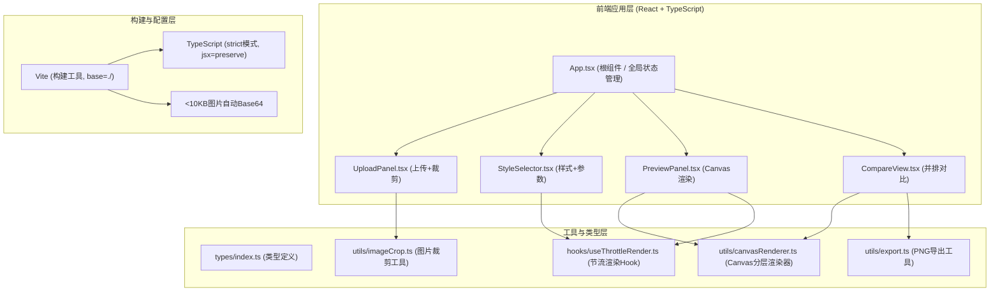

## 1. 架构设计



## 2. 技术说明

- **前端框架**：React@18 + TypeScript@5 + Vite@5
- **初始化工具**：Vite (React + TypeScript 模板)
- **后端服务**：无（纯前端SPA应用，浏览器本地处理）
- **核心依赖包**：
  - `react` / `react-dom`：UI框架
  - `typescript`：类型系统（strict模式）
  - `vite` / `@vitejs/plugin-react`：构建工具链
  - `react-color`：颜色选择器组件（圆形拾色器）
  - `lodash.throttle`：参数变化节流（100ms）
- **CSS方案**：原生CSS + CSS变量（统一主题色管理），不引入额外CSS框架
- **Canvas渲染**：原生 HTML5 Canvas API，requestAnimationFrame 节流重绘

## 3. 路由定义

| 路由路径 | 页面/组件 | 用途说明 |
|---------|-----------|---------|
| / | App.tsx 根组件 | 单页应用主入口，整合所有子模块 |

单页应用无多路由，全部功能在单页面内通过组件显隐/状态切换完成。

## 4. 类型定义（types/index.ts）

```typescript
// 装裱样式枚举
export type MountStyle = 'scroll' | 'frame' | 'fan';

// 裁剪区域
export interface CropArea {
  x: number;      // 裁剪框左上角x（原图比例0-1）
  y: number;      // 裁剪框左上角y
  width: number;  // 裁剪框宽度（0-1）
  height: number; // 裁剪框高度（0-1），固定 width * 1.4
}

// 卷轴样式参数
export interface ScrollParams {
  axisColor: string;      // 轴头颜色，默认#4a3520
  fabricTexture: number;  // 绫布纹理索引 0-5
}

// 镜框样式参数
export interface FrameParams {
  frameColor: string;  // 框条颜色，默认#8b6914
  frameWidth: number;  // 框条宽度 3-20px，默认8
  matColor: string;    // 卡纸颜色，默认#ffffff
}

// 扇面样式参数
export interface FanParams {
  ribMaterial: 'bamboo' | 'wood' | 'copper'; // 扇骨材质
  fanBgColor: string;  // 扇面底色
}

// 全局装裱参数
export interface MountParams {
  scroll: ScrollParams;
  frame: FrameParams;
  fan: FanParams;
}

// 应用全局状态
export interface AppState {
  imageUrl: string | null;           // 上传原图URL
  originalImage: HTMLImageElement | null; // 原始图片对象
  cropArea: CropArea | null;         // 裁剪区域
  currentStyle: MountStyle;          // 当前选中样式
  params: MountParams;               // 装裱参数
  compareModes: MountStyle[];        // 并排对比选中的样式列表（2-4项）
  isCompareMode: boolean;            // 是否进入并排对比模式
}

// 回调类型
export type SetImageCallback = (url: string, img: HTMLImageElement) => void;
export type SetStyleCallback = (style: MountStyle) => void;
export type SetParamsCallback = <K extends keyof MountParams>(
  style: K,
  key: keyof MountParams[K],
  value: MountParams[K][keyof MountParams[K]]
) => void;
export type SetCropCallback = (area: CropArea) => void;
```

## 5. 文件调用关系与数据流向

```
┌───────────────────────────────────────────────────────┐
│                    App.tsx (根组件)                    │
│  useState: imageUrl, cropArea, currentStyle, params   │
│  useState: isCompareMode, compareModes                │
└──────────┬───────────────────┬───────────────────┬────┘
           │ props/回调        │ props/回调        │ props/回调
           ▼                   ▼                   ▼
  ┌────────────────┐  ┌──────────────────┐  ┌─────────────────┐
  │ UploadPanel    │  │ StyleSelector    │  │ PreviewPanel    │
  │ - 拖拽/点击上传│  │ - 3个样式按钮    │  │ - Canvas渲染    │
  │ - 1:1.4裁剪框  │  │ - 参数面板(条件) │  │ - 缩放/拖拽     │
  │ - 裁剪确认回调 │──┘ setStyle/setParams  │ - 500ms淡入     │
  └────────────────┘                       │ - 导出PNG       │
                                           └────────┬────────┘
                                                    │并排模式
                                                    ▼
                                          ┌────────────────────┐
                                          │ CompareView        │
                                          │ - 2-4列Grid布局    │
                                          │ - 每列PreviewPanel │
                                          │ - 统一参数联动     │
                                          └────────────────────┘

  数据流向：
  用户操作 → UploadPanel裁剪 → setImage + setCrop → App状态更新
  用户操作 → StyleSelector点击 → setStyle + setParams → App状态更新
  App状态(props) → PreviewPanel重绘(useThrottleRender 100ms节流)
  App状态(props) → CompareView多实例渲染，参数统一生效
```

## 6. 关键实现约束

| 约束项 | 实现方案 |
|-------|---------|
| 预览重绘<200ms | Canvas分层绘制缓存 + requestAnimationFrame + lodash.throttle(100ms) |
| 1:1.4裁剪比例 | 裁剪框拖拽时固定height = width * 1.4，边界校验不超出图片 |
| 绫布6种纹理 | CSS linear-gradient/repeating-linear-gradient 生成纹理图案 |
| 扇骨材质 | 竹(#90EE90径向线)、木(#8B4513木纹渐变)、铜(#B87333金属渐变) |
| 响应式<768px | CSS媒体查询，flex-direction切换为column |
| 参数面板手风琴<480px | max-height: 0 → max-height: 1000px过渡 + overflow-hidden |
| 导出白底PNG | 导出前先fillRect白色背景到临时Canvas，再合成装裱层 |
| 10MB图片限制 | File.size校验 > 10*1024*1024 时alert提示拒绝 |
