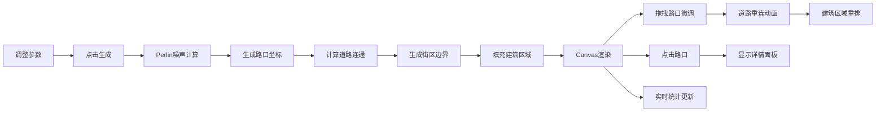

## 1. 产品概述

程序化城市道路网络生成器是一款面向游戏设计师的2D俯视角城市地图快速生成工具，解决手动设计大型开放世界地图时道路布局耗时、交通逻辑难以保证合理性的痛点。

- 核心目标：通过参数化配置和程序化算法，快速生成具备真实交通逻辑的城市道路网络，支持交互式微调与数据统计
- 目标用户：游戏关卡设计师、开放世界地图策划、城市模拟游戏开发者
- 市场价值：大幅提升大型城市地图的设计效率，通过算法保证道路网络的连通性和合理性

## 2. 核心功能

### 2.1 功能模块

1. **参数控制面板**：网格密度、街区大小、道路宽度比例等参数调节，实时统计显示
2. **程序化道路生成引擎**：基于Perlin噪声的网格化道路生成，区分主干道与支路
3. **交互式画布**：Canvas渲染、鼠标拖拽微调路口、滚轮缩放与平移
4. **路口信息面板**：点击路口显示连通方向与周边建筑类型分布饼图
5. **建筑区域生成**：街区内随机填充住宅/商业/工业建筑，带旋转角度和纹理噪点

### 2.2 页面详情

| 页面名称 | 模块名称 | 功能描述 |
|-----------|-------------|---------------------|
| 主界面 | 参数面板 | 滑块控制网格密度(5x5~15x15)、街区大小(10~50px)、主次路宽度比(1:0.5~1:0.8)，生成按钮触发道路生成，实时显示道路总长度、路口数量、街区面积统计 |
| 主界面 | Canvas画布 | 米白色背景，深灰色主干道实线、浅灰色支路虚线、白色圆形路口，支持拖拽路口微调、滚轮缩放(0.5x~3x)、拖拽平移 |
| 主界面 | 路口浮动面板 | 点击路口弹出，显示四向连通状态、是否十字路口，Canvas绘制建筑类型分布饼图，半透明深色背景带圆角阴影 |

## 3. 核心流程

用户调整参数→点击生成按钮→Perlin噪声计算生成路口坐标→计算道路连通关系→生成街区边界→填充建筑区域→Canvas渲染绘制→用户拖拽路口微调→道路自动重连平滑动画→建筑区域重排缩放→点击路口查看详情→实时更新统计数据

## 4. 用户界面设计

### 4.1 设计风格

- **视觉风格**：扁平化信息图表风格，色调统一克制，避免过度花哨
- **主色调**：深灰#2c3e50（参数面板）、米白#fdf6e3（画布背景）、深灰#34495e（主干道）、浅灰#bdc3c7（支路）
- **建筑配色**：暖黄#f4d03f（住宅）、蓝灰#5dade2（商业）、红棕#a569bd（工业）
- **交互强调色**：红色（拖拽高亮）、白色（路口填充）
- **按钮控件**：统一圆角矩形(border-radius:6px)，渐变蓝灰滑块轨道，点击缩放反馈scale(0.95)
- **字体**：使用无衬线等宽字体，确保数据显示清晰，文字最小字号12px
- **动画**：所有交互150ms ease-out过渡，数字跳动动画，饼图外环淡入动画

### 4.2 页面布局

| 区域 | 模块 | UI元素 |
|-----|------|---------|
| 左侧(25%) | 参数面板 | 深色背景，白色文字，滑块组、生成按钮、统计数值区，圆角控件 |
| 右侧(75%) | Canvas画布 | 米白背景，道路网络、建筑区域，支持缩放平移 |
| 浮动层 | 路口面板 | 半透明深色rgba(20,20,20,0.85)，圆角，阴影，叉号关闭按钮，饼图 |

### 4.3 响应式设计

- 桌面端优先设计，固定1:3左右两栏布局
- 支持窗口缩放时Canvas自适应调整
- 所有数值显示确保最小字号12px

### 4.4 性能要求

- 5x5网格生成时间≤500ms
- 拖拽路口重绘响应≤16ms（60FPS）
- 参数更新实时不阻塞UI线程
