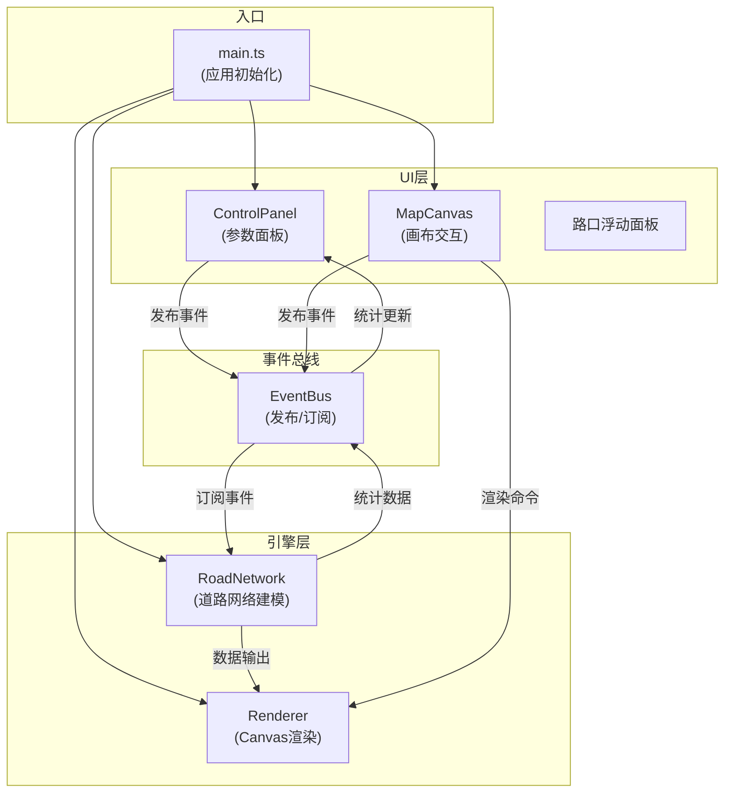

## 1. 架构设计



## 2. 技术选型

- **前端框架**：无第三方UI框架，原生TypeScript + DOM API
- **构建工具**：Vite@5
- **语言**：TypeScript@5（严格模式，target ES2020）
- **渲染引擎**：原生HTML5 Canvas 2D API
- **状态管理**：自定义EventBus事件总线（发布/订阅模式）
- **算法**：Perlin噪声（程序化生成路口偏移）

## 3. 目录结构

```
d:\Pro\tasks\auto152\
├── package.json
├── vite.config.js
├── tsconfig.json
├── index.html
└── src\
    ├── main.ts              # 应用入口
    ├── EventBus.ts          # 事件总线
    ├── engine\
    │   ├── RoadNetwork.ts   # 道路网络核心引擎
    │   └── Renderer.ts      # Canvas渲染引擎
    └── ui\
        ├── ControlPanel.ts  # 参数面板控制器
        └── MapCanvas.ts     # Canvas交互控制器
```

## 4. 核心模块定义

### 4.1 EventBus 事件总线

```typescript
type EventHandler = (...args: any[]) => void;

class EventBus {
  on(event: string, handler: EventHandler): void;
  off(event: string, handler: EventHandler): void;
  emit(event: string, ...args: any[]): void;
}
```

### 4.2 RoadNetwork 数据模型

```typescript
interface Intersection {
  id: string;
  gridX: number;
  gridY: number;
  x: number;
  y: number;
  isDragging: boolean;
}

interface RoadSegment {
  id: string;
  startId: string;
  endId: string;
  type: 'main' | 'branch';
  length: number;
}

interface Building {
  id: string;
  x: number;
  y: number;
  width: number;
  height: number;
  rotation: number;
  type: 'residential' | 'commercial' | 'industrial';
}

interface CityBlock {
  id: string;
  bounds: { x: number; y: number; width: number; height: number };
  buildings: Building[];
}

interface GenerationParams {
  gridSize: number;      // 5-15
  blockSize: number;     // 10-50
  roadRatio: number;     // 0.5-0.8
}

interface Statistics {
  totalRoadLength: number;
  intersectionCount: number;
  totalBlockArea: number;
}

class RoadNetwork {
  generate(params: GenerationParams): void;
  getIntersections(): Intersection[];
  getRoadSegments(): RoadSegment[];
  getCityBlocks(): CityBlock[];
  getStatistics(): Statistics;
  dragIntersection(id: string, x: number, y: number): void;
  getIntersectionInfo(id: string): IntersectionDetail;
  snapToGrid(x: number, y: number): { x: number; y: number };
}
```

### 4.3 Renderer 渲染引擎

```typescript
interface Viewport {
  scale: number;       // 0.5-3
  offsetX: number;
  offsetY: number;
}

interface RenderOptions {
  highlightIntersection?: string;
  animationProgress?: number;
}

class Renderer {
  constructor(canvas: HTMLCanvasElement);
  setViewport(viewport: Viewport): void;
  render(network: RoadNetwork, options?: RenderOptions): void;
  renderPieChart(ctx: CanvasRenderingContext2D, data: PieChartData, size: number): void;
  screenToWorld(screenX: number, screenY: number): { x: number; y: number };
  worldToScreen(worldX: number, worldY: number): { x: number; y: number };
  getIntersectionAtPoint(x: number, y: number): Intersection | null;
}
```

## 5. 事件定义

| 事件名 | 参数 | 触发源 | 订阅者 | 说明 |
|--------|------|--------|--------|------|
| `generate` | `params: GenerationParams` | ControlPanel | RoadNetwork | 触发道路网络生成 |
| `statistics-update` | `stats: Statistics` | RoadNetwork | ControlPanel | 统计数据更新 |
| `intersection-drag-start` | `id: string` | MapCanvas | RoadNetwork | 开始拖拽路口 |
| `intersection-drag-move` | `id: string, x: number, y: number` | MapCanvas | RoadNetwork | 拖拽路口移动 |
| `intersection-drag-end` | `id: string` | MapCanvas | RoadNetwork | 结束拖拽路口 |
| `intersection-click` | `id: string, x: number, y: number` | MapCanvas | UI层 | 点击路口显示详情 |
| `viewport-change` | `viewport: Viewport` | MapCanvas | Renderer | 视口变换（缩放/平移） |
| `render` | - | MapCanvas/RoadNetwork | Renderer | 触发重绘 |

## 6. 关键算法

### 6.1 Perlin噪声实现
```typescript
class PerlinNoise {
  private permutation: number[];
  noise2D(x: number, y: number): number;
  fade(t: number): number;
  lerp(a: number, b: number, t: number): number;
  grad(hash: number, x: number, y: number): number;
}
```

### 6.2 道路连通性判断
- 基于网格坐标计算相邻路口
- 使用Perlin噪声阈值决定主干道与支路
- 确保网络整体连通性

### 6.3 建筑区域布局
- 街区内网格划分
- 随机旋转角度(0-90°)
- 最小间距5px约束
- 建筑类型随机分配

## 7. 性能优化策略

1. **Canvas脏矩形渲染**：仅重绘变化区域
2. **requestAnimationFrame动画循环**：统一渲染调度
3. **事件防抖/节流**：滚轮缩放、拖拽事件优化
4. **离屏Canvas预渲染**：建筑纹理缓存
5. **Web Worker（备选）**：大型网格生成离线计算
