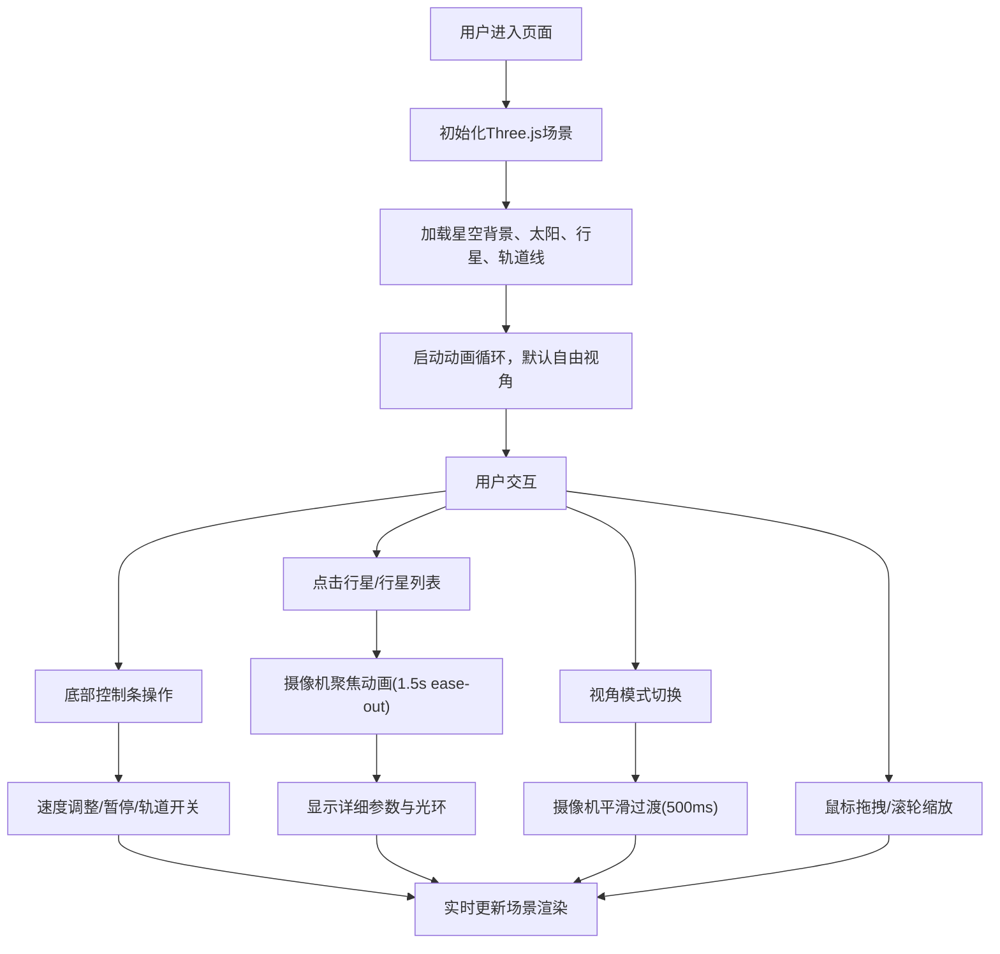

## 1. 产品概述

交互式太阳系行星公转与轨道倾斜三维模拟器，面向天文爱好者和学生群体，通过直观的三维可视化帮助用户理解太阳系天体运动规律。
- 核心价值：将抽象的天文数据转化为可交互、可探索的三维视觉体验，降低天文知识的理解门槛
- 目标用户：中学生、大学生、天文爱好者、科普教育工作者

## 2. 核心功能

### 2.1 功能模块
1. **三维主场景**：星空背景、太阳（带光晕）、八大行星、轨道线
2. **行星参数面板**：行星列表、颜色标识、详细参数展示
3. **底部控制条**：速度滑块、暂停/恢复按钮、轨道倾角开关
4. **视角控制系统**：自由视角、俯视视角、侧视视角、行星聚焦

### 2.2 功能详情

| 模块名称 | 子模块 | 功能描述 |
|---------|--------|---------|
| 三维主场景 | 星空背景 | 深空蓝渐变背景（#0b0e2a → #1a1a3a），随机星点粒子 |
| 三维主场景 | 太阳 | 橙黄色球体，自转，CSS径向渐变光晕 + three.js点光源 |
| 三维主场景 | 行星 | 八颗行星按比例缩放，Canvas绘制纹理贴图（气态/岩石行星差异化），自转+公转 |
| 三维主场景 | 轨道线 | 半透明白色细圆环，按真实轨道倾角倾斜，可开关显示与发光效果 |
| 行星参数面板 | 行星列表 | 右侧悬浮，显示行星名称与颜色圆点，点击选中 |
| 行星参数面板 | 详细参数 | 轨道半径、公转周期、自转周期、轨道倾角、赤道半径、质量、平均温度，标签-数值对，浅色圆角背景 |
| 行星参数面板 | 光环指示器 | 选中行星周围显示半透明光环 |
| 底部控制条 | 速度滑块 | 0x~10x，步长0.5x，数值实时显示在滑块上方 |
| 底部控制条 | 暂停/恢复 | 图标在暂停/播放间切换，带300ms缩放动画 |
| 底部控制条 | 轨道倾角开关 | 开启时轨道线显示并发光，关闭时淡出消失 |
| 视角控制 | 自由视角 | 鼠标拖拽旋转（平滑阻尼），滚轮缩放 |
| 视角控制 | 视角模式 | 自由/俯视/侧视，下拉菜单切换，500ms过渡动画 |
| 视角控制 | 行星聚焦 | 点击行星后摄像机1.5s ease-out飞行动画，聚焦到行星附近 |

## 3. 核心流程

用户进入页面 → 加载三维太阳系场景 → 默认自由视角自动播放 → 可通过底部控制条调整速度/暂停/开关轨道 → 可点击右侧行星列表或场景中的行星 → 摄像机飞行动画聚焦行星 → 显示详细参数与光环 → 可通过下拉菜单切换俯视/侧视视角观察 → 可随时拖拽旋转/滚轮缩放自由探索

## 4. 用户界面设计

### 4.1 设计风格
- **主色调**：深空蓝渐变背景 `#0b0e2a` → `#1a1a3a`
- **强调色**：太阳橙黄色 `#ffaa33`，行星各自本色标识
- **辅助色**：半透明白色 `rgba(255,255,255,0.15)`，UI控件背景
- **按钮风格**：圆角12px，毛玻璃效果 `backdrop-filter: blur(8px)`，白色半透明背景
- **字体**：现代无衬线字体，清晰易读
- **图标风格**：简洁线性图标，暂停/播放按钮带缩放动画

### 4.2 页面布局

| 区域 | 位置 | 元素 |
|-----|-----|-----|
| 3D渲染区 | 全屏背景 | Three.js Canvas，星空、太阳、行星、轨道 |
| 行星参数面板 | 右侧固定，垂直居中 | 行星列表（名称+色点），选中后展示详细参数卡片 |
| 底部控制条 | 底部水平居中 | 速度滑块、暂停/播放按钮、轨道倾角开关、视角模式下拉菜单 |

### 4.3 响应式
- 桌面端优先设计
- 面板在小屏幕上自动调整宽度与字体大小
- 触摸设备支持单指拖拽旋转、双指缩放

### 4.4 3D场景指导
- **环境**：深空渐变背景 + 随机星点粒子系统，营造宇宙空间感
- **光照**：太阳位置点光源（橙黄色），环境光补充，行星使用MeshStandardMaterial接收光照
- **相机**：PerspectiveCamera，初始位置合理观察整个太阳系
- **动画**：行星公转/自转动画循环，帧率保持55FPS以上，所有交互反馈300ms内完成
- **后处理**：光晕效果（CSS径向渐变叠加在太阳屏幕位置），轨道线可选发光
- **性能**：几何体复用，材质优化，粒子系统高效渲染
