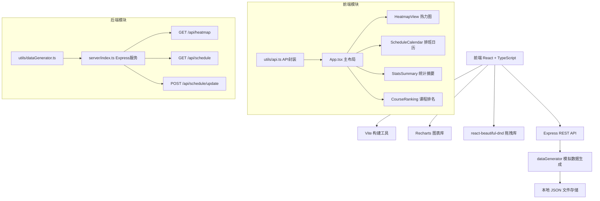
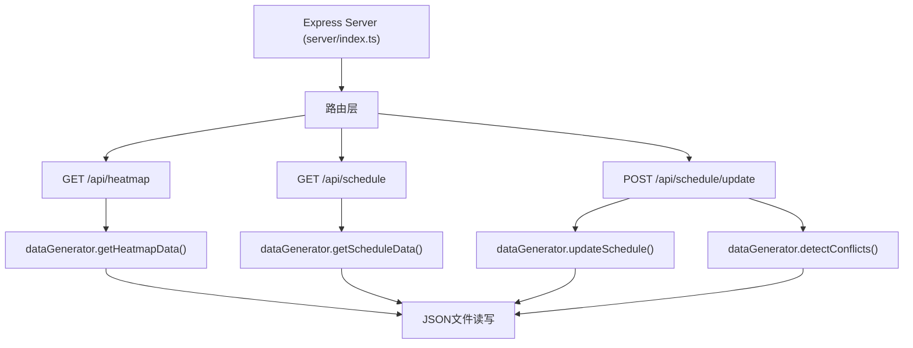

## 1. 架构设计



## 2. 技术描述

### 前端技术栈
- **框架**：React 18 + TypeScript
- **构建工具**：Vite 5
- **图表库**：Recharts 2
- **拖拽库**：react-beautiful-dnd 13
- **HTTP客户端**：Fetch API
- **状态管理**：React useState/useEffect

### 后端技术栈
- **框架**：Express 4
- **语言**：TypeScript
- **ID生成**：uuid 9
- **跨域**：cors 2
- **数据存储**：本地JSON文件

### 项目初始化
```
npm init vite-init@latest -y . "--" --template react-express-ts --force
```

## 3. 目录结构

```
auto154/
├── src/                          # 前端源码
│   ├── App.tsx                   # 主布局组件
│   ├── main.tsx                  # 入口文件
│   ├── components/
│   │   ├── HeatmapView.tsx       # 热力图组件
│   │   ├── ScheduleCalendar.tsx  # 排班日历组件
│   │   ├── StatsSummary.tsx      # 统计摘要组件
│   │   ├── CourseRanking.tsx     # 热门课程排名组件
│   │   └── Sidebar.tsx           # 侧边栏组件
│   ├── utils/
│   │   ├── api.ts                # API请求封装
│   │   └── types.ts              # 类型定义
│   └── index.css                 # 全局样式
├── server/                       # 后端源码
│   ├── index.ts                  # Express服务入口
│   └── utils/
│       └── dataGenerator.ts      # 模拟数据生成器
├── data/                         # 数据存储
│   ├── bookings.json             # 预约数据
│   └── schedule.json             # 排班数据
├── package.json
├── vite.config.js
├── tsconfig.json
└── index.html
```

## 4. 数据流向

```
前端请求 → App.tsx useState管理状态 → utils/api.ts → 
Express API → dataGenerator生成/读取数据 → JSON文件存储 →
返回JSON响应 → 前端子组件渲染 → 用户交互 → 状态更新
```

## 5. API 定义

### TypeScript 类型定义

```typescript
// 课程类型
type CourseType = '哈他' | '流' | '阿斯汤加' | '阴瑜伽';

// 时段定义
interface TimeSlot {
  id: string;
  start: string;  // "09:00"
  end: string;    // "10:00"
}

// 预约数据
interface BookingData {
  date: string;           // "2026-06-20"
  timeSlot: number;       // 0-8 共9个时段
  courseType: CourseType;
  bookings: number;       // 预约人数
  capacity: number;       // 容量
  instructorId: string;
}

// 教练
interface Instructor {
  id: string;
  name: string;
}

// 排班项
interface ScheduleItem {
  id: string;
  date: string;
  timeSlot: number;
  instructorId: string;
  courseType: CourseType;
}

// 冲突信息
interface ConflictInfo {
  date: string;
  timeSlot: number;
  instructorId: string;
  items: ScheduleItem[];
}

// 热力图响应
interface HeatmapResponse {
  period: 'week' | 'month';
  startDate: string;
  endDate: string;
  data: BookingData[];
  summary: {
    totalBookings: number;
    avgAttendance: number;
    peakTimeSlot: number;
    conflictCount: number;
  };
  courseRankings: { type: CourseType; count: number }[];
}

// 排班响应
interface ScheduleResponse {
  weekStart: string;
  instructors: Instructor[];
  schedule: ScheduleItem[];
  conflicts: ConflictInfo[];
}
```

### API 端点

| 方法 | 端点 | 参数 | 响应 |
|------|------|------|------|
| GET | `/api/heatmap` | `period=week\|month` | `HeatmapResponse` |
| GET | `/api/schedule` | - | `ScheduleResponse` |
| POST | `/api/schedule/update` | `{ itemId, newDate, newTimeSlot }` | `{ success: boolean, schedule, conflicts }` |

## 6. 服务器架构



## 7. 关键技术决策

1. **状态管理**：使用React内置useState/useEffect，无需额外状态管理库
2. **拖拽实现**：使用react-beautiful-dnd提供流畅的拖拽体验
3. **图表渲染**：使用Recharts的Heatmap和BarChart组件
4. **数据存储**：本地JSON文件，便于开发和演示
5. **动画实现**：CSS transitions + React state驱动，确保60fps性能
6. **类型安全**：前后端共享TypeScript类型定义
