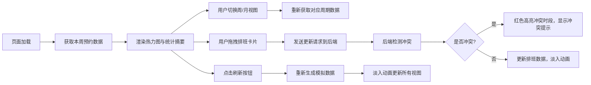

## 1. 产品概述

瑜伽课程预约热度与教练排班可视化看板，为小型瑜伽工作室提供直观的课程预约数据展示和教练排班管理工具。目标用户为工作室管理员，帮助其快速了解各时段预约热度、热门课程排名，并高效管理教练排班与冲突检测。

## 2. 核心功能

### 2.1 用户角色
| 角色 | 注册方式 | 核心权限 |
|------|---------|---------|
| 工作室管理员 | 系统内置 | 查看预约统计、管理教练排班、检测排班冲突 |

### 2.2 功能模块
1. **预约热度热力图**：按周/月展示各时段上座率，颜色从浅蓝到深红渐变
2. **热门课程排名**：条形图展示前5热门课程，金银铜渐变配色
3. **教练排班日历**：可拖拽的教练课程卡片，支持冲突检测与红色高亮
4. **时段统计摘要**：滚动计数器展示总预约人次、平均上座率等关键指标
5. **数据刷新功能**：一键重新生成模拟数据，保留当前视图模式

### 2.3 页面详情
| 页面名称 | 模块名称 | 功能描述 |
|---------|---------|----------|
| 主看板 | 侧边导航栏 | 250px宽白色侧边栏，包含周/月视图切换、热门课程排名、刷新按钮 |
| 主看板 | 热力图区域 | 7x8周热度网格，悬停显示课程详情弹窗，响应式适配 |
| 主看板 | 统计摘要栏 | 滚动计数器动画展示4项核心指标，位于热力图上方 |
| 主看板 | 排班日历 | 拖拽式排班卡片，冲突时段红色高亮，冲突详情面板 |

## 3. 核心流程

## 4. 用户界面设计

### 4.1 设计风格
- **主色调**：#5dade2（柔和蓝色）
- **辅助色**：#f4d03f（金色）、#a569bd（紫色）
- **背景色**：#f5f5f5（浅灰色内容区）、#ffffff（侧边栏）
- **热力图渐变色**：浅蓝(#e8f4fc) → 深红(#c0392b)
- **字体**：系统默认无衬线字体
- **卡片圆角**：热力图单元格2px，教练卡片1px浅灰边框
- **动画**：拖拽跟随半透明(opacity 0.7)、放置200ms ease-out回弹、冲突面板300ms cubic-bezier升起

### 4.2 页面设计概述
| 页面名称 | 模块名称 | UI元素 |
|---------|---------|--------|
| 主看板 | 侧边导航栏 | 固定宽度250px，白色背景，右侧阴影分隔，包含视图切换按钮、热门课程条形图、刷新按钮 |
| 主看板 | 统计摘要栏 | 4个指标卡片横向排列，数字从0滚动到目标值，淡入动画 |
| 主看板 | 热力图区域 | 7x8网格布局，单元格圆角2px，悬停弹窗显示课程名称、预约人数、空缺席位 |
| 主看板 | 排班日历 | 时间轴布局，可拖拽卡片，冲突时红色边框+“冲突！”文字，点击显示详情面板 |

### 4.3 响应式
- **桌面端**：左右分栏布局，侧边栏250px固定宽度
- **移动端**（<768px）：侧边栏折叠为汉堡菜单，点击展开
- **图表响应式**：热力图和条形图自动适应容器宽度

## 5. 性能约束
- 页面滚动和拖拽操作保持50fps以上
- 热力图颜色变化动画≤200ms
- 后端API响应时间≤300ms（10条时段数据量下）
