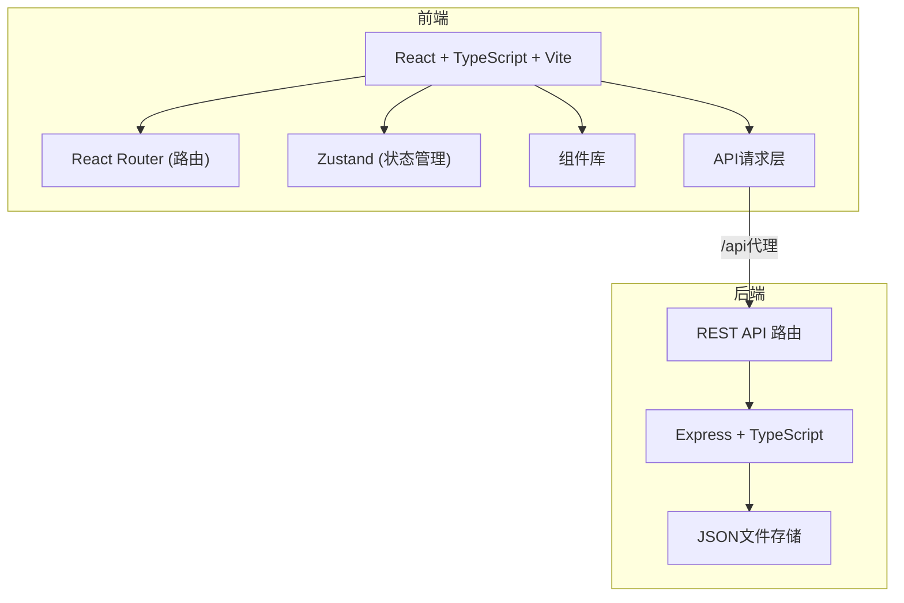

## 1. 架构设计



---

## 2. 技术描述

### 前端技术栈
- **框架**：React 18 + TypeScript
- **构建工具**：Vite
- **路由**：react-router-dom v6
- **图表**：chart.js + react-chartjs-2
- **状态管理**：React useState/useContext（轻量场景），Zustand（如需要）
- **HTTP客户端**：原生 fetch API（封装统一错误处理）
- **唯一ID**：uuid

### 后端技术栈
- **框架**：Express 4
- **语言**：TypeScript
- **数据存储**：本地JSON文件
- **跨域**：cors 中间件

### 开发工具
- **并发启动**：使用 npm scripts 并发启动前后端
- **代理**：Vite dev server 代理 /api 到后端 3001 端口

---

## 3. 路由定义

### 前端路由

| 路由路径 | 页面组件 | 用途 |
|---------|---------|------|
| / | AdminPage | 后台管理页面，创建节目 |
| /episode/:id | EpisodePage | 节目公开展示页 |
| /episode/:id/stats | StatsPage | 节目统计看板 |

### 后端API路由

| 方法 | 路径 | 用途 |
|------|------|------|
| POST | /api/episodes | 创建新节目 |
| GET | /api/episodes/:id | 获取节目详情 |
| POST | /api/episodes/:id/comments | 提交留言 |
| GET | /api/episodes/:id/comments | 分页获取留言 |
| GET | /api/episodes/:id/stats | 获取节目统计数据 |

---

## 4. API 定义

### 类型定义

```typescript
// 嘉宾信息
interface Guest {
  name: string;
  avatar: string;
}

// 时间轴条目
interface TimelineItem {
  id: string;
  timestamp: number; // 秒
  title: string;
  description: string;
}

// 节目信息
interface Episode {
  id: string;
  podcastName: string;
  episodeNumber: string;
  coverImage: string;
  audioUrl: string;
  guests: Guest[];
  description: string;
  timeline: TimelineItem[];
  createdAt: string;
  visitCount: number;
}

// 留言
interface Comment {
  id: string;
  nickname: string;
  content: string;
  timestamp?: number; // 关联的播放时间点（秒）
  createdAt: string;
}

// 统计数据
interface EpisodeStats {
  visitCount: number;
  commentCount: number;
  topTimeSegments: { segment: string; count: number }[];
}
```

### 请求/响应示例

#### POST /api/episodes
**请求体：**
```json
{
  "podcastName": "科技前沿",
  "episodeNumber": "第42期",
  "coverImage": "https://example.com/cover.jpg",
  "audioUrl": "https://example.com/episode42.mp3",
  "guests": [{ "name": "张三", "avatar": "https://example.com/avatar.jpg" }],
  "description": "本期我们探讨AI的未来发展..."
}
```

**响应：**
```json
{
  "id": "uuid-string",
  "podcastName": "科技前沿",
  "episodeNumber": "第42期",
  "...": "..."
}
```

---

## 5. 项目文件结构

```
├── package.json              # 项目依赖和脚本
├── vite.config.js            # Vite构建配置
├── tsconfig.json             # TypeScript配置
├── index.html                # 入口HTML
├── server/
│   ├── index.ts              # Express后端入口
│   └── data/                 # JSON数据存储目录
│       └── episodes.json     # 节目数据
├── src/
│   ├── App.tsx               # React根组件，路由配置
│   ├── main.tsx              # 入口文件
│   ├── pages/
│   │   ├── AdminPage.tsx     # 后台管理页
│   │   ├── EpisodePage.tsx   # 节目展示页
│   │   └── StatsPage.tsx     # 统计看板页
│   ├── components/
│   │   ├── AudioPlayer.tsx   # 音频播放器组件
│   │   ├── Timeline.tsx      # 时间轴组件
│   │   └── CommentSection.tsx # 留言区组件
│   └── utils/
│       └── api.ts            # API请求封装
```

---

## 6. 数据存储方案

### 存储方式
使用本地JSON文件存储数据，文件位于 `server/data/episodes.json`

### 数据结构
```json
{
  "episodes": [
    {
      "id": "...",
      "podcastName": "...",
      "episodeNumber": "...",
      "coverImage": "...",
      "audioUrl": "...",
      "guests": [],
      "description": "...",
      "timeline": [],
      "createdAt": "...",
      "visitCount": 0,
      "comments": []
    }
  ]
}
```

---

## 7. 性能优化策略

1. **音频波形Canvas优化**：使用 requestAnimationFrame 控制绘制帧率
2. **列表虚拟滚动**：留言列表无限滚动，每次加载10条
3. **动画优化**：使用 CSS transform 和 opacity 实现 GPU 加速
4. **资源控制**：除音频外总资源 < 500KB
5. **代码分割**：按路由级别进行代码分割（可选）
