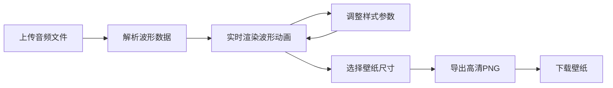

## 1. 产品概述

音乐波形壁纸生成器是一款将音频文件转化为可视化动态波形壁纸的创意工具，面向追求个性化桌面和手机壁纸的音乐爱好者。用户上传音频后可实时预览波形动画，自定义样式并导出高清壁纸图片。

- 主要用途：将音乐波形可视化，生成个性化动态/静态壁纸
- 目标用户：音乐爱好者、设计师、追求个性化的用户群体
- 产品价值：让音乐以视觉形式留存，创造独一无二的个性化壁纸

## 2. 核心功能

### 2.1 功能模块

1. **主页面（单页应用）**：左侧画布预览区 + 右侧控制面板
2. **音频上传模块**：拖拽/点击上传、文件名展示、音频播放控制
3. **波形绘制模块**：Canvas实时渲染、动画循环、多种波形样式
4. **样式控制面板**：波形类型、颜色方案、背景色调整
5. **壁纸导出模块**：尺寸选择、PNG导出、下载功能

### 2.2 页面详情

| 页面名称 | 模块名称 | 功能描述 |
|-----------|-------------|---------------------|
| 主页面 | 上传区域 | 虚线边框圆角矩形，支持拖拽和点击上传音频文件，展示文件名 |
| 主页面 | 播放控制 | 上传后显示播放按钮，点击可播放/暂停音频，波形实时跳动 |
| 主页面 | 画布预览区 | Canvas绘制波形动画，默认青紫渐变，深色背景(#1a1a2e)，60FPS |
| 主页面 | 控制面板 | 波形类型选择（条形/线条/圆点）、5组预置渐变色/自定义双色、背景色拾色器 |
| 主页面 | 导出按钮 | 选择尺寸(1920x1080/1080x1920)，导出带毛玻璃边框的高清PNG，加载动画+成功提示 |

## 3. 核心流程

用户上传音频文件 → 系统解析提取波形数据 → Canvas实时渲染波形动画 → 用户调整样式参数（实时预览）→ 选择壁纸尺寸 → 导出并下载高清PNG壁纸

## 4. 用户界面设计

### 4.1 设计风格

- **主色调**：深色主题，背景色 #1a1a2e，面板半透明毛玻璃效果 #ffffff15
- **渐变色方案**：默认青色→紫色，另外预置4组渐变色方案
- **按钮风格**：圆角12px，柔和阴影，悬停时上移2px（translateY(-2px)）过渡效果
- **字体**：现代无衬线字体，层级清晰，标题加粗，正文常规
- **布局风格**：左右分栏布局，左侧画布占主要面积（约70%），右侧可折叠控制面板
- **动效**：参数调整时波形300ms平滑过渡，按钮悬停微动效，导出加载动画

### 4.2 页面设计概述

| 页面名称 | 模块名称 | UI元素 |
|-----------|-------------|-------------|
| 主页面 | 上传区域 | 虚线边框圆角矩形，拖拽提示图标和文字，浅色虚线 |
| 主页面 | 播放控制 | 圆形播放/暂停按钮，居中显示在画布下方 |
| 主页面 | 画布预览区 | 全屏Canvas，居中展示波形，深色背景 |
| 主页面 | 控制面板 | 半透明毛玻璃卡片，分组展示波形类型、颜色方案、背景色、导出按钮 |
| 主页面 | 导出弹窗 | 尺寸选择器，加载动画，成功提示，下载按钮 |

### 4.3 响应式设计

- 桌面端优先设计，左右分栏布局
- 移动端自动切换为上下布局，控制面板折叠为抽屉式
- 触摸操作优化，按钮尺寸适合手指点击
