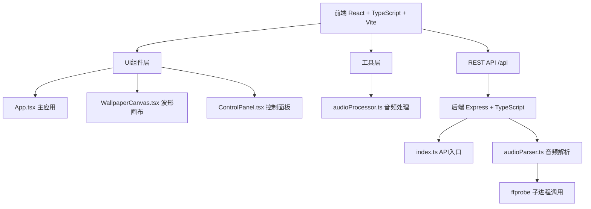

## 1. 架构设计



## 2. 技术描述

- **前端**：React 18 + TypeScript + Vite
- **UI样式**：原生CSS（深色主题，毛玻璃效果，圆角设计）
- **波形绘制**：Canvas 2D API + requestAnimationFrame（60FPS）
- **音频处理**：Web Audio API（前端实时分析）+ ffprobe（后端解析）
- **后端**：Express 4 + TypeScript
- **文件上传**：Multer中间件
- **跨域处理**：CORS中间件
- **代理配置**：Vite代理 /api 到后端端口3001

## 3. 目录结构

```
├── package.json
├── vite.config.js
├── tsconfig.json
├── index.html
├── src/
│   ├── App.tsx
│   ├── components/
│   │   ├── WallpaperCanvas.tsx
│   │   └── ControlPanel.tsx
│   └── utils/
│       └── audioProcessor.ts
└── server/
    ├── index.ts
    └── audioParser.ts
```

## 4. API定义

### 4.1 上传音频并获取波形数据

**POST** `/api/upload`

请求类型：`multipart/form-data`

| 参数 | 类型 | 描述 |
|------|------|------|
| audio | File | 音频文件 |

响应：
```typescript
interface WaveformResponse {
  success: boolean;
  filename: string;
  duration: number;
  sampleRate: number;
  samples: number[];  // 归一化波形数据 -1 ~ 1
}
```

## 5. 数据类型定义

```typescript
// 波形类型
type WaveformType = 'bars' | 'line' | 'dots';

// 渐变色方案
interface GradientScheme {
  name: string;
  colors: [string, string];
}

// 画布配置
interface CanvasConfig {
  waveformType: WaveformType;
  gradientColors: [string, string];
  backgroundColor: string;
  animationSmoothness: number; // 300ms
}

// 壁纸尺寸
type WallpaperSize = '1920x1080' | '1080x1920';
```

## 6. 性能优化策略

1. **Canvas渲染优化**：使用 requestAnimationFrame 保证60FPS，离屏Canvas缓存渐变
2. **音频处理**：前端使用 AnalyserNode 实时获取频域数据，避免阻塞主线程
3. **参数过渡**：CSS transition + 线性插值实现300ms平滑过渡
4. **后端解析**：使用 ffprobe 高效提取音频样本，流式处理大文件
