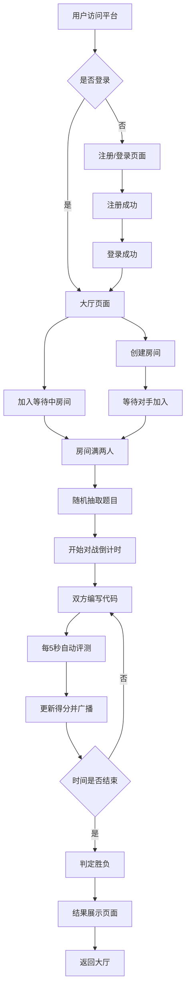

## 1. 产品概述

在线编程挑战竞技平台，支持用户注册登录后创建或加入实时编程对战房间，在限定时间内解决算法题目，系统自动对比代码输出结果并判定胜负。

- 核心目的：为编程爱好者提供实时算法竞技对战平台，提升编程技能和竞技乐趣
- 目标用户：编程学习者、算法爱好者、开发人员
- 市场价值：填补实时编程对战细分领域，提供沉浸式竞赛体验

## 2. 核心功能

### 2.1 用户角色
| 角色 | 注册方式 | 核心权限 |
|------|---------|----------|
| 普通用户 | 用户名+密码注册 | 登录后可创建/加入房间、参与对战、查看结果；未登录仅可浏览房间列表 |

### 2.2 功能模块
1. **登录注册模块**：用户注册、登录、JWT认证、密码加密存储
2. **大厅模块**：房间列表展示、创建房间、加入房间
3. **对战房间模块**：代码编辑器、计时器、题目展示、实时比分、代码提交评测
4. **结果模块**：胜负判定、得分统计、双方代码对比展示

### 2.3 页面详情
| 页面名称 | 模块名称 | 功能描述 |
|---------|---------|----------|
| 登录注册页 | 表单模块 | 用户名密码输入、注册/登录切换、表单验证、错误提示 |
| 大厅页 | 房间列表 | 网格布局展示房间卡片、房间信息、加入按钮、刷新功能 |
| 大厅页 | 创建房间 | 弹窗表单、房间名输入、时长选择（5/10/15分钟） |
| 对战房间页 | 题目面板 | 题目描述、示例输入输出、可折叠 |
| 对战房间页 | 代码编辑器 | 语法高亮、等宽字体、Tab缩进、实时保存 |
| 对战房间页 | 控制台 | 输出结果展示、错误行号提示 |
| 对战房间页 | 比分面板 | 双方头像昵称、得分、代码行数、实时更新动画 |
| 对战房间页 | 计时器 | 倒计时显示、时间到自动结束 |
| 结果页 | 胜负展示 | 获胜方标识、双方得分、用时、代码行数对比 |
| 结果页 | 代码对比 | 双方代码并排展示、语法高亮 |

## 3. 核心流程

用户在首页选择注册或登录，登录后进入大厅查看房间列表，可创建新房间或加入等待中的房间，房间满两人后自动开始对战，双方在限定时间内编写代码解决同一道算法题，系统每5秒自动评测双方代码输出，实时更新得分，时间结束后根据得分和代码行数判定胜负并展示结果页面。

## 4. 用户界面设计

### 4.1 设计风格
- 主题：暗色竞赛风格，营造沉浸式编程体验
- 主色调：#89b4fa（亮蓝色），用于强调、按钮、链接
- 背景色：#1e1e2e（深紫灰色）
- 卡片色：#2b2b3d（中紫灰色）
- 字体：代码区使用等宽字体（Fira Code / Consolas），正文使用现代无衬线字体
- 按钮风格：圆角8px，悬停有轻微上浮和阴影效果
- 布局风格：卡片式布局，网格排列，清晰的视觉层次

### 4.2 页面设计概述
| 页面名称 | 模块名称 | UI元素 |
|---------|---------|--------|
| 登录注册页 | 表单模块 | 暗色背景卡片、蓝色强调按钮、输入框焦点高亮、错误提示动画 |
| 大厅页 | 房间卡片 | 网格布局（每行3-4个）、卡片悬停上浮动画（transform: translateY(-4px)）、阴影过渡、玩家数1/2标识 |
| 对战房间页 | 主面板 | 左右分栏（7:3桌面端），左侧从上到下：题目区（可折叠）、代码编辑器、控制台输出 |
| 对战房间页 | 比分面板 | 右侧固定，双方信息垂直排列，得分变动时有scale缩放跳动动画 |
| 对战房间页 | 计时器 | 顶部居中，大号字体，最后30秒变红闪烁 |
| 结果页 | 胜负展示 | 居中大卡片，获胜方金色标识，双方数据对比表格，代码并排展示 |

### 4.3 响应式设计
- **桌面端（≥1024px）**：对战房间左右分栏7:3，大厅网格3列
- **平板端（768px-1023px）**：对战房间上下堆叠，大厅网格2列
- **手机端（<768px）**：只显示编辑器和比分，题目可折叠，大厅单列，按钮触控优化

### 4.4 动效设计
- 页面加载：卡片淡入+上移（staggered动画）
- 卡片悬停：transform: translateY(-4px) + 阴影增强，200ms过渡
- 得分更新：scale(1.2)缩放跳动150ms后恢复
- 倒计时结束：数字闪烁红色提醒
- 代码提交成功：绿色对勾动画
- 代码提交错误：红色叉号+错误行号高亮
