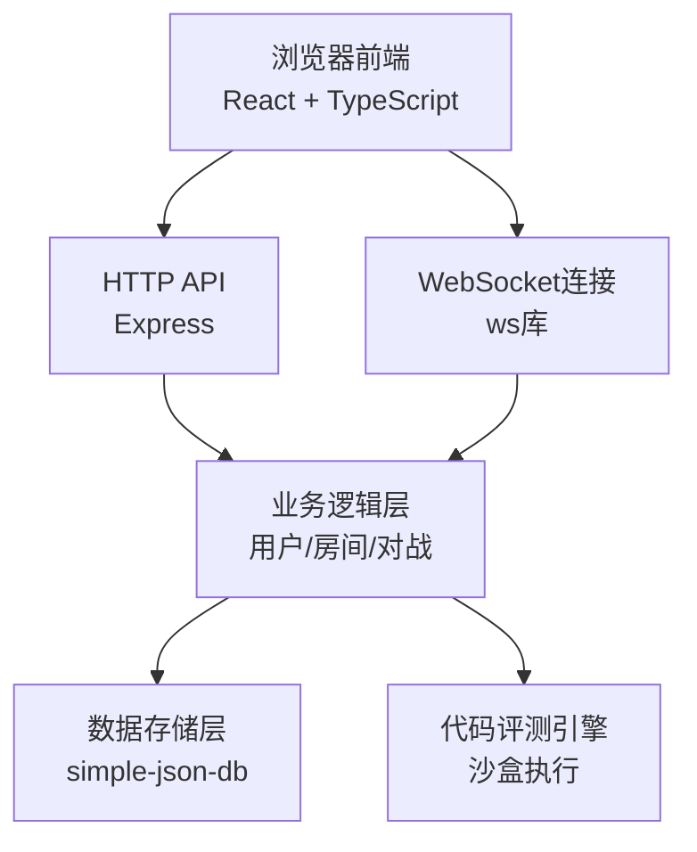

## 1. 架构设计



## 2. 技术描述

- **前端框架**：React 18 + TypeScript 5 + Vite 5
- **状态管理**：React Context + useState/useReducer
- **路由管理**：React Router v6
- **代码编辑器**：自定义语法高亮 textarea + Prism.js 或 CodeMirror 6
- **样式方案**：CSS Modules + CSS Variables，不使用Tailwind（用户未指定）
- **后端框架**：Express 4
- **WebSocket**：ws 8.x
- **数据存储**：simple-json-db（本地JSON文件存储）
- **密码加密**：bcrypt
- **Token认证**：JWT（jsonwebtoken）
- **唯一ID**：uuid

## 3. 项目结构

```
auto16/
├── package.json
├── vite.config.js
├── tsconfig.json
├── index.html
├── data/
│   └── db.json               # simple-json-db 数据文件
└── src/
    ├── server.ts             # 后端入口，Express + WebSocket
    ├── App.tsx               # 主应用组件，路由和状态
    ├── main.tsx              # React入口
    ├── types/
    │   └── index.ts          # 类型定义（前后端共享）
    ├── utils/
    │   ├── auth.ts           # JWT工具函数
    │   └── codeExecutor.ts   # 代码执行和评测
    ├── components/
    │   ├── Lobby.tsx         # 大厅组件
    │   ├── GameRoom.tsx      # 对战房间组件
    │   ├── Result.tsx        # 结果展示组件
    │   ├── Login.tsx         # 登录组件
    │   ├── Register.tsx      # 注册组件
    │   ├── CodeEditor.tsx    # 代码编辑器组件
    │   ├── Timer.tsx         # 计时器组件
    │   ├── ScorePanel.tsx    # 比分面板组件
    │   └── ProblemPanel.tsx  # 题目面板组件
    ├── hooks/
    │   └── useWebSocket.ts   # WebSocket连接Hook
    └── styles/
        └── variables.css     # CSS变量定义
```

## 4. 路由定义

| 路由路径 | 页面/组件 | 权限要求 |
|---------|----------|----------|
| /login | Login.tsx | 公开 |
| /register | Register.tsx | 公开 |
| /lobby | Lobby.tsx | 公开（未登录可浏览不可加入） |
| /room/:roomId | GameRoom.tsx | 需要登录 |
| /result/:roomId | Result.tsx | 需要登录 |
| * | 重定向到/lobby | - |

## 5. API 接口定义

### 5.1 用户相关

#### POST /api/register
请求体：
```typescript
{
  username: string;
  password: string;
}
```
响应：
```typescript
{
  success: boolean;
  message: string;
  userId?: string;
}
```

#### POST /api/login
请求体：
```typescript
{
  username: string;
  password: string;
}
```
响应：
```typescript
{
  success: boolean;
  token: string;
  user: {
    id: string;
    username: string;
  };
}
```

#### GET /api/user/info
请求头：`Authorization: Bearer <token>`
响应：
```typescript
{
  success: boolean;
  user: {
    id: string;
    username: string;
  };
}
```

### 5.2 房间相关

#### GET /api/rooms
响应：
```typescript
{
  success: boolean;
  rooms: Array<{
    id: string;
    name: string;
    hostId: string;
    hostName: string;
    playerCount: number;
    duration: number;
    status: 'waiting' | 'playing' | 'finished';
    createdAt: number;
  }>;
}
```

#### POST /api/rooms
请求头：`Authorization: Bearer <token>`
请求体：
```typescript
{
  name: string;
  duration: number; // 5 | 10 | 15
}
```
响应：
```typescript
{
  success: boolean;
  roomId: string;
}
```

#### POST /api/rooms/:roomId/join
请求头：`Authorization: Bearer <token>`
响应：
```typescript
{
  success: boolean;
  message: string;
  canJoin: boolean;
}
```

## 6. WebSocket 消息协议

### 连接鉴权
连接时通过 query 参数传递 token：
```
ws://localhost:3000/ws?token=<jwt_token>&roomId=<room_id>
```

### 消息类型定义

| type | 发送方 | 描述 | 数据结构 |
|------|--------|------|----------|
| `room_join` | 客户端 | 加入房间 | `{ roomId: string }` |
| `room_state` | 服务端 | 房间状态更新 | `{ players: Player[], status: string, problem?: Problem }` |
| `game_start` | 服务端 | 对战开始 | `{ problem: Problem, startTime: number, duration: number }` |
| `code_update` | 客户端 | 代码更新 | `{ code: string }` |
| `code_broadcast` | 服务端 | 广播对方代码（可选，用于实时预览） | `{ playerId: string, code: string, lineCount: number }` |
| `score_update` | 服务端 | 得分更新 | `{ playerId: string, score: number, testResults: TestResult[] }` |
| `timer_update` | 服务端 | 倒计时更新 | `{ remainingSeconds: number }` |
| `game_end` | 服务端 | 对战结束 | `{ winner: string, players: FinalPlayerResult[] }` |
| `error` | 服务端 | 错误消息 | `{ message: string }` |

### 数据类型定义

```typescript
interface User {
  id: string;
  username: string;
  passwordHash: string;
  createdAt: number;
}

interface Player {
  id: string;
  username: string;
  code: string;
  score: number;
  lineCount: number;
  testResults: TestResult[];
}

interface Room {
  id: string;
  name: string;
  hostId: string;
  players: Player[];
  duration: number; // 分钟
  status: 'waiting' | 'playing' | 'finished';
  problem: Problem | null;
  startTime: number | null;
  endTime: number | null;
  createdAt: number;
}

interface Problem {
  id: string;
  title: string;
  description: string;
  testCases: TestCase[];
  exampleInput: string;
  exampleOutput: string;
}

interface TestCase {
  input: string;
  expected: string;
}

interface TestResult {
  passed: boolean;
  input: string;
  expected: string;
  actual: string;
  errorLine?: number;
  executionTime: number;
}

interface FinalPlayerResult {
  id: string;
  username: string;
  score: number;
  code: string;
  lineCount: number;
  timeUsed: number;
}
```

## 7. 内置算法题目

### 题目1：两数之和
```
给定一个整数数组 nums 和一个目标值 target，在数组中找出和为目标值的两个整数。
返回它们的数组下标。
示例：
输入: nums = [2,7,11,15], target = 9
输出: [0,1]
```

### 题目2：反转字符串
```
编写一个函数，将输入的字符串反转过来。
示例：
输入: "hello"
输出: "olleh"
```

### 题目3：数组去重
```
给定一个排序数组，原地删除重复出现的元素，返回移除后数组的新长度。
示例：
输入: [1,1,2,2,3]
输出: 长度3，数组前3个元素为 [1,2,3]
```

## 8. 代码评测逻辑

### 执行流程
1. 每隔5秒检查双方代码，如有更新则执行评测
2. 使用 Node.js `vm` 模块在沙盒环境中执行玩家代码
3. 对每个测试用例，调用玩家代码获取输出
4. 比较实际输出与预期输出（支持 JSON 序列化比较）
5. 统计通过的测试用例数作为得分
6. 捕获运行时错误，记录错误行号

### 沙盒安全措施
- 使用 `vm.runInNewContext` 隔离执行环境
- 设置执行超时（500ms）防止死循环
- 禁止访问 `process`、`fs` 等危险模块
- 限制内存使用

## 9. 性能保障措施

| 性能指标 | 要求 | 实现方案 |
|---------|------|----------|
| 编辑器输入延迟 | ≤100ms | 使用受控textarea + requestAnimationFrame更新 |
| WebSocket广播延迟 | ≤200ms | 内存状态 + 直接消息转发 + 避免不必要广播 |
| 房间状态刷新 | ≤5秒一次 | 前端轮询 + 仅状态变更时推送 |
| 首次加载 | <2秒 | 代码分割 + 小体积依赖 + 懒加载非关键资源 |
| 代码执行 | <500ms/次 | 沙盒超时限制 + 测试用例并行执行 |
