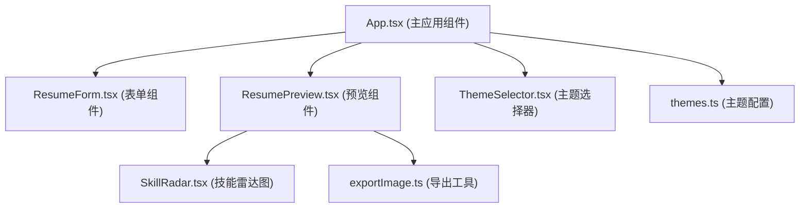

## 1. 架构设计



## 2. 技术栈说明

- 前端框架：React 18 + TypeScript
- 构建工具：Vite
- 状态管理：React useState/useReducer（轻量状态，无需额外状态库
- 样式方案：CSS变量 + 内联样式
- 图片导出：html2canvas
- 颜色选择：react-colorful（可选扩展）
- Canvas绘图：原生Canvas API（自绘雷达图

## 3. 目录结构

```
src/
├── App.tsx              # 主应用组件，全局状态管理
├── components/
│   ├── ResumeForm.tsx    # 简历表单组件
│   ├── ResumePreview.tsx # 简历预览组件
│   ├── ThemeSelector.tsx  # 主题选择组件
│   └── SkillRadar.tsx    # 技能雷达图组件
├── styles/
│   └── themes.ts        # 主题样式定义
└── utils/
    └── exportImage.ts    # 图片导出工具
```

## 4. 数据模型

### 4.1 简历数据类型

```typescript
interface BasicInfo {
  name: string;
  title: string;
  email: string;
  phone: string;
  summary: string;
}

interface Education {
  id: string;
  school: string;
  major: string;
  period: string;
  description: string;
}

interface WorkExperience {
  id: string;
  company: string;
  position: string;
  period: string;
  description: string;
}

interface Skill {
  name: string;
  value: number;
}

interface ResumeData {
  basicInfo: BasicInfo;
  education: Education[];
  workExperience: WorkExperience[];
  skills: Skill[];
}
```

### 4.2 主题类型

```typescript
interface Theme {
  name: string;
  primaryColor: string;
  secondaryColor: string;
  backgroundColor: string;
  textColor: string;
  accentColor: string;
  fontFamily: string;
  headingFont: string;
}
```

## 5. 核心功能实现方案

### 5.1 实时预览
- 使用React状态提升到App组件
- 表单输入通过onChange实时更新状态
- 预览组件通过props接收数据实时渲染

### 5.2 主题切换
- CSS变量实现主题切换
- 0.4s transition动画
- 颜色和字体同时切换

### 5.3 拖拽排序
- HTML5原生拖拽API
- 教育经历和工作经历支持拖拽排序

### 5.4 技能雷达图
- Canvas 2D API绘制六边形雷达图
- 5个技能维度
- 随主题颜色变化

### 5.5 图片导出
- html2canvas库实现DOM转图片
- 闪光动画效果
- 自动下载PNG

## 6. 性能优化

- 表单输入与预览延迟 < 16ms（60FPS）
- 主题切换动画 > 30FPS
- 图片导出 < 1秒
- 使用React.memo优化预览组件
- 合理使用useMemo/useCallback
