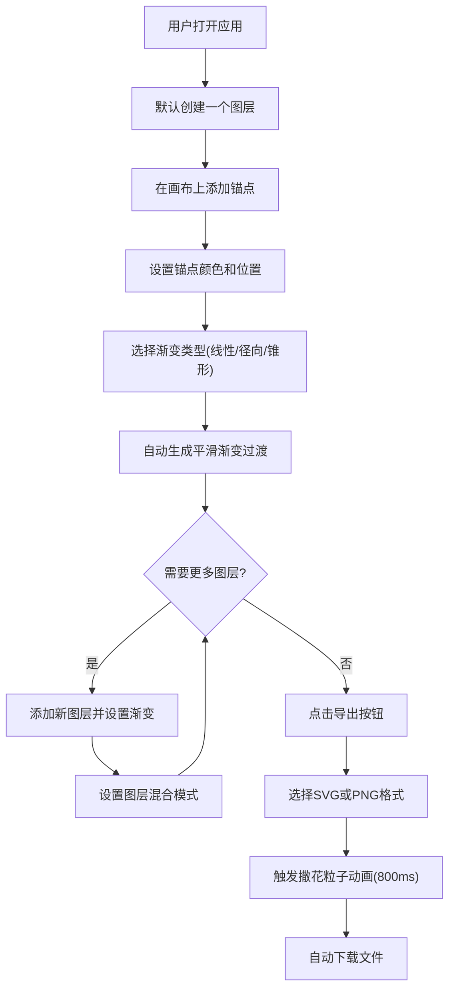
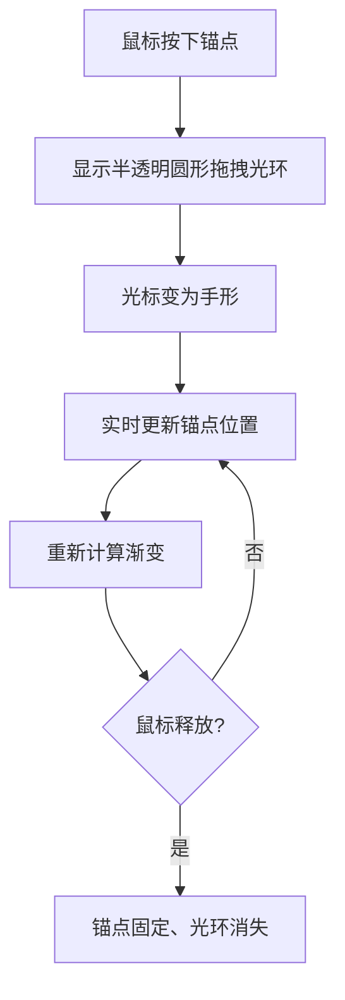

## 1. 产品概述

SVG渐变纹理设计器是一款面向前端设计师的轻量级在线工具，用于在快速原型阶段交互式创建和导出独特的渐变背景图案（径向、线性、锥形渐变），解决设计师缺乏便捷在线工具生成渐变SVG纹理的痛点。

- 目标用户：前端设计师、UI设计师、视觉创作者
- 核心价值：零安装、即时创作、一键导出SVG/PNG

## 2. 核心功能

### 2.1 用户角色

| 角色 | 使用方式 | 核心权限 |
|------|----------|----------|
| 设计师 | 直接访问 | 全部功能：创建、编辑、导出 |

### 2.2 功能模块

1. **主画布页面**：SVG画布渲染、锚点交互、渐变生成、缩略图导航、缩放平移
2. **属性面板**：渐变类型切换、锚点颜色编辑、图层管理与混合模式

### 2.3 页面详情

| 页面名称 | 模块名称 | 功能描述 |
|----------|----------|----------|
| 主画布页面 | SVG画布 | 棋盘格透明背景、SVG渐变渲染、锚点绘制与拖拽、滚轮缩放(50%-200%)、空格+拖拽平移、缩略图导航(150x150) |
| 主画布页面 | 顶部栏 | 应用标题、导出按钮（下拉菜单选SVG/PNG格式） |
| 主画布页面 | 属性面板 | 渐变类型按钮组(线性/径向/锥形)、锚点列表与颜色选择器、图层列表(拖拽排序/显隐/重命名/删除)、混合模式选择(正常/正片叠底/滤色/叠加/柔光)、面板折叠/展开 |

## 3. 核心流程

锚点拖拽流程：

## 4. 用户界面设计

### 4.1 设计风格

- 主色调：深色主题（背景#1a1a2e，面板#16213e，主色#0f3460，强调色#e94560）
- 按钮风格：圆角矩形，强调色高亮，悬停过渡200ms
- 字体：标题使用独特展示字体，正文使用高可读性UI字体
- 布局风格：左侧画布(70%) + 右侧属性面板(280px)
- 图标风格：线条图标(lucide-react)

### 4.2 页面设计概览

| 页面名称 | 模块名称 | UI元素 |
|----------|----------|--------|
| 主画布页面 | 顶部栏 | 深色背景、左侧标题文字、右侧导出下拉按钮 |
| 主画布页面 | 画布区域 | 棋盘格背景、SVG渐变预览、可拖拽锚点(圆形带光环)、右上角缩略图导航窗 |
| 主画布页面 | 属性面板 | 可折叠面板(280px↔50px)、渐变类型按钮组、锚点列表(颜色选择器+位置)、图层列表(拖拽排序+显隐+重命名+删除)、混合模式下拉选择 |

### 4.3 响应式设计

- 桌面优先设计，最小支持1280px宽度
- 画布区域自适应剩余空间
- 属性面板折叠时画布自动扩展

### 4.4 动画规格

- 渐变类型切换：平滑过渡动画300ms
- 面板折叠/展开：200ms ease-in-out
- 按钮悬停/点击：200ms ease-in-out
- 导出撒花粒子：800ms
- 锚点拖拽光环：实时响应
- 画布渲染帧率：≥50fps
