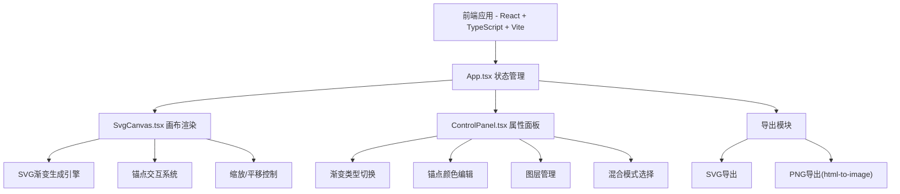

## 1. 架构设计



## 2. 技术说明

- 前端：React@18 + TypeScript + Vite
- 初始化工具：vite-init (react-ts模板)
- 状态管理：zustand
- 样式方案：Tailwind CSS + CSS变量（深色主题token）
- 图标库：lucide-react
- 导出依赖：html-to-image（PNG导出）、file-saver（文件下载）
- 无后端：纯前端应用

## 3. 路由定义

| 路由 | 用途 |
|------|------|
| / | 主页面，包含画布和属性面板 |

## 4. 数据模型

### 4.1 核心类型定义

```typescript
interface AnchorPoint {
  id: string;
  x: number;
  y: number;
  color: string;
  type: 'start' | 'end';
}

type GradientType = 'linear' | 'radial' | 'conic';

type BlendMode = 'normal' | 'multiply' | 'screen' | 'overlay' | 'soft-light';

interface Layer {
  id: string;
  name: string;
  visible: boolean;
  gradientType: GradientType;
  anchors: AnchorPoint[];
  blendMode: BlendMode;
  order: number;
}

interface CanvasState {
  zoom: number;
  panX: number;
  panY: number;
}
```

### 4.2 状态结构 (zustand)

```typescript
interface AppStore {
  layers: Layer[];
  activeLayerId: string;
  canvasState: CanvasState;
  panelCollapsed: boolean;

  addLayer: () => void;
  removeLayer: (id: string) => void;
  updateLayer: (id: string, partial: Partial<Layer>) => void;
  reorderLayers: (ids: string[]) => void;
  setActiveLayer: (id: string) => void;

  addAnchor: (layerId: string, anchor: AnchorPoint) => void;
  updateAnchor: (layerId: string, anchorId: string, partial: Partial<AnchorPoint>) => void;
  removeAnchor: (layerId: string, anchorId: string) => void;

  setZoom: (zoom: number) => void;
  setPan: (x: number, y: number) => void;
  togglePanel: () => void;
}
```

## 5. 文件结构

```
├── index.html
├── package.json
├── vite.config.js
├── tsconfig.json
├── src/
│   ├── App.tsx           # 主应用组件，布局和状态管理
│   ├── SvgCanvas.tsx     # SVG画布渲染和交互
│   ├── ControlPanel.tsx  # 右侧属性面板
│   ├── main.tsx          # 入口文件
│   ├── store.ts          # zustand状态管理
│   ├── types.ts          # 类型定义
│   └── index.css         # 全局样式和CSS变量
```

## 6. 性能策略

- 锚点拖拽使用requestAnimationFrame确保≥50fps
- 渐变类型切换使用CSS transition实现300ms动画
- 图层渲染使用SVG元素组合，避免重绘
- PNG导出使用html-to-image库，目标响应时间<500ms
- 缩放/平移使用SVG transform避免DOM重排
