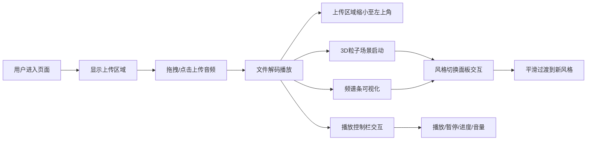

## 1. 产品概述
音乐播放器频谱可视化应用是一个基于 Web 的交互式音频可视化工具，用户上传音频文件后，系统实时提取音频频谱数据，驱动 3D 粒子在 Three.js 场景中呈现动态的粒子风暴效果。

- 主要用途：音乐可视化欣赏、音频节奏可视化展示
- 目标用户：音乐爱好者、视觉设计师、直播场景
- 核心价值：将抽象的音频转化为震撼的视觉体验，支持多种可视化风格切换

## 2. 核心功能

### 2.1 功能模块
1. **音频上传模块**：支持拖拽或点击上传 MP3/WAV 格式音频文件
2. **音频分析模块**：通过 Web Audio API 实时分析音频频谱数据
3. **3D 粒子场景模块**：Three.js 渲染，粒子根据音频频率动态变化
4. **风格切换模块**：三种可视化风格（火焰、星云、极光）平滑切换
5. **频谱条可视化模块**：Canvas 绘制频谱条辅助视图
6. **播放控制模块**：播放/暂停、进度条、音量调节

### 2.2 页面详情
| 页面名称 | 模块名称 | 功能描述 |
|-----------|-------------|---------------------|
| 主页面 | 上传区域 | 虚线圆角矩形上传区域，支持拖拽和点击，拖拽时高亮放大 |
| 主页面 | 3D 粒子场景 | Three.js 全屏粒子风暴，随音乐节奏动态变化 |
| 主页面 | 风格切换面板 | 右侧悬浮面板，三个风格按钮，平滑过渡 |
| 主页面 | 频谱条视图 | 底部 Canvas 频谱条，颜色与当前风格同步 |
| 主页面 | 播放控制栏 | 底部半透明毛玻璃控制栏，播放/暂停、进度、音量 |
| 主页面 | 文件信息显示 | 左上角显示文件名和当前风格名称 |

## 3. 核心流程

用户进入页面 → 看到居中的上传区域 → 拖拽或点击上传音频文件 → 文件开始解码播放 → 上传区域缩小至左上角 → 3D 粒子场景自动启动（默认火焰风格）→ 频谱条随音乐跳动 → 用户可点击右侧风格按钮切换可视化效果 → 用户可通过底部控制栏控制播放

## 4. 用户界面设计

### 4.1 设计风格
- **主题色**：深色主题（背景 #0d0d0d）
- **主色调**：根据风格动态变化（火焰：红橙黄 / 星云：蓝紫 / 极光：绿蓝）
- **按钮风格**：圆角矩形，悬浮有亮蓝色边框高亮，200ms 过渡动画
- **字体**：无衬线体，白色文字，字号 16px（信息显示）
- **布局风格**：全屏沉浸式，左侧信息、右侧风格面板、底部控制栏
- **毛玻璃效果**：底部控制栏使用 rgba(255,255,255,0.08) 背景，边框模糊 10px

### 4.2 页面设计概述
| 页面名称 | 模块名称 | UI 元素 |
|-----------|-------------|-------------|
| 主页面 | 上传区域 | 虚线圆角矩形，#888 边框，拖拽时亮蓝色并放大，300ms ease 过渡 |
| 主页面 | 3D 场景 | 全屏 Three.js 渲染，宽度 100%，高度 calc(100vh - 120px) |
| 主页面 | 风格切换面板 | 右侧悬浮，三个按钮，点击平滑过渡 1 秒 |
| 主页面 | 频谱条 | Canvas 绘制，颜色与风格同步，60FPS |
| 主页面 | 播放控制栏 | 底部固定，半透明毛玻璃，播放按钮、进度条、音量滑块 |
| 主页面 | 文件信息 | 左上角，文件名和风格名，白色无衬线字体 |

### 4.3 响应式设计
- 桌面端优先设计
- 控制栏在小屏幕上自适应布局

### 4.4 3D 场景设计
- **环境**：深色背景，营造沉浸感
- **粒子系统**：最大 15000 个粒子，从中心向外扩散，逐渐消失
- **相机**：固定视角，观察粒子风暴效果
- **交互**：粒子颜色、大小、速度随音乐节奏变化
- **性能**：60FPS 流畅渲染，切换风格无白屏闪烁
- **风格差异**：
  - 火焰：红橙黄渐变，粒子运动剧烈
  - 星云：蓝紫渐变，微粒闪烁
  - 极光：绿蓝渐变，沿垂直方向波动
