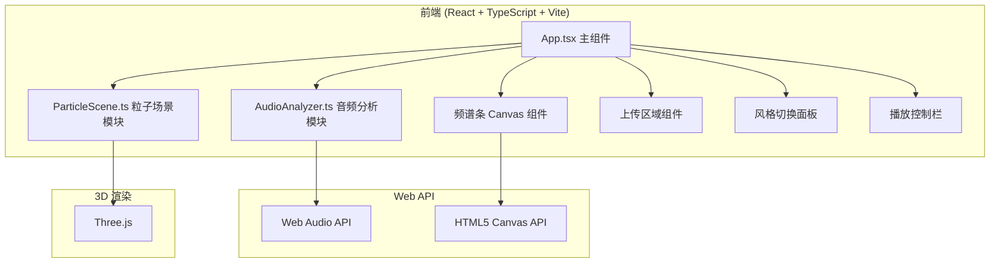

## 1. 架构设计



## 2. 技术描述

- **前端框架**：React 18 + TypeScript
- **构建工具**：Vite 5.x
- **3D 渲染**：Three.js 0.160.x + @types/three
- **音频处理**：Web Audio API（AnalyserNode）
- **状态管理**：React Hooks（useState、useEffect、useRef、useCallback）
- **样式方案**：原生 CSS（无 UI 框架，自定义样式）

**不使用后端**：纯前端应用，所有处理在浏览器端完成。

## 3. 文件结构

| 文件路径 | 用途 |
|----------|------|
| `package.json` | 项目依赖和脚本配置 |
| `vite.config.js` | Vite 构建配置（base: './'） |
| `tsconfig.json` | TypeScript 配置（严格模式，JSX: react-jsx） |
| `index.html` | 入口 HTML，包含根节点 `<div id="root">` |
| `src/App.tsx` | React 主组件，状态管理和 UI 布局 |
| `src/AudioAnalyzer.ts` | 音频分析模块，自定义 hook，Web Audio API 封装 |
| `src/ParticleScene.ts` | Three.js 粒子场景渲染模块 |
| `src/index.css` | 全局样式 |
| `src/main.tsx` | 应用入口 |

## 4. 核心模块设计

### 4.1 AudioAnalyzer 模块
- **功能**：解码音频文件，实时输出频谱数据
- **接口**：`useAudioAnalyzer()` hook
- **返回值**：
  - `analyser`：AnalyserNode 实例
  - `dataArray`：Uint8Array 频谱数据
  - `audioElement`：音频元素
  - `loadAudio(file: File)`：加载音频文件
  - `play()` / `pause()`：播放控制
  - `currentTime` / `duration`：进度信息
  - `volume`：音量控制
  - `isPlaying`：播放状态

### 4.2 ParticleScene 模块
- **功能**：Three.js 粒子系统，根据频谱数据渲染动态粒子
- **风格**：火焰、星云、极光
- **接口**：
  - `init(container: HTMLElement)`：初始化场景
  - `update(spectrumData: Uint8Array)`：更新粒子状态
  - `setStyle(style: StyleType)`：切换可视化风格
  - `dispose()`：清理资源
- **粒子控制**：
  - 低频（0-200Hz）→ 粒子生成速率
  - 高频（2000-8000Hz）→ 粒子扩散速度
  - 中频（200-2000Hz）→ 粒子颜色饱和度

### 4.3 频谱条模块
- 使用 Canvas 2D 绘制
- 颜色与当前粒子风格同步
- 60FPS 刷新率
- 条柱数量与 FFT 大小对应

## 5. 性能优化策略

- **粒子池化**：使用对象池复用粒子，避免频繁创建销毁
- **BufferGeometry**：使用 Three.js BufferGeometry 提升性能
- **ShaderMaterial**：使用自定义着色器实现粒子颜色和大小变化
- **帧率控制**：requestAnimationFrame 确保 60FPS
- **频谱数据降采样**：减少频谱条数量，平衡视觉效果与性能
- **风格过渡**：使用线性插值平滑过渡颜色和参数，避免重新初始化场景

## 6. 类型定义

```typescript
type VisualStyle = 'flame' | 'nebula' | 'aurora';

interface SpectrumData {
  lowFrequency: number;    // 0-200Hz 平均能量
  midFrequency: number;    // 200-2000Hz 平均能量
  highFrequency: number;   // 2000-8000Hz 平均能量
  rawData: Uint8Array;     // 原始频谱数据
}

interface ParticleStyleConfig {
  colorStart: string;      // 起始颜色
  colorEnd: string;        // 结束颜色
  particleSize: number;    // 粒子大小
  speed: number;           // 运动速度
  fadeRate: number;        // 消散速度
  motionPattern: 'radial' | 'wave' | 'spiral';
}
```
