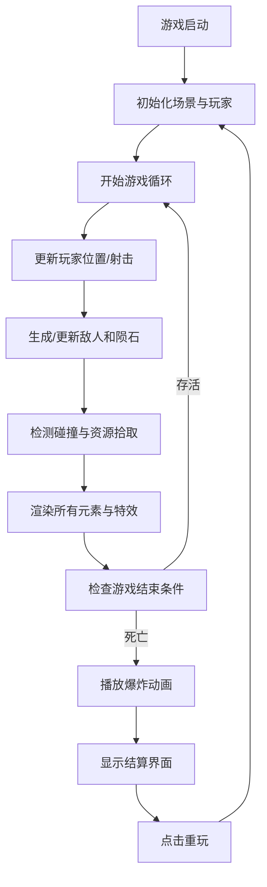

## 1. 产品概述

太空废墟生存者是一款基于Canvas的自上而下视角太空生存射击游戏，玩家操控飞船在太空废墟中收集资源、躲避陨石、击退敌人，挑战生存极限。

- 核心玩法：生存射击 + 资源收集 + 技能释放
- 目标用户：休闲游戏爱好者，网页游戏玩家
- 产品价值：提供快节奏、沉浸式的太空生存体验，无需下载即可在浏览器中游玩

## 2. 核心功能

### 2.1 功能模块

1. **游戏主场景**：Canvas渲染、背景星空、游戏循环
2. **玩家系统**：飞船移动、定向射击、护盾技能、碰撞检测、资源拾取
3. **敌人系统**：敌人生成与AI、陨石生成与移动、碰撞销毁
4. **资源系统**：晶体生成、闪烁动画、自动拾取、资源积累
5. **HUD系统**：得分显示、生存时间、资源条、技能冷却、游戏结束界面
6. **特效系统**：子弹弹道、击中爆炸粒子、护盾光晕、飞船爆炸碎裂动画

### 2.2 页面详情

| 页面名称 | 模块名称 | 功能描述 |
|-----------|-------------|---------------------|
| 游戏主界面 | 背景渲染 | 深空蓝黑渐变背景、星星闪烁动画 |
| 游戏主界面 | 玩家飞船 | WASD移动控制、鼠标点击定向射击、护盾技能激活 |
| 游戏主界面 | 敌人陨石 | 屏幕边缘随机生成、数量随时间递增、碰撞伤害 |
| 游戏主界面 | 资源晶体 | 随机分布、青蓝到紫罗兰渐变、闪烁动画、自动拾取 |
| 游戏主界面 | HUD面板 | 半透明圆角矩形、得分/生存时间显示、资源条、技能状态 |
| 游戏主界面 | 特效系统 | 子弹轨迹、击中爆炸、护盾光晕、飞船爆炸碎裂 |
| 游戏结束界面 | 统计面板 | 最终得分、生存时间、拾取资源数、重玩按钮 |

## 3. 核心流程

## 4. 用户界面设计

### 4.1 设计风格

- **主色调**：深空蓝黑渐变背景 (#0a0e1a → #1a1f3a)
- **强调色**：青蓝色 (#00ffff)、紫罗兰色 (#8a2be2)
- **中性色**：半透明深灰面板、青白色发光文字
- **风格定位**：像素风 + 科幻霓虹 + 深空氛围

### 4.2 视觉元素

- **飞船**：16x16像素风色块绘制，主体青蓝色，引擎尾焰动画
- **敌人**：16x16像素风，红色主色调，异形外观
- **陨石**：灰褐色随机多边形，带裂纹纹理
- **资源晶体**：青蓝色到紫罗兰色渐变，菱形外观，闪烁动画
- **HUD面板**：半透明圆角矩形，横跨屏幕顶部，青白色发光文字
- **界面动画**：所有元素轻微呼吸动画，技能激活时脉冲效果

### 4.3 响应式设计

- 桌面横屏优先，自适应窗口大小
- Canvas容器全屏显示，保持游戏画面比例
- HUD元素相对定位，适配不同屏幕尺寸

### 4.4 性能要求

- 稳定60FPS帧率
- 高效的Canvas渲染循环
- 对象池管理减少GC开销
- 碰撞检测优化
