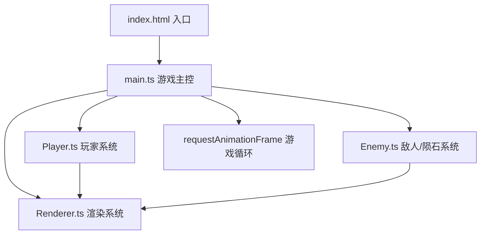

## 1. 架构设计



## 2. 技术描述

- **构建工具**：Vite@5
- **开发语言**：TypeScript@5 (严格模式，target ES2020)
- **渲染引擎**：原生 Canvas 2D API
- **无外部游戏引擎依赖**

## 3. 文件结构定义

| 文件路径 | 职责描述 |
|----------|----------|
| `package.json` | 项目配置，依赖管理，启动脚本 |
| `index.html` | HTML入口，全屏Canvas容器 |
| `tsconfig.json` | TypeScript编译配置 (严格模式，ES2020) |
| `vite.config.js` | Vite配置，开发服务器端口3000 |
| `src/main.ts` | 游戏主循环，状态管理，事件调度 |
| `src/Player.ts` | 玩家飞船类：移动、射击、护盾、碰撞、拾取 |
| `src/Enemy.ts` | 敌人类 & 陨石类：生成、移动、碰撞、销毁 |
| `src/Renderer.ts` | Canvas渲染：背景、实体、HUD、特效 |

## 4. 核心数据类型定义

```typescript
// 游戏状态
type GameState = 'playing' | 'gameover';

// 位置接口
interface Position {
  x: number;
  y: number;
}

// 速度接口
interface Velocity {
  vx: number;
  vy: number;
}

// 游戏实体基类
interface Entity extends Position {
  width: number;
  height: number;
  active: boolean;
}

// 玩家状态
interface PlayerState extends Entity {
  speed: number;
  health: number;
  resources: number;
  score: number;
  shieldActive: boolean;
  shieldCooldown: number;
  shieldDuration: number;
  survivalTime: number;
  resourcesCollected: number;
}

// 子弹状态
interface Bullet extends Entity, Velocity {
  damage: number;
}

// 敌人状态
interface Enemy extends Entity, Velocity {
  health: number;
  type: 'enemy' | 'asteroid';
  speed: number;
}

// 资源晶体
interface Crystal extends Entity {
  glowPhase: number;
  value: number;
}

// 粒子特效
interface Particle extends Position, Velocity {
  life: number;
  maxLife: number;
  color: string;
  size: number;
}

// 爆炸碎片
interface Debris extends Position, Velocity {
  life: number;
  maxLife: number;
  rotation: number;
  rotationSpeed: number;
  size: number;
  color: string;
}
```

## 5. 性能优化策略

### 5.1 渲染优化
- 使用 `requestAnimationFrame` 实现60FPS游戏循环
- 分层渲染：静态背景 → 动态实体 → UI层
- 离屏Canvas缓存星空背景
- 合理使用 `save()`/`restore()` 减少状态切换

### 5.2 内存管理
- 对象池模式复用子弹、粒子、碎片对象
- 及时标记 `active: false` 便于GC回收
- 限制同屏实体数量上限

### 5.3 碰撞检测优化
- 空间分区（网格划分）减少碰撞检测次数
- 圆形碰撞检测替代精确像素检测
- 按距离排序，提前排除远距离实体

## 6. 核心算法

### 6.1 游戏主循环
```typescript
let lastTime = 0;
function loop(timestamp: number) {
  const deltaTime = Math.min((timestamp - lastTime) / 1000, 0.1);
  lastTime = timestamp;
  update(deltaTime);
  render();
  requestAnimationFrame(loop);
}
```

### 6.2 玩家移动
- WASD按键状态映射 → 方向向量归一化 → 速度计算
- 边界检测防止飞船移出屏幕

### 6.3 射击系统
- 鼠标位置 → 计算射击方向 → 生成子弹
- 子弹轨迹：位置 += 速度 × 时间

### 6.4 敌人生成
- 基于生存时间的难度曲线
- 屏幕外边缘随机位置生成
- 朝向玩家位置的移动向量

### 6.5 护盾技能
- 资源满100激活 → 点击底部按钮触发
- 15秒冷却计时
- 5秒无敌时间 + 光晕旋转动画
