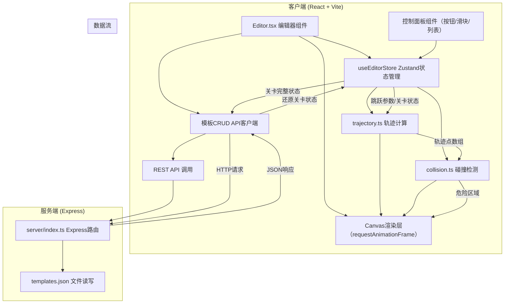
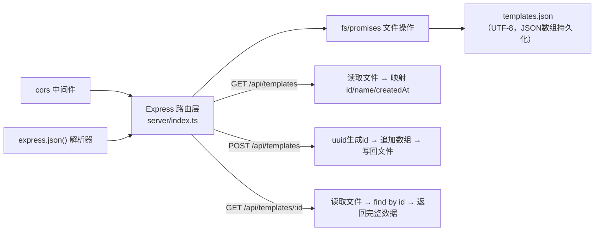

## 1. 架构设计



## 2. 技术说明

- **前端框架**：React@18 + TypeScript@5（严格模式）
- **构建工具**：Vite@5 + @vitejs/plugin-react，`base: './'`
- **状态管理**：Zustand@4（存储关卡状态、历史栈、选中项）
- **UI库**：lucide-react（图标），无额外UI框架（手写CSS）
- **样式方案**：内联CSS + CSS Modules（scoped样式，避免命名冲突）
- **后端框架**：Express@4 + cors@2 + uuid@9
- **后端语言**：TypeScript（编译为ESM运行，或tsx直接运行）
- **存储**：本地JSON文件 `server/templates.json`

## 3. 路由定义（后端）

| 路由 | 方法 | 用途 |
|-------|------|---------|
| `/api/templates` | GET | 获取所有关卡模板列表（id + name + createdAt） |
| `/api/templates` | POST | 保存新模板（body含name和完整关卡数据），返回新模板id |
| `/api/templates/:id` | GET | 根据id获取单个模板的完整数据 |

## 4. API 类型定义

```typescript
// ============ 共享数据模型（可放 shared/types.ts） ============

// 平台元素：矩形，可拖拽位置+调整大小
export interface Platform {
  id: string;
  type: 'platform';
  x: number;       // 左上角x
  y: number;       // 左上角y
  width: number;
  height: number;
}

// 尖刺元素：三角形，可45度步进旋转
export interface Spike {
  id: string;
  type: 'spike';
  x: number;       // 中心点x
  y: number;       // 中心点y
  size: number;    // 三角形外接正方形边长
  rotation: 0 | 45 | 90 | 135 | 180 | 225 | 270 | 315; // 角度
}

// 跳跃起点
export interface PlayerStart {
  x: number;
  y: number;
}

// 跳跃力度参数
export interface JumpParams {
  vx: number;  // 水平速度 0-500 px/s
  vy: number;  // 垂直速度 0-500 px/s（正值向上）
}

// 物理常量
export const PHYSICS = {
  GRAVITY: 1200,  // px/s²，像素级重力加速度
  DT: 1/60,       // 物理步进
  MAX_T: 5,       // 最大模拟时间 秒
  POINT_SPACING: 10, // 轨迹点间距 px
} as const;

// 关卡完整状态（保存/加载/导入导出）
export interface LevelState {
  platforms: Platform[];
  spikes: Spike[];
  playerStart: PlayerStart;
  jumpParams: JumpParams;
  canvasWidth: number;
  canvasHeight: number;
}

// 模板元数据（列表项）
export interface TemplateMeta {
  id: string;
  name: string;
  createdAt: number;
}

// 完整模板
export interface LevelTemplate extends TemplateMeta {
  level: LevelState;
}

// ============ 轨迹与碰撞 ============

// 单个轨迹点
export interface TrajectoryPoint {
  x: number;
  y: number;
  t: number;     // 时间 s
  vx: number;
  vy: number;
}

// 危险区域（碰撞）
export interface HazardZone {
  id: string;
  type: 'spike_hit' | 'out_of_bounds';  // 撞到尖刺 或 超出边界
  startIndex: number;  // 轨迹数组起始下标
  endIndex: number;    // 轨迹数组结束下标
  collisionX: number;  // 碰撞位置坐标（取第一个命中点）
  collisionY: number;
  elementId?: string;  // 涉及的元素id（尖刺用）
}

// ============ 响应结构 ============

// GET /api/templates → TemplateMeta[]
// POST /api/templates (body: { name: string, level: LevelState }) → { id: string, ok: true }
// GET /api/templates/:id → LevelTemplate
```

## 5. 服务端架构图



## 6. 文件结构与调用关系

```
d:\Pro\tasks\auto171\
├── package.json                    # 依赖+脚本：npm run dev（并行启动Vite+Express）
├── vite.config.js                  # Vite配置，base: './'，代理 /api → Express
├── tsconfig.json                   # TS严格模式配置
├── index.html                      # 入口HTML
├── src/
│   ├── main.tsx                    # React入口，挂载<App/>
│   ├── App.tsx                     # 顶层布局（画布+控制面板响应式容器）
│   ├── components/
│   │   ├── Editor.tsx              # 关卡编辑器（画布+拖拽逻辑+绘制）
│   │   │   └── 调用: trajectory.ts, collision.ts, apiClient
│   │   ├── ControlPanel.tsx        # 右侧控制面板（滑块+按钮+危险列表）
│   │   ├── TemplateSelector.tsx    # 模板加载下拉菜单
│   │   └── Modal.tsx               # 保存模板时的命名弹窗
│   ├── utils/
│   │   ├── trajectory.ts           # 抛物线物理模拟 → TrajectoryPoint[]
│   │   ├── collision.ts            # 轨迹×元素碰撞 → HazardZone[]
│   │   ├── history.ts              # 撤销/重做历史栈工具
│   │   └── geometry.ts             # 几何工具：点线与矩形/三角形求交
│   ├── stores/
│   │   └── useEditorStore.ts       # Zustand：levelState+history+selected
│   ├── api/
│   │   └── apiClient.ts            # fetch封装：GET/POST模板接口
│   └── types/
│       └── shared.ts               # 共享类型（Platform/Spike/LevelState等）
└── server/
    ├── index.ts                    # Express入口：3路由+cors+json
    ├── tsconfig.json               # 服务端TS配置（Node18 ESM）
    └── templates.json              # LevelTemplate数组持久化
```

**调用关系链**：
1. 用户操作 → `ControlPanel.tsx` / `Editor.tsx` → dispatch 到 `useEditorStore`
2. `useEditorStore` 状态变更 → `Editor.tsx` 订阅 → 调用 `trajectory.calculate(store.start, store.params)` 获得轨迹点
3. 轨迹点 → 调用 `collision.detect(points, store.platforms, store.spikes, canvasBounds)` 获得危险区
4. 结果 → Canvas 绘制（平台=绿、尖刺=橙、轨迹=蓝虚线、碰撞段=红实线4px、起点=绿圆）
5. 保存模板 → `Modal` 输入名称 → `apiClient.saveTemplate(name, store.levelState)` → POST 后端 → 写 `templates.json`
6. 加载模板 → `TemplateSelector` 选择 → `apiClient.getTemplate(id)` → GET → 替换 store.levelState → 重绘

## 7. 性能保障措施

- **requestAnimationFrame 渲染**：所有Canvas绘制走rAF，避免重排闪烁
- **节流参数更新**：滑块`onInput`直接更新store，但轨迹计算用`useMemo`依赖稳定引用，≤30ms完成
- **增量碰撞检测**：每段轨迹（10px步进）逐个元素SAT/包围盒粗判→精判，避免O(n²)退化
- **引用稳定**：Zustand selector避免不必要重渲染，Canvas节点用ref直接操作
- **双缓冲绘制**：每帧先clearRect再一次性绘制所有元素，避免逐元素合成导致撕裂
