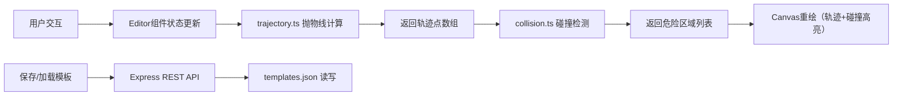

## 1. 产品概述

2D平台跳跃路径预测与危险区域标记工具，为独立游戏工作室提供快速验证关卡跳跃可行性的编辑器。通过抛物线物理模拟实时预测玩家跳跃轨迹，标记碰撞危险区域，支持关卡模板的保存、加载、导入和导出。

- **核心目标**：降低关卡设计迭代成本，让设计师在编辑阶段即可预判跳跃路径的安全性
- **目标用户**：独立游戏工作室的关卡设计师、策划人员
- **市场价值**：减少游戏测试阶段的反复调整，提升关卡设计效率

## 2. 核心特性

### 2.1 功能模块

1. **关卡编辑器**：平台放置/调整、尖刺放置/旋转、玩家起点拖拽、历史记录撤销重做
2. **轨迹预测**：实时抛物线计算、蓝色虚线轨迹绘制、碰撞片段红色高亮
3. **碰撞检测**：轨迹与尖刺/平台边缘碰撞判定、危险区域列表展示
4. **关卡管理**：模板保存到后端、模板下拉加载、JSON文件导入导出

### 2.2 页面详情

| 页面名称 | 模块名称 | 功能描述 |
|-----------|-------------|---------------------|
| 主页面 | 画布区域 | 左侧70%宽深色画布，支持平台/尖刺/起点的放置与拖拽编辑 |
| 主页面 | 控制面板 | 右侧30%宽毛玻璃面板，包含跳跃参数滑块、操作按钮组、危险区域列表 |
| 主页面 | 轨迹绘制层 | 实时渲染抛物线轨迹（蓝色虚线）及碰撞片段（红色粗线） |
| 主页面 | 模板加载器 | 左侧下拉菜单，列出已保存模板，选择后加载并重置画布 |

## 3. 核心流程

```
用户打开应用 → 编辑器初始化（空白画布+默认参数）
    ↓
用户放置平台/尖刺 → 元素渲染到画布 → 更新关卡状态 → 触发轨迹重算
    ↓
调整跳跃起点或力度滑块 → 抛物线轨迹实时更新（≤30ms）
    ↓
轨迹穿过尖刺或越界 → 对应片段变红 + 右侧危险区域列表闪烁更新
    ↓
用户操作：撤销(Ctrl+Z)/重做(Ctrl+Shift+Z) → 历史栈回退/前进 → 重绘
    ↓
保存模板 → 输入名称 → POST请求后端 → 写入templates.json
    ↓
加载模板 → 下拉选择 → GET请求后端 → 清空画布并还原状态
    ↓
导出/导入 → JSON文件下载/上传 → 完整还原关卡数据
```



## 4. 用户界面设计

### 4.1 设计风格
- **主色调**：深灰蓝 `#2c3e50`（画布背景）、浅绿 `#27ae60`（平台/起点）、橙色 `#e67e22`（尖刺）、蓝色 `#3498db`（轨迹）、红色 `#e74c3c`（危险标记）
- **面板风格**：毛玻璃效果 `backdrop-filter: blur(10px)`，半透明白色背景
- **按钮风格**：扁平化图标按钮，悬停浅灰背景，200ms ease过渡
- **字体**：现代无衬线字体（如 JetBrains Mono / DM Sans），标题加粗，正文常规
- **滑块风格**：渐变轨道，实时数值显示，拖动流畅

### 4.2 页面设计概览

| 模块 | UI元素 | 样式细节 |
|------|--------|----------|
| 画布区域 | 70%宽，`#2c3e50`背景，Canvas元素 | 平台=浅绿矩形带圆角，尖刺=橙色三角形，起点=绿色圆点（r=10px） |
| 控制面板 | 30%宽，毛玻璃面板 | 圆角16px，边框半透明白色，内边距24px |
| 滑块区域 | 水平速度、垂直速度两组滑块 | 渐变轨道（蓝→紫），数值显示在滑块右侧 |
| 按钮组 | 放置平台/尖刺、撤销、重做、保存、加载、导出、导入 | 2×4网格布局，图标来自lucide-react，悬停浅灰 |
| 危险列表 | 滚动容器，每项带红色圆点 | 固定高度200px，超出滚动，新项高亮闪烁 |
| 模板下拉 | 画布左上方，带标签 | 深色半透明背景，选项悬停高亮 |

### 4.3 响应式设计
- **桌面（≥768px）**：画布70%左 + 控制面板30%右，横向布局
- **移动（<768px）**：画布100%上 + 控制面板100%下，纵向堆叠，画布最小高度400px
- **触摸优化**：可拖拽元素扩大命中区域（≥44px），滑块增加触摸反馈

### 4.4 动画与过渡
- **元素放置**：scale 0→1 + fade-in，200ms ease
- **拖拽操作**：position transition 200ms ease（松手回弹）
- **滑块调整**：轨迹重绘无闪烁（双缓冲/requestAnimationFrame）
- **碰撞警报**：危险区域项目红脉冲动画，画布红色闪烁
- **危险区域闪烁**：碰撞区域每500ms交替透明度1→0.4
