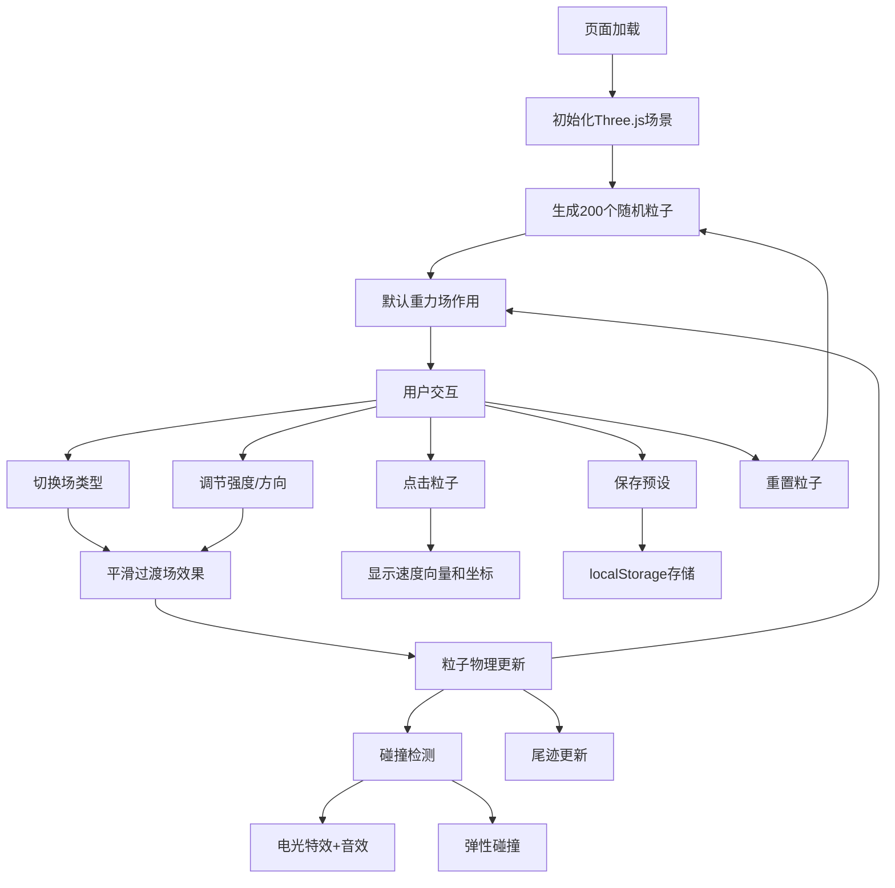

## 1. 产品概述

3D粒子系统交互式模拟器，用于在浏览器中直观展示带电粒子在重力场、均匀磁场、点电荷电场中的运动轨迹。主要面向物理教学和游戏特效设计领域，解决复杂场中粒子运动难以可视化的问题。

- 目标用户：物理教师、学生、游戏特效设计师
- 产品价值：将抽象的物理概念转化为可交互的三维可视化体验，提升教学效率和设计创意探索能力

## 2. 核心功能

### 2.1 用户角色
| 角色 | 注册方式 | 核心权限 |
|------|---------|---------|
| 普通用户 | 无需注册，直接使用 | 操作粒子系统、调节场参数、保存/加载预设方案 |

### 2.2 功能模块
1. **主页面**：3D粒子渲染场景、参数控制面板、预设管理
2. **3D场景模块**：Three.js渲染、粒子系统、相机控制、尾迹效果、碰撞特效
3. **控制面板模块**：场类型切换、强度调节、方向控制、重置按钮、预设保存/加载
4. **粒子交互模块**：粒子点击查看速度向量和坐标、碰撞检测与特效

### 2.3 页面详情
| 页面名称 | 模块名称 | 功能描述 |
|---------|---------|---------|
| 主页面 | 3D渲染场景 | Three.js深空背景、200个彩色发光粒子、鼠标拖拽旋转视角、滚轮缩放、粒子尾迹 |
| 主页面 | 控制面板 | 场类型下拉菜单、强度滑块(X/Y/Z三轴)、尾迹长度滑块、重置按钮、保存预设按钮 |
| 主页面 | 粒子交互 | 点击粒子显示速度向量箭头和位置坐标标签 |
| 主页面 | 碰撞系统 | 粒子碰撞时产生蓝色电光特效、弹性碰撞速度更新、Web Audio音效 |
| 主页面 | 预设管理 | localStorage保存最多3个预设方案、预设列表展示、一键加载预设 |

## 3. 核心流程

用户打开页面 → 查看默认随机粒子在重力场中的运动 → 通过控制面板切换场类型/调节强度 → 观察粒子轨迹变化 → 点击单个粒子查看详情 → 碰撞时观察特效和音效 → 保存当前参数为预设或重置到初始状态

## 4. 用户界面设计

### 4.1 设计风格
- **主色调**：深空蓝灰 (#0b0e14 → #1a1f2e 渐变)
- **强调色**：蓝紫渐变按钮 (#4a9eff → #7b2ff7)、悬停发光边框 (#4a9eff)
- **粒子配色**：橙黄#ff6b35、宝石绿#2ecc71、亮紫#9b59b6、霓虹粉#ff2d78、青色#00d2ff
- **按钮风格**：圆角渐变按钮，悬停发光效果
- **面板风格**：半透明毛玻璃 (blur 8px, 圆角12px)
- **布局风格**：桌面端左右分栏(70%/30%)，移动端上下分栏(70%/30%)

### 4.2 页面设计概览
| 页面名称 | 模块名称 | UI元素 |
|---------|---------|---------|
| 主页面 | 3D场景 | 深空渐变背景、发光粒子球体、半透明尾迹线、白色速度向量箭头、坐标标签、蓝色电光碰撞特效 |
| 主页面 | 控制面板 | 毛玻璃背景面板、下拉菜单、滑块控件(带数值显示)、渐变按钮、预设列表卡片 |

### 4.3 响应式设计
- 桌面端(>768px)：左侧70%为3D场景，右侧30%为悬浮控制面板
- 移动端(≤768px)：上部70%为3D场景，下部30%为控制面板
- 所有交互支持触摸操作

### 4.4 3D场景指引
- **环境**：深空色渐变背景 (#0b0e14 到 #1a1f2e)，无外部HDRI
- **光照**：环境光 + 粒子自发光光晕效果
- **相机**：PerspectiveCamera，OrbitControls带阻尼惯性
- **构图**：粒子均匀分布在以原点为中心的区域
- **交互**：鼠标拖拽旋转、滚轮缩放、点击粒子选中
- **后期效果**：粒子光晕、半透明尾迹渐变
- **性能预算**：200粒子稳定60FPS，碰撞检测O(n)复杂度
