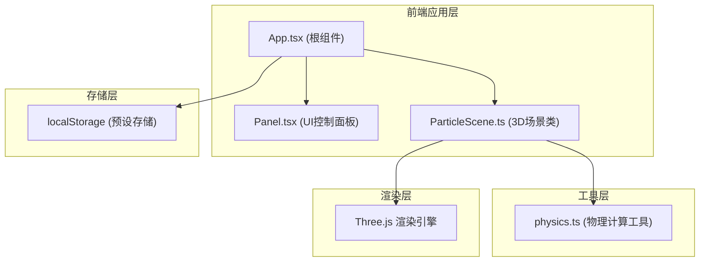

## 1. 架构设计



## 2. 技术描述

- **前端框架**：React 18 + TypeScript
- **构建工具**：Vite 5
- **3D渲染**：Three.js (直接使用，非R3F)
- **状态管理**：React useReducer
- **音效**：Web Audio API (原生)
- **存储**：localStorage
- **样式**：内联CSS + CSS变量 (深色主题)

## 3. 文件结构
```
├── package.json
├── vite.config.js
├── tsconfig.json
├── index.html
└── src/
    ├── main.tsx          # React入口
    ├── App.tsx           # 根组件，状态管理
    ├── ui/
    │   └── Panel.tsx     # 控制面板UI组件
    ├── three/
    │   └── ParticleScene.ts  # Three.js场景和粒子系统
    └── utils/
        └── physics.ts    # 物理计算工具函数
```

## 4. 核心类型定义

### 4.1 场参数类型
```typescript
type FieldType = 'gravity' | 'magnetic' | 'electric';

interface FieldParams {
  fieldType: FieldType;
  strength: number;
  direction: { x: number; y: number; z: number };
  trailLength: number;
}
```

### 4.2 粒子数据类型
```typescript
interface ParticleData {
  position: THREE.Vector3;
  velocity: THREE.Vector3;
  color: string;
  charge: number;
  trail: THREE.Vector3[];
}
```

### 4.3 预设类型
```typescript
interface Preset {
  id: string;
  name: string;
  fieldType: FieldType;
  strength: number;
  direction: { x: number; y: number; z: number };
  trailLength: number;
  particles: ParticleData[];
  timestamp: number;
}
```

### 4.4 App状态类型
```typescript
interface AppState {
  fieldType: FieldType;
  strength: number;
  direction: { x: number; y: number; z: number };
  trailLength: number;
  presets: Preset[];
}
```

## 5. 性能优化策略

### 5.1 粒子系统优化
- 使用 BufferGeometry + PointsMaterial 替代单独 Mesh 以减少Draw Call
- 尾迹使用 LineSegments 批量渲染
- 碰撞检测使用空间网格划分，将复杂度从 O(n²) 降至 O(n)

### 5.2 渲染优化
- 使用 requestAnimationFrame 与 Three.js 渲染循环同步
- 粒子更新采用 Verlet 积分减少计算量
- 尾迹更新仅维护固定长度的历史数据

### 5.3 UI交互优化
- 场参数变化时采用线性插值平滑过渡
- 粒子点击检测使用 Raycaster，仅在点击事件时执行
- 控制面板状态变更防抖处理
