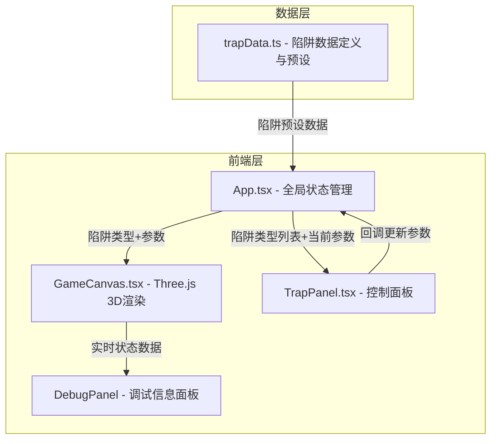

## 1. 架构设计


## 2. 技术说明
- 前端：React@18 + TypeScript + Three.js + Vite
- 初始化工具：vite-init（react-ts模板）
- 3D渲染：Three.js 直接使用（非R3F，以获得更精细的动画控制）
- 状态管理：React useState/useCallback（轻量级，无需zustand）
- 后端：无
- 数据库：无，使用内存预设数据

## 3. 文件结构与调用关系
```
project/
├── index.html              # 入口HTML，加载main.tsx
├── package.json            # 依赖：react, react-dom, typescript, vite, @vitejs/plugin-react, three, @types/three
├── vite.config.ts          # Vite配置，支持React和TypeScript
├── tsconfig.json           # 严格模式，target ES2020，jsx: react-jsx
├── src/
│   ├── main.tsx            # React根渲染入口
│   ├── App.tsx             # 主布局组件（管理全局状态：当前陷阱类型和参数）
│   │                       #   → 传递数据给 GameCanvas 和 TrapPanel
│   ├── GameCanvas.tsx      # Three.js 3D场景组件
│   │                       #   ← 接收陷阱参数，生成3D地牢房间和陷阱
│   │                       #   → 输出实时调试数据到 DebugPanel
│   ├── TrapPanel.tsx       # 右侧控制面板组件
│   │                       #   ← 接收陷阱类型列表和当前参数
│   │                       #   → 用户调整后触发回调更新App状态
│   ├── DebugPanel.tsx      # 左下角调试面板组件
│   │                       #   ← 接收实时碰撞箱、伤害范围、状态数据
│   ├── trapData.ts         # 陷阱数据定义模块
│   │                       #   → 导出陷阱接口定义和预设列表
│   └── style.css           # 全局样式
```

### 数据流向
1. **trapData.ts** → **App.tsx**：应用初始化时加载陷阱预设数据
2. **App.tsx** → **GameCanvas.tsx**：传递当前陷阱类型和参数（triggerRadius, damage, duration）
3. **App.tsx** → **TrapPanel.tsx**：传递陷阱类型列表和当前参数值
4. **TrapPanel.tsx** → **App.tsx**：用户操作回调（onTrapTypeChange, onParamChange）
5. **GameCanvas.tsx** → **DebugPanel.tsx**：每帧更新实时状态数据（碰撞箱位置、伤害范围、状态）
6. **App.tsx** → **App.tsx**：重置按钮触发状态回退到默认值

## 4. 路由定义
| 路由 | 用途 |
|------|------|
| / | 单页应用，所有功能在同一页面 |

## 5. 3D场景技术细节

### 陷阱模型与动画
| 陷阱类型 | 模型描述 | 动画逻辑 |
|----------|----------|----------|
| 尖刺 | 多个锥体从地面伸出 | 周期2秒弹出/缩回，弹出时顶端红光闪烁 |
| 落石 | 上方悬挂球体 | 周期性坠落并回弹，触发时地面震动 |
| 毒气 | 粒子系统（绿色球体群） | 持续扩散收缩循环，绿色半透明 |
| 旋转刀片 | 扁平圆柱体绕中心旋转 | 持续旋转，速度随参数变化 |

### 性能保障
- 使用requestAnimationFrame驱动渲染循环
- 陷阱切换使用opacity过渡避免GC压力
- 参数更新直接修改已有对象属性，避免重建
- 触发范围圆环使用CircleGeometry + ShaderMaterial实现半透明效果
