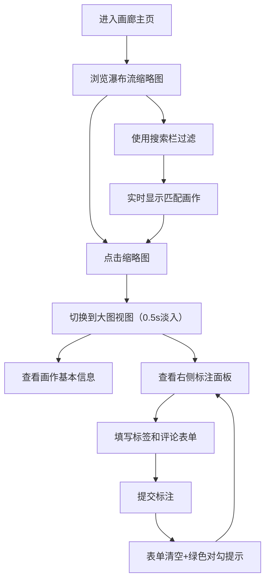

## 1. 产品概述
在线艺术画廊图库浏览与交互标注应用，为艺术爱好者提供高质量画作浏览、搜索和标注功能。
- 主要目的：提供沉浸式的艺术画作浏览体验，支持用户对感兴趣的作品进行个性化标注
- 目标用户：艺术爱好者、艺术史学习者、策展人员
- 产品价值：将艺术鉴赏与个人标注结合，打造个性化的数字艺术收藏体验

## 2. 核心特性

### 2.1 功能模块
1. **画廊主界面**：瀑布流缩略图展示、搜索过滤、画作切换
2. **大图视图**：高清画作展示、基本信息展示、淡入过渡动画
3. **标注面板**：标注列表展示、标签和评论添加、表单交互反馈

### 2.2 功能详情
| 页面名称 | 模块名称 | 功能描述 |
|-----------|-------------|---------------------|
| 画廊主界面 | 瀑布流网格 | 200x200缩略图，0.3s淡入动画，悬停放大1.05倍+遮罩层显示名称 |
| 画廊主界面 | 搜索栏 | 模糊匹配搜索，实时过滤缩略图，清除按钮恢复全部 |
| 大图视图 | 画作展示 | 宽度自适应容器，高度≤600px，0.5s淡入过渡 |
| 大图视图 | 基本信息 | 两列对齐排版，名称/艺术家/年份/尺寸，#333颜色14px字体 |
| 标注面板 | 标注列表 | 标签蓝色圆角方块，评论文本深灰色 |
| 标注面板 | 添加表单 | 标签输入框+评论多行文本，聚焦蓝色边框(#4a90d9)，按压动效，绿色对勾提示 |

## 3. 核心流程
用户进入应用 → 浏览瀑布流画作缩略图 → 使用搜索栏过滤作品 → 点击缩略图查看大图 → 在右侧标注面板查看已有标注 → 添加新标签和评论 → 提交标注并看到成功反馈

## 4. 用户界面设计

### 4.1 设计风格
- 主色调：#4a90d9（蓝色）
- 辅助色：#f5a623（暖橙色）
- 背景色：#faf8f5（淡米白色）
- 按钮风格：蓝色背景圆角按钮，按压时scale 0.95
- 字体：-apple-system, BlinkMacSystemFont, sans-serif（系统默认字体）
- 布局：桌面端左右布局（大图+浮动标注面板），移动端上下布局
- 动画过渡：所有交互元素0.2s transition效果

### 4.2 页面设计概览
| 页面名称 | 模块名称 | UI元素 |
|-----------|-------------|-------------|
| 画廊主界面 | 顶部搜索栏 | 圆角20px输入框，清除按钮(X)，焦点蓝色边框 |
| 画廊主界面 | 瀑布流网格 | 卡片式缩略图，悬停遮罩层，淡入动画 |
| 大图视图区 | 画作展示区 | 居中布局，最大高度600px，淡入过渡 |
| 大图视图区 | 信息面板 | 两列对齐，标签-值对展示 |
| 标注面板 | 面板容器 | 白色背景，#e0e0e0边框，4px圆角，桌面端右浮动 |
| 标注面板 | 标注列表 | 列表项布局，标签圆角蓝色块 |
| 标注面板 | 表单区域 | 输入框+文本域+提交按钮 |

### 4.3 响应式设计
- 桌面端（≥768px）：右侧浮动标注面板（宽300px，右距20px），瀑布流多列
- 移动端（<768px）：标注面板折叠至底部全宽，瀑布流单列布局，大图高度自适应

## 4.4 性能要求
- 画作切换延迟：从点击缩略图到大图渲染完成 < 500ms（图片预缓存假设下）
