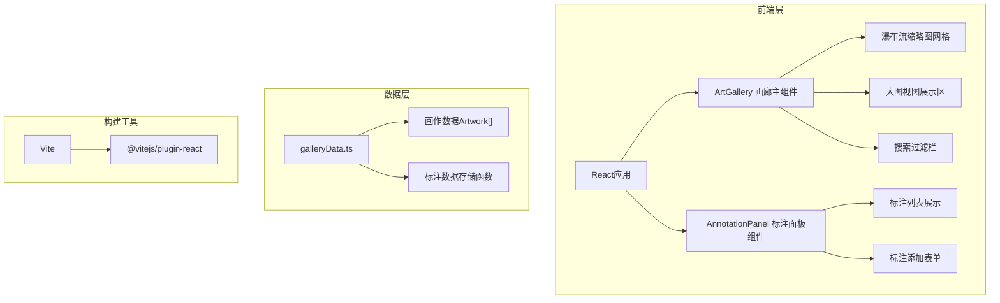
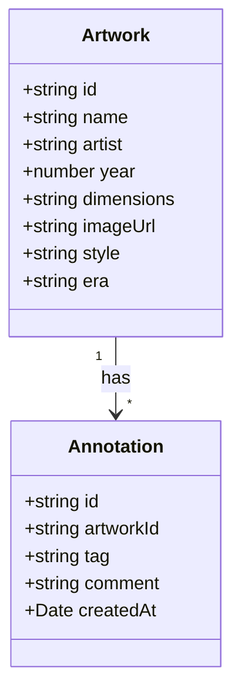

## 1. 架构设计



## 2. 技术说明
- 前端框架：React 18 + TypeScript
- 构建工具：Vite 5.x + @vitejs/plugin-react
- 样式方案：内联CSS Modules（styled-components风格，使用CSS-in-JS）
- 文件上传库：react-dropzone（按用户依赖要求）
- 状态管理：React useState/useReducer 组件内状态
- 数据存储：内存存储 + localStorage持久化标注数据

## 3. 项目文件结构
| 文件路径 | 用途说明 |
|---------|---------|
| package.json | 项目依赖和npm脚本定义 |
| vite.config.js | Vite构建配置（base: './'） |
| tsconfig.json | TypeScript配置（严格模式，jsx: react-jsx） |
| index.html | HTML入口页面 |
| src/main.tsx | React应用挂载入口 |
| src/components/ArtGallery.tsx | 画廊主组件（缩略图网格+大图+搜索） |
| src/components/AnnotationPanel.tsx | 标注面板组件（标注列表+表单） |
| src/data/galleryData.ts | 画作数据定义、初始数据、标注存储函数 |

## 4. 数据模型

### 4.1 数据模型定义



### 4.2 TypeScript类型定义

```typescript
interface Artwork {
  id: string;
  name: string;
  artist: string;
  year: number;
  dimensions: string;
  imageUrl: string;
  style: string;
  era: string;
}

interface Annotation {
  id: string;
  artworkId: string;
  tag: string;
  comment: string;
  createdAt: string;
}
```

## 5. 状态管理设计

### 5.1 ArtGallery组件状态
- `artworks`: Artwork[] - 全部画作列表（从galleryData导入）
- `selectedArtworkId`: string | null - 当前选中的画作ID
- `searchQuery`: string - 搜索关键词
- `filteredArtworks`: Artwork[] - 过滤后的画作列表（派生状态）

### 5.2 AnnotationPanel组件状态
- `annotations`: Annotation[] - 当前画作的标注列表
- `tagInput`: string - 标签输入框值
- `commentInput`: string - 评论输入框值
- `showSuccess`: boolean - 成功提示标志
