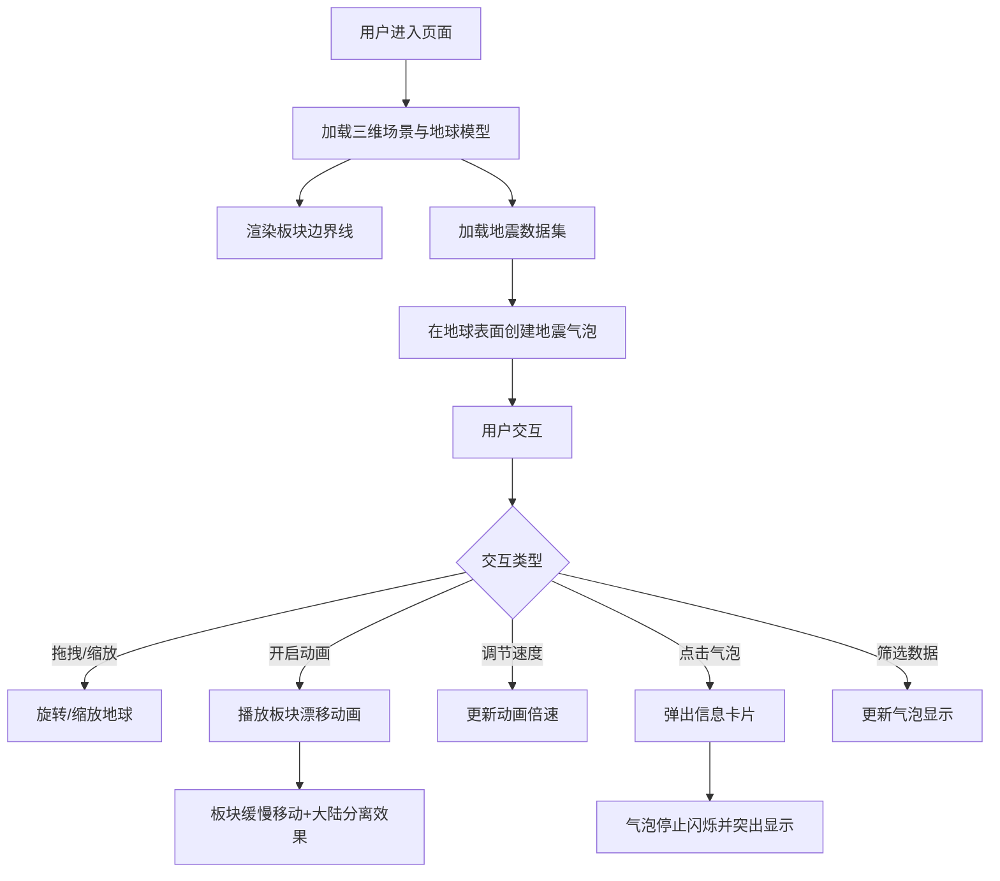

## 1. 产品概述

三维地壳板块运动与地震分布交互式可视化工具，解决地理教学中板块漂移和地震带难以直观理解的问题。面向地理教师与学生，通过三维地球模型、板块漂移动画、地震气泡可视化，将抽象的地质概念转化为可交互的沉浸式体验。

## 2. 核心功能

### 2.1 功能模块

| 模块 | 功能描述 |
|------|----------|
| 三维地球渲染 | 加载简化三维地球，显示大洲轮廓线与板块边界（红色发光线标示太平洋、欧亚等主要板块） |
| 板块漂移动画 | 模拟过去2亿年板块漂移，支持速度调节（0.5x-3x），含大陆分离视觉效果 |
| 地震数据可视化 | 100条模拟地震记录，动态闪烁气泡表示地震事件，大小随震级变化，颜色随深度渐变（浅红→深紫），入场动画由小变大 |
| 交互控制 | 鼠标拖拽旋转、右键平移、滚轮缩放、点击气泡弹出信息卡片（震级/深度/时间/位置描述），淡入弹窗，点击时气泡停止闪烁并突出 |
| 右侧信息面板 | 实时显示可见地震总数、最近地震详情、按震级分段柱状图（0-3/3-5/5-7/7+） |

### 2.2 页面详情

| 页面名称 | 模块名称 | 功能描述 |
|----------|----------|----------|
| 主页面 | 三维地球视图 | 全屏Three.js渲染容器，包含地球模型、板块边界、地震气泡 |
| 主页面 | 控制面板层 | 左侧控制区（板块动画开关、速度滑块），右侧信息面板（统计+柱状图） |
| 主页面 | 信息卡片弹窗 | 点击地震气泡弹出的半透明毛玻璃卡片 |
| 主页面 | 操作提示层 | 屏幕顶部淡入淡出操作提示（2秒自动消失） |

## 3. 核心流程

## 4. 用户界面设计

### 4.1 设计风格

- **主色调**：暗色太空主题背景（#0B0C10），地球深蓝到浅蓝渐变（#1F2833到#45A29E）
- **强调色**：板块边界发光红（#FF4444，3px内发光+2px外发光），地震气泡半透明光晕（#FF6666，alpha 0.3）
- **面板样式**：半透明毛玻璃（背景rgba(11,12,16,0.7)，边框#45A29E 1px）
- **文字色**：#C5C6C7
- **按钮/滑块**：圆角矩形（背景#2C3E50，悬停#45A29E），切换动画0.3秒缓动
- **字体**：Orbitron（标题/数据）+ Source Sans Pro（正文）
- **布局**：全屏3D渲染+固定位置UI覆盖层

### 4.2 页面设计概览

| 页面名称 | 模块名称 | UI元素 |
|----------|----------|--------|
| 主页面 | 三维地球 | 深空背景，蓝色渐变地球球体，红色发光板块边界线，彩色发光地震气泡 |
| 主页面 | 左侧控制区 | 板块动画开关按钮、速度滑块(0.5x-3x)、毛玻璃面板 |
| 主页面 | 右侧信息面板 | 可见地震总数、最近地震详情、震级分段柱状图、毛玻璃面板 |
| 主页面 | 信息卡片 | 淡入弹窗，毛玻璃背景，震级/深度/时间/位置信息 |
| 主页面 | 操作提示 | 顶部居中，淡入淡出文字，2秒自动消失 |

### 4.3 响应式适配

- 桌面端（≥768px）：左右侧面板固定定位
- 移动端（<768px）：信息面板折叠为底部抽屉式，地震卡片改为全屏底部弹出

### 4.4 三维场景指引

- **环境**：深空背景，无HDRI，使用纯色+星空粒子营造太空感
- **光照**：环境光（低强度蓝白）+ 方向光（模拟太阳，偏暖白）
- **相机**：透视相机，远距观察地球，支持轨道控制器交互
- **后处理**：板块边界线发光效果（UnrealBloomPass或自定义着色器）
- **性能预算**：粒子总数≤10000，帧率≥30FPS

## 5. 性能要求

- 粒子总数（发光线条段数+地震气泡）控制在10000以内
- 所有动画帧率稳定在30FPS以上
- 鼠标拖拽和缩放操作时3D渲染无明显卡顿或延迟
