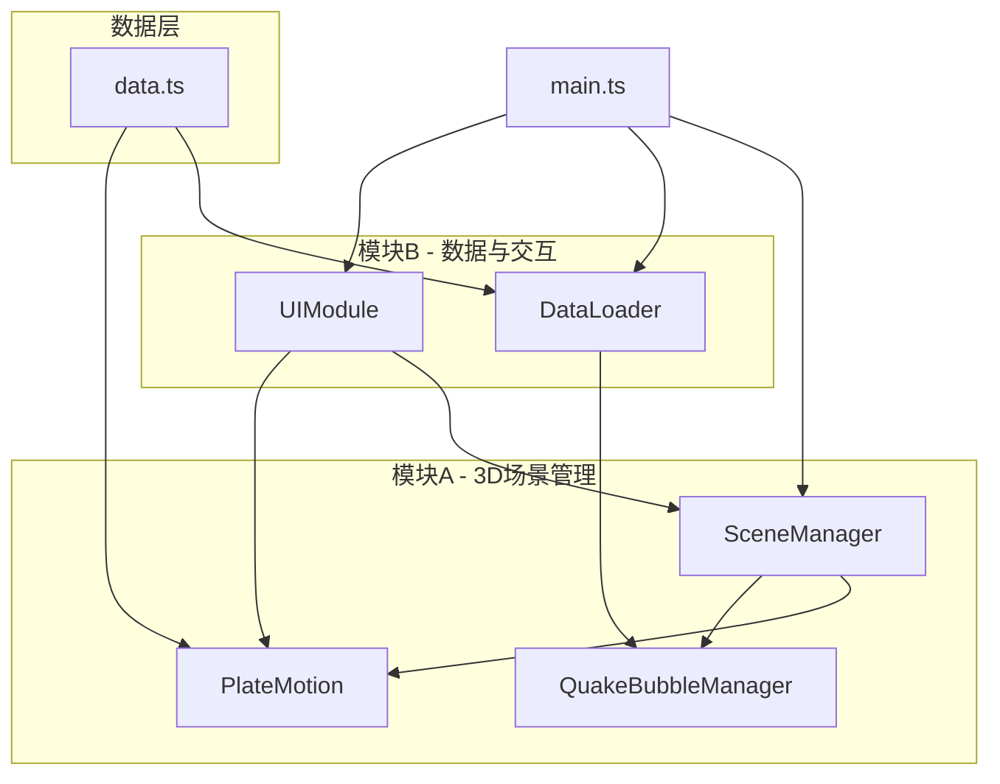

## 1. 架构设计



## 2. 技术说明

- **前端框架**：TypeScript + Three.js（原生，非React封装）
- **构建工具**：Vite
- **依赖库**：three, @types/three, typescript, vite, d3-scale, d3-interpolate
- **后端**：无（纯前端，数据内置）
- **数据库**：无（模拟数据集内置于data.ts）

## 3. 文件结构

| 文件路径 | 职责 |
|----------|------|
| package.json | 项目依赖与启动脚本（npm run dev） |
| vite.config.js | TypeScript与入口配置 |
| tsconfig.json | 严格模式，target ES2020，moduleResolution bundler |
| index.html | 入口页面，全屏渲染容器+固定位置UI层 |
| src/main.ts | 应用入口，初始化场景/相机/渲染器，加载数据，启动动画循环 |
| src/moduleA/SceneManager.ts | 创建管理Three.js场景、相机、轨道控制器，提供渲染循环 |
| src/moduleA/PlateMotion.ts | 定义板块边界线条数据，实现板块漂移动画逻辑，暴露start/stop/setSpeed |
| src/moduleB/DataLoader.ts | 从内置模拟数据集加载/过滤数据，提供按震级/深度筛选 |
| src/moduleB/QuakeBubbleManager.ts | 创建管理地震气泡，处理点击事件调用UI显示信息卡片 |
| src/moduleB/UIModule.ts | 右侧信息面板、控制滑块、震级柱状图，监听事件调度模块A动画控制 |
| src/data.ts | 内置100条模拟地震记录+板块边界基础数据 |

## 4. 数据模型

### 4.1 地震记录

```typescript
interface EarthquakeRecord {
  id: number;
  lat: number;
  lng: number;
  depth: number;
  magnitude: number;
  time: string;
  location: string;
}
```

### 4.2 板块边界

```typescript
interface PlateBoundary {
  name: string;
  color: number;
  points: [number, number][]; // [lat, lng][]
}
```

## 5. 模块接口定义

### SceneManager

```typescript
class SceneManager {
  constructor(container: HTMLElement);
  getScene(): THREE.Scene;
  getCamera(): THREE.PerspectiveCamera;
  getRenderer(): THREE.WebGLRenderer;
  animate(): void;
  addTickCallback(cb: (dt: number) => void): void;
  dispose(): void;
}
```

### PlateMotion

```typescript
class PlateMotion {
  constructor(scene: THREE.Scene, camera: THREE.Camera);
  start(): void;
  stop(): void;
  setSpeed(speed: number): void;
  isPlaying(): boolean;
  dispose(): void;
}
```

### DataLoader

```typescript
class DataLoader {
  loadAll(): EarthquakeRecord[];
  filterByMagnitude(min: number, max: number): EarthquakeRecord[];
  filterByDepth(min: number, max: number): EarthquakeRecord[];
}
```

### QuakeBubbleManager

```typescript
class QuakeBubbleManager {
  constructor(scene: THREE.Scene, camera: THREE.Camera, uiModule: UIModule);
  loadData(records: EarthquakeRecord[]): void;
  update(dt: number): void;
  handleClick(event: MouseEvent): void;
  getVisibleCount(): number;
  getLatestQuake(): EarthquakeRecord | null;
  getMagnitudeStats(): { range: string; count: number }[];
  dispose(): void;
}
```

### UIModule

```typescript
class UIModule {
  constructor(container: HTMLElement);
  showQuakeCard(record: EarthquakeRecord): void;
  hideQuakeCard(): void;
  updateStats(visibleCount: number, latest: EarthquakeRecord | null, stats: { range: string; count: number }[]): void;
  onAnimationToggle(callback: (playing: boolean) => void): void;
  onSpeedChange(callback: (speed: number) => void): void;
  showTip(message: string): void;
  dispose(): void;
}
```
