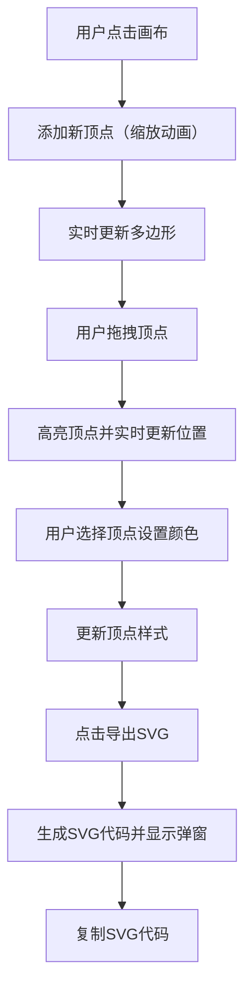

## 1. 产品概述

交互式多边形绘制与编辑工具，为在线设计协作平台提供灵活的自定义形状创建能力。用户可在画布上通过点击添加顶点、拖拽调整形状、自定义顶点样式，并导出为标准 SVG 格式。

- **核心价值**：为设计师和开发者提供轻量级的多边形创建工具，支持精确控制顶点位置和样式，无缝集成到设计协作流程中
- **目标用户**：UI/UX 设计师、前端开发者、图形设计爱好者
- **市场定位**：组件库内部工具，提升设计协作效率

## 2. 核心功能

### 2.1 功能模块

1. **画布绘制模块**：Canvas 画布渲染、多边形实时绘制、顶点交互管理
2. **顶点编辑模块**：顶点添加、拖拽移动、双击删除、样式自定义
3. **侧边栏控制模块**：顶点属性面板、添加/删除操作、SVG 导出功能
4. **SVG 导出模块**：多边形和顶点的 SVG 代码生成、代码预览与复制

### 2.2 页面详情

| 页面名称 | 模块名称 | 功能描述 |
|-----------|-------------|---------------------|
| 主页面 | 画布区域 | 1000x700px 绘图区域，浅灰色背景带网格辅助线，支持鼠标交互 |
| 主页面 | 侧边栏区域 | 300px 宽度控制面板，包含顶点坐标显示、颜色选择器、操作按钮 |
| 主页面 | SVG 导出弹窗 | 显示生成的 SVG 代码，提供一键复制功能 |

## 3. 核心流程

用户在画布上点击创建顶点 → 系统渲染多边形连接所有顶点 → 用户拖拽顶点调整形状 → 用户选择顶点设置颜色 → 点击导出按钮生成 SVG → 预览并复制 SVG 代码

## 4. 用户界面设计

### 4.1 设计风格

- **主色调**：#3498db（蓝色），用于顶点默认色、按钮、强调元素
- **背景色**：画布 #f0f0f0（浅灰），侧边栏 #ffffff（白色）
- **字体色**：#2c3e50（深灰），用于标题和正文
- **网格线**：1px 浅蓝色虚线，间隔 20px
- **按钮样式**：圆角矩形（border-radius: 6px），按压时 scale 0.95 缩放效果
- **过渡效果**：所有交互使用 ease-out 缓动，持续 0.2s

### 4.2 页面设计概述

| 页面名称 | 模块名称 | UI 元素 |
|-----------|-------------|-------------|
| 主页面 | 画布区域 | 浅灰背景、网格辅助线、十字准星光标、实心顶点圆、多边形填充 |
| 主页面 | 侧边栏区域 | 圆滑标题栏、顶点坐标输入、颜色选择器、操作按钮组、导出按钮 |
| 主页面 | 顶点状态 | 默认半径 5px，选中/拖拽时半径 7px 高亮，添加时 0→1 缩放动画，删除时缩小动画 |
| 主页面 | SVG 弹窗 | 代码展示区域、复制按钮、关闭按钮 |

### 4.3 响应式设计

- **桌面端**（≥900px）：左右两栏布局，画布占约 70% 宽度，侧边栏 300px 宽度
- **移动端**（<900px）：单列布局，侧边栏折叠到画布下方
- **触摸优化**：增大点击区域，支持触摸拖拽

### 4.4 性能指标

- 画布重绘延迟：拖动顶点时多边形更新 ≤50ms
- SVG 导出响应时间：≤100ms
- 动画流畅度：60fps 目标帧率
