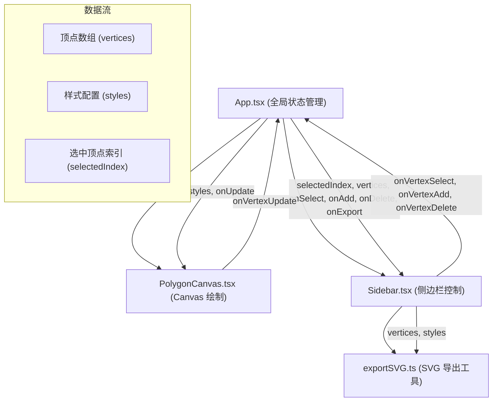

## 1. 架构设计



## 2. 技术描述

- **前端框架**：React@18 + TypeScript@5
- **构建工具**：Vite@5 + @vitejs/plugin-react@4
- **渲染技术**：HTML5 Canvas API 用于多边形绘制
- **状态管理**：React useState/useCallback 本地状态管理
- **样式方案**：CSS Modules 或原生 CSS（按职责模块化）
- **动画实现**：requestAnimationFrame 帧动画 + CSS transition

### 文件结构与调用关系

| 文件路径 | 职责 | 依赖 | 被依赖 |
|---------|------|------|--------|
| `package.json` | 项目依赖配置 | - | - |
| `vite.config.js` | Vite 构建配置，base: './' | - | - |
| `tsconfig.json` | TypeScript 严格模式配置 | - | - |
| `index.html` | 入口页面，挂载根组件 | - | - |
| `src/App.tsx` | 主应用组件，管理全局状态和布局 | PolygonCanvas, Sidebar | - |
| `src/PolygonCanvas.tsx` | Canvas 绘制组件，处理鼠标交互 | React, Canvas API | App.tsx |
| `src/Sidebar.tsx` | 侧边栏组件，顶点属性编辑 | exportSVG, React | App.tsx |
| `src/exportSVG.ts` | SVG 导出工具函数 | - | Sidebar.tsx |

### 数据流向

1. **App.tsx → PolygonCanvas.tsx**：传递顶点数组、样式配置、更新回调
2. **PolygonCanvas.tsx → App.tsx**：通过回调更新顶点位置、添加/删除顶点
3. **App.tsx → Sidebar.tsx**：传递选中顶点索引、顶点数组、操作回调
4. **Sidebar.tsx → App.tsx**：通过回调选择顶点、添加/删除顶点、更新样式
5. **Sidebar.tsx → exportSVG.ts**：传递顶点数组和样式，获取 SVG 字符串

## 3. 数据模型

### 3.1 类型定义

```typescript
// 顶点数据结构
interface Vertex {
  id: string;
  x: number;
  y: number;
  color: string;
  strokeColor: string;
  scale: number; // 用于动画：0-1
  isDeleting: boolean; // 删除动画标记
}

// 样式配置
interface PolygonStyles {
  fillColor: string;
  strokeColor: string;
  strokeWidth: number;
  vertexRadius: number;
  vertexStrokeWidth: number;
}

// 动画状态
interface AnimationState {
  vertexId: string;
  type: 'appear' | 'delete';
  startTime: number;
  duration: number;
}
```

### 3.2 组件状态

- **App.tsx 状态**：
  - `vertices: Vertex[]` - 顶点数组
  - `selectedVertexIndex: number | null` - 当前选中顶点索引
  - `polygonStyles: PolygonStyles` - 多边形样式配置

- **PolygonCanvas.tsx 状态**：
  - `isDragging: boolean` - 是否正在拖拽
  - `dragVertexId: string | null` - 正在拖拽的顶点 ID
  - `mousePos: { x: number; y: number }` - 鼠标位置

- **Sidebar.tsx 状态**：
  - `showExportModal: boolean` - 是否显示导出弹窗
  - `exportedSVG: string` - 导出的 SVG 代码
  - `copied: boolean` - 复制成功状态

## 4. 核心算法

### 4.1 顶点碰撞检测

```typescript
function isPointInVertex(
  px: number, py: number, 
  vx: number, vy: number, 
  radius: number
): boolean {
  const dx = px - vx;
  const dy = py - vy;
  return dx * dx + dy * dy <= radius * radius;
}
```

### 4.2 Canvas 绘制流程

1. 清空画布
2. 绘制网格辅助线
3. 绘制多边形填充和描边
4. 按动画状态绘制所有顶点（考虑 scale）
5. 高亮选中/拖拽状态的顶点

### 4.3 SVG 生成算法

```typescript
function exportSVG(
  vertices: Vertex[],
  styles: PolygonStyles,
  width: number,
  height: number
): string
```

- 生成 `<polygon>` 元素，points 属性由顶点坐标拼接
- 为每个顶点生成 `<circle>` 元素
- 包含完整的 SVG 命名空间和视口设置

## 5. 性能优化策略

1. **Canvas 渲染优化**：
   - 使用 `requestAnimationFrame` 进行动画帧同步
   - 只在必要时重绘（顶点变化、拖拽中）
   - 避免在渲染循环中创建新对象

2. **拖拽性能优化**：
   - 使用 `useCallback` 缓存事件处理函数
   - 鼠标事件节流（但 Canvas 渲染已由 rAF 控制）
   - 减少状态更新频率，拖拽时直接操作 Canvas

3. **内存管理**：
   - 及时清理动画定时器
   - 组件卸载时移除事件监听器
   - 避免闭包内存泄漏

4. **SVG 导出优化**：
   - 字符串拼接使用数组 push + join
   - 避免不必要的属性计算
   - 坐标值保留 2 位小数减少字符串长度
