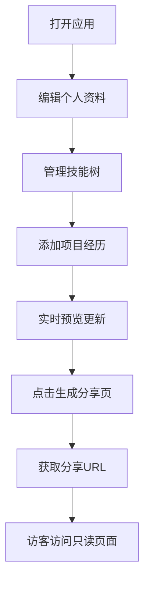

## 1. 产品概述
开发者个人品牌展示应用，帮助独立开发者快速搭建专业的个人品牌和项目展示页面。解决开发者缺乏集成动态技能图谱和项目时间线的轻量级展示工具的痛点。

- 核心价值：提供一站式个人品牌展示解决方案，集成可编辑的个人资料、多级技能树和项目时间轴
- 目标用户：独立开发者、开源贡献者、技术自由职业者
- 市场价值：降低个人品牌建设门槛，通过一键生成分享链接提升个人曝光

## 2. 核心功能

### 2.1 用户角色
| 角色 | 注册方式 | 核心权限 |
|------|----------|----------|
| 开发者用户 | 无需注册，本地数据存储 | 编辑个人资料、管理技能树、维护项目时间线、生成分享页面 |
| 访客用户 | 无需登录 | 只读浏览公开分享页面 |

### 2.2 功能模块
1. **个人资料编辑模块**：头像、姓名、简介、个人网站链接的表单编辑与实时预览
2. **技能图谱模块**：多级技能树展示、掌握度进度条、折叠/展开交互
3. **项目时间轴模块**：按年份倒序展示项目卡片、悬浮详情、标签展示
4. **公开分享模块**：生成只读分享页面、可复制的分享URL

### 2.3 页面详情
| 页面名称 | 模块名称 | 功能描述 |
|----------|----------|----------|
| 编辑主页 | 左侧编辑面板 | 个人资料表单、技能树编辑器、项目列表管理 |
| 编辑主页 | 右侧预览区 | 实时预览个人资料、技能树、项目时间轴 |
| 公开分享页 | 资料展示区 | 只读展示头像、姓名、简介、网站链接 |
| 公开分享页 | 技能树展示区 | 只读展示完整技能树和掌握度 |
| 公开分享页 | 时间轴展示区 | 只读展示项目时间轴卡片 |

## 3. 核心流程
用户打开应用 → 编辑个人资料（头像、姓名、简介、网站）→ 管理技能树（添加多级技能、调整掌握度）→ 添加项目经历（标题、描述、年份、标签）→ 实时预览所有更改 → 点击生成分享页 → 获取可分享的URL → 访客通过链接访问只读展示页面

## 4. 用户界面设计

### 4.1 设计风格
- **主色调**：墨绿(#1F5C3B) 作为品牌主色，米白(#F5F0E8) 作为背景色，琥珀色(#D4A017) 用于强调按钮和进度条
- **按钮风格**：圆角4px，墨绿背景配白色文字，琥珀色用于主要操作按钮，hover时轻微提升阴影
- **字体**：系统无衬线字体 'Segoe UI', sans-serif，标题字重600，正文字重400
- **布局风格**：左右分栏卡片式布局，编辑区使用浅灰卡片，预览区使用米白背景
- **图标风格**：使用Lucide图标库，线性风格，与主色调保持一致

### 4.2 页面设计概述
| 页面名称 | 模块名称 | UI元素 |
|----------|----------|----------|
| 编辑主页 | 左侧编辑面板 | 表单输入框、滑动条、树状节点、添加/删除按钮、保存按钮（带成功反馈动画） |
| 编辑主页 | 右侧预览区 | 头像展示、个人简介、可折叠技能树（带虚线连接线）、横向项目时间轴卡片 |
| 公开分享页 | 整体布局 | 居中卡片式布局，个人资料头部、技能树区块、时间轴区块依次排列，无编辑控件 |

### 4.3 响应式
- **桌面端**：左右分栏布局，左侧35%宽度，右侧65%宽度，固定最大宽度1400px
- **平板及以下**（<768px）：自动堆叠为上下结构，编辑区在上，预览区在下，宽度100%
- **触摸优化**：按钮最小高度44px，滑动条增大触控区域，点击反馈明确

### 4.4 动画与交互
- 技能树展开：子节点渐进式出现（opacity 0→1，translateY 10px→0，每节点延迟50ms）
- 时间轴卡片入场：slideInLeft动画（持续0.5s），依次延迟
- 卡片悬浮：向上弹出轻阴影（box-shadow: 0 8px 16px rgba(0,0,0,0.15)）
- 保存成功：按钮变对勾图标，3秒后恢复原状
- 折叠/展开：CSS transitions，时长0.3s
