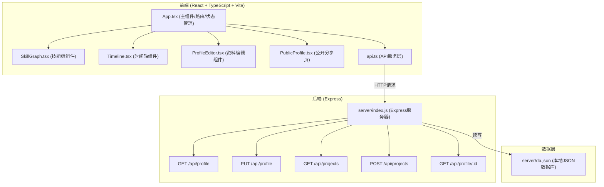
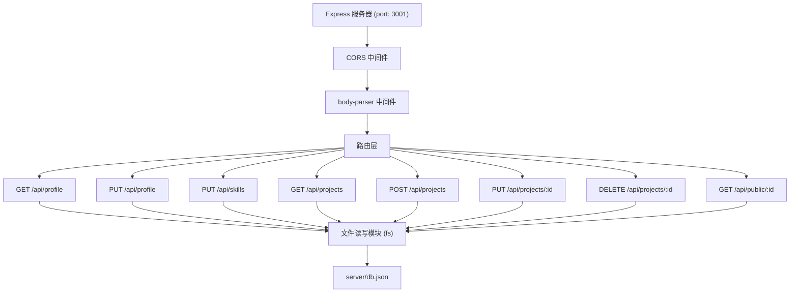
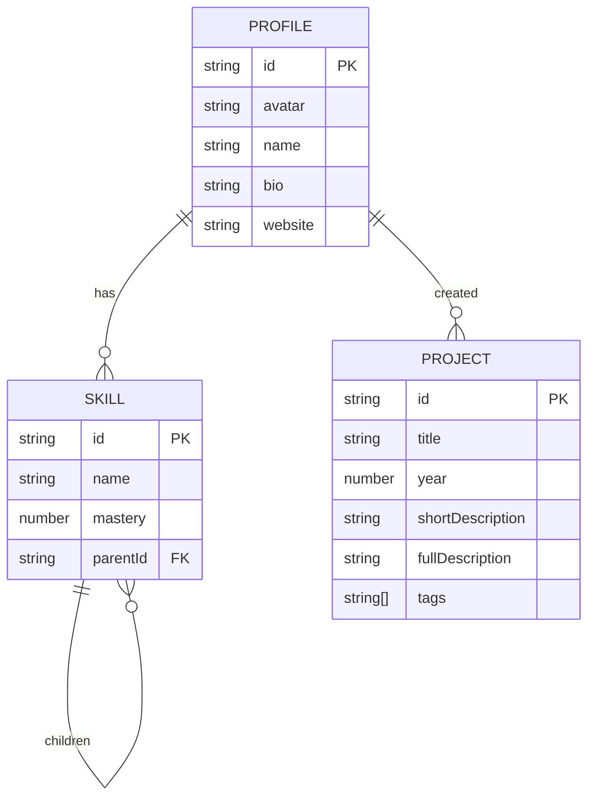

## 1. 架构设计



## 2. 技术描述

- **前端框架**：React@18 + TypeScript@5 + Vite@5
- **构建工具**：Vite，配置React插件和后端代理（代理到3001端口）
- **状态管理**：React useState/useEffect 本地状态管理，无需额外状态管理库
- **路由**：React Router DOM@6 处理客户端路由
- **后端框架**：Express@4，提供RESTful API接口
- **数据存储**：本地JSON文件（server/db.json），使用文件系统读写
- **图标库**：Lucide React
- **图表库**：Recharts（用于技能掌握度可视化）
- **唯一ID生成**：uuid
- **请求体解析**：body-parser

## 3. 路由定义

| 路由 | 用途 |
|------|------|
| `/` | 编辑主页，包含左侧编辑面板和右侧预览区 |
| `/profile/:id` | 公开分享页面，只读展示个人资料、技能树和项目时间轴 |

## 4. API 定义

### 4.1 TypeScript 类型定义

```typescript
interface Profile {
  id: string;
  avatar: string;
  name: string;
  bio: string;
  website: string;
}

interface Skill {
  id: string;
  name: string;
  mastery: number; // 0-100
  children?: Skill[];
}

interface Project {
  id: string;
  title: string;
  year: number;
  shortDescription: string;
  fullDescription: string;
  tags: string[];
}

interface AppData {
  profile: Profile;
  skills: Skill[];
  projects: Project[];
}
```

### 4.2 API 接口

| 方法 | 路径 | 描述 | 请求体 | 响应 |
|------|------|------|--------|------|
| GET | `/api/profile` | 获取当前用户资料 | - | `{ profile, skills, projects }` |
| PUT | `/api/profile` | 更新用户资料 | `{ avatar, name, bio, website }` | `{ success: true, profile }` |
| PUT | `/api/skills` | 更新技能树 | `Skill[]` | `{ success: true, skills }` |
| GET | `/api/projects` | 获取项目列表 | - | `Project[]` |
| POST | `/api/projects` | 添加新项目 | `{ title, year, shortDescription, fullDescription, tags }` | `{ success: true, project }` |
| PUT | `/api/projects/:id` | 更新项目 | `{ title, year, shortDescription, fullDescription, tags }` | `{ success: true, project }` |
| DELETE | `/api/projects/:id` | 删除项目 | - | `{ success: true }` |
| GET | `/api/public/:id` | 获取公开分享数据 | - | `{ profile, skills, projects }` |

## 5. 服务器架构图



## 6. 数据模型

### 6.1 数据模型定义



### 6.2 数据库结构（db.json）

```json
{
  "profile": {
    "id": "user-001",
    "avatar": "https://images.unsplash.com/photo-1472099645785-5658abf4ff4e?w=150&h=150&fit=crop",
    "name": "张开发",
    "bio": "全栈开发工程师，热爱开源，专注于React和Node.js生态。",
    "website": "https://github.com/developer"
  },
  "skills": [
    {
      "id": "skill-1",
      "name": "前端开发",
      "mastery": 90,
      "children": [
        {
          "id": "skill-1-1",
          "name": "React",
          "mastery": 95,
          "children": [
            { "id": "skill-1-1-1", "name": "Hooks", "mastery": 92 },
            { "id": "skill-1-1-2", "name": "Redux", "mastery": 85 }
          ]
        },
        { "id": "skill-1-2", "name": "TypeScript", "mastery": 88 }
      ]
    },
    {
      "id": "skill-2",
      "name": "后端开发",
      "mastery": 80,
      "children": [
        { "id": "skill-2-1", "name": "Node.js", "mastery": 85 },
        { "id": "skill-2-2", "name": "Express", "mastery": 82 }
      ]
    }
  ],
  "projects": [
    {
      "id": "proj-1",
      "title": "开源UI组件库",
      "year": 2024,
      "shortDescription": "基于React的现代化UI组件库，支持主题定制",
      "fullDescription": "设计并实现了一套完整的React UI组件库，包含50+高质量组件，支持暗色模式和主题定制。使用TypeScript编写，提供完整的类型定义。",
      "tags": ["React", "TypeScript", "开源"]
    },
    {
      "id": "proj-2",
      "title": "电商后台管理系统",
      "year": 2023,
      "shortDescription": "全栈电商管理平台，支持商品、订单、用户管理",
      "fullDescription": "从零搭建电商后台管理系统，前端使用React+Ant Design，后端使用Node.js+Express+MongoDB。实现了完整的商品SKU管理、订单流程、数据统计等功能。",
      "tags": ["全栈", "Node.js", "MongoDB"]
    },
    {
      "id": "proj-3",
      "title": "个人博客系统",
      "year": 2022,
      "shortDescription": "基于Markdown的静态博客生成器",
      "fullDescription": "开发了一个轻量级的静态博客生成器，支持Markdown写作、代码高亮、文章分类标签、评论系统等功能。",
      "tags": ["Node.js", "Markdown", "静态站点"]
    }
  ]
}
```

## 7. 性能优化策略

### 7.1 技能树性能优化
- 使用 React.memo 包装树节点组件，避免不必要的重渲染
- 折叠状态使用对象存储，而非数组遍历查找
- 超过50个节点时，虚拟滚动或按需加载子节点
- 展开/折叠操作使用CSS transition，避免JS动画阻塞

### 7.2 时间轴性能优化
- 项目列表按年份分组缓存
- 卡片组件使用 React.memo
- 入场动画使用 transform 而非 margin/left 触发GPU加速
- 最多20个卡片限制，避免DOM过多

### 7.3 通用优化
- API请求防抖处理（编辑输入时）
- 图片懒加载
- 生产环境代码分割
- CSS变量实现主题切换，避免重复样式计算
