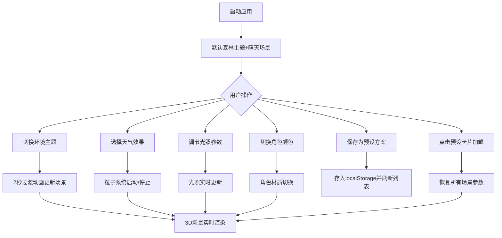

## 1. 产品概述

RPG战斗场景环境编辑器是一款专为回合制RPG游戏开发者设计的3D战斗场景环境编辑与动态天气效果预览工具。它解决了开发者在设计和测试战斗关卡时，难以直观地切换环境主题并实时预览天气效果对场景光照、粒子特效和地面材质影响的问题，帮助开发者快速迭代关卡美术风格。

- 目标用户：回合制RPG游戏开发者、关卡设计师、美术设计师
- 产品价值：提升战斗场景美术迭代效率，降低环境与天气效果调试成本

## 2. 核心功能

### 2.1 用户角色

| 角色 | 注册方式 | 核心权限 |
|------|----------|----------|
| 游戏开发者 | 无需注册，本地使用 | 编辑场景、切换主题、控制天气、保存/加载预设 |

### 2.2 功能模块

1. **3D战斗场景渲染模块**：Three.js渲染的圆形战斗平台，支持低多边形树木/仙人掌/雪松模型
2. **环境主题切换模块**：森林/沙漠/雪原三大主题，带2秒过渡动画
3. **天气粒子系统模块**：晴天/雨天/雪天/沙尘暴四种天气效果
4. **光照参数调节模块**：方向光角度与强度实时调节，角色投射阴影
5. **角色材质测试模块**：红/蓝/绿三种角色颜色切换
6. **预设方案管理模块**：保存/加载/展示场景预设方案（localStorage存储 + REST API模拟）

### 2.3 页面详情

| 页面名称 | 模块名称 | 功能描述 |
|----------|----------|----------|
| 主编辑页面 | 左侧预设面板 | 280px宽，卡片网格展示预设列表，点击加载预设，毛玻璃效果，悬停上移动效 |
| 主编辑页面 | 中央3D场景 | Three.js渲染战斗场地，实时响应所有编辑操作 |
| 主编辑页面 | 右侧控制面板 | 220px宽，天气切换按钮、光照调节滑块、角色颜色切换按钮、主题下拉菜单、保存预设 |

## 3. 核心流程

用户启动应用后，默认显示森林主题晴天场景。用户可通过右侧面板切换环境主题（森林/沙漠/雪原），选择天气效果（晴天/雨天/雪天/沙尘暴），调节方向光角度和强度，切换角色颜色测试材质表现。编辑完成后可保存为预设方案，预设卡片显示在左侧面板，点击即可一键恢复所有场景设置。

## 4. 用户界面设计

### 4.1 设计风格

- **主色调**：暗色主题，背景 `#1a1e24`
- **强调色**：主题色跟随当前环境主题动态变化（森林绿 `#4a7c59`、沙漠橙 `#d4a574`、雪原蓝 `#88b4d8`）
- **按钮样式**：圆角矩形，4px圆角，悬停高亮，激活态脉冲动效
- **字体**：现代无衬线字体，标题 16px 半粗体，正文 13px 常规
- **布局风格**：三栏式布局（左280px + 中间自适应 + 右220px）
- **卡片效果**：毛玻璃 `rgba(255,255,255,0.05)` 背景 + `rgba(255,255,255,0.1)` 边框，悬停上移4px

### 4.2 页面设计概述

| 页面名称 | 模块名称 | UI元素 |
|----------|----------|--------|
| 主编辑页面 | 左侧预设面板 | 标题栏、新建预设按钮、预设卡片网格（毛玻璃卡片+悬停动效） |
| 主编辑页面 | 中央3D场景 | Three.js Canvas、战斗平台、角色模型、环境装饰、天气粒子 |
| 主编辑页面 | 右侧控制面板 | 主题下拉菜单、天气按钮组（带脉冲动效）、光照滑块组、角色颜色按钮组、保存预设按钮 |

### 4.3 响应式设计

- 桌面端（≥768px）：三栏式横向布局
- 移动端（<768px）：上下堆叠布局，预设面板在上、3D场景在中、控制面板在下

### 4.4 3D场景指导

- **环境与氛围**：三种主题各自独特的色调和氛围（森林-生机盎然、沙漠-炎热干燥、雪原-寒冷静谧）
- **光照设置**：环境光 + 方向光组合，方向光支持角度（0-360°）和强度（0-2）调节，支持阴影投射
- **相机设置**：PerspectiveCamera，45° FOV，固定俯视斜角，轻微轨道感
- **构图与焦点**：圆形战斗平台为中心，角色位于中央，装饰模型环绕分布
- **交互与动画**：主题切换2秒渐变过渡，天气按钮脉冲动效，预设卡片悬停上移，粒子系统持续运动
- **后处理效果**：无额外后处理，保持高性能
- **资源来源与性能预算**：全部程序化生成低多边形模型，粒子数量≤500，目标帧率≥30FPS
