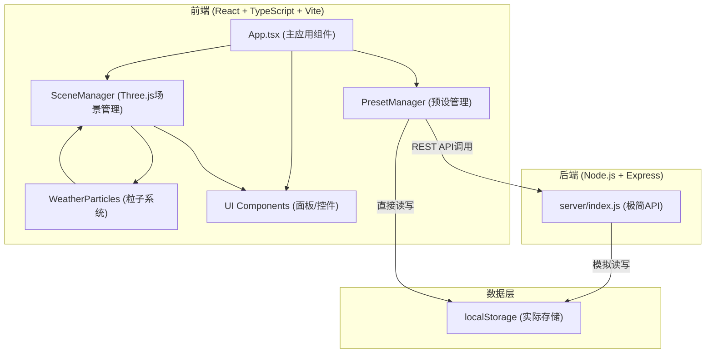
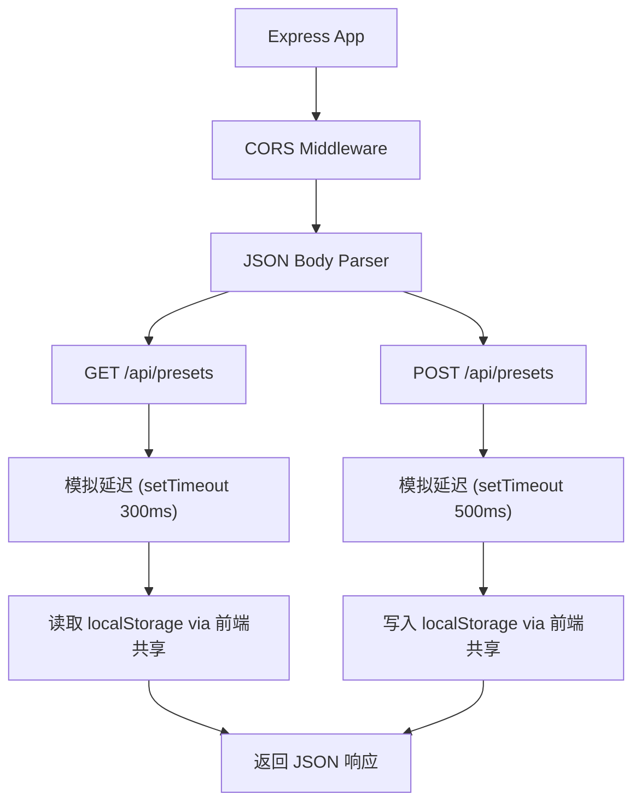
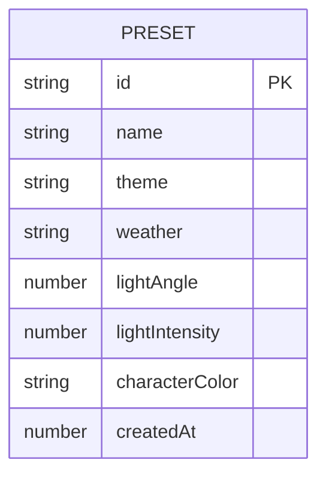

## 1. 架构设计



## 2. 技术说明

- **前端**：React@18 + TypeScript@5 + Vite@5，使用 Three.js@0.160 进行3D渲染
- **初始化工具**：Vite (react-ts模板)
- **后端**：Express@4 + cors，提供模拟REST API
- **数据存储**：浏览器 localStorage（前后端均操作此存储）
- **样式方案**：原生 CSS + CSS 变量，响应式布局使用 Flexbox + Media Queries

## 3. 路由定义

| 路由 | 用途 |
|------|------|
| / | 主编辑页面（单页应用，无前端路由） |
| GET /api/presets | 获取所有预设方案列表 |
| POST /api/presets | 保存新的预设方案 |

## 4. API 定义

### 预设数据类型

```typescript
interface Preset {
  id: string;
  name: string;
  theme: 'forest' | 'desert' | 'snow';
  weather: 'sunny' | 'rain' | 'snow' | 'sandstorm';
  lightAngle: number;    // 0-360度
  lightIntensity: number; // 0-2
  characterColor: 'red' | 'blue' | 'green';
  createdAt: number;
}
```

### GET /api/presets

- 响应：`{ success: true; data: Preset[] }`
- 说明：模拟300ms网络延迟后返回localStorage中的预设列表

### POST /api/presets

- 请求体：`Omit<Preset, 'id' | 'createdAt'>`
- 响应：`{ success: true; data: Preset }`
- 说明：模拟500ms网络延迟后保存到localStorage并返回完整Preset对象

## 5. 服务器架构图



注：由于是极简模拟API，实际数据存储仍由前端通过localStorage直接操作，后端仅模拟网络请求延迟和请求响应格式。

## 6. 数据模型

### 6.1 数据模型定义



### 6.2 存储结构

数据以 JSON 数组形式存储在 localStorage 的 `rpg_scene_presets` key 下：

```json
[
  {
    "id": "uuid-string",
    "name": "森林晴天预设",
    "theme": "forest",
    "weather": "sunny",
    "lightAngle": 45,
    "lightIntensity": 1.2,
    "characterColor": "red",
    "createdAt": 1718889600000
  }
]
```

## 7. 文件结构

```
.
├── package.json
├── vite.config.js
├── tsconfig.json
├── index.html
├── server/
│   └── index.js
└── src/
    ├── main.tsx
    ├── App.tsx
    ├── scene/
    │   ├── SceneManager.ts
    │   └── WeatherParticles.ts
    ├── presets/
    │   └── PresetManager.ts
    └── styles/
        └── index.css
```
