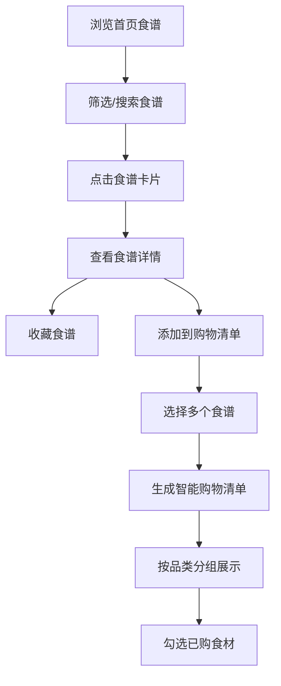

## 1. 产品概述

本产品是一个在线食谱分享与智能购物清单生成应用，帮助用户发现、收藏美味食谱，并根据选定食谱自动生成按品类分组的智能购物清单，解决用户"今天吃什么"和"买菜清单整理"的日常痛点。

- 核心价值：简化食谱查找与食材采购流程，提升家庭烹饪体验
- 目标用户：家庭主妇、烹饪爱好者、忙碌上班族
- 市场定位：轻量化、智能化的日常烹饪辅助工具

## 2. 核心功能

### 2.1 用户角色

| 角色 | 注册方式 | 核心权限 |
|------|----------|----------|
| 普通用户 | 无需注册（本地存储） | 浏览食谱、收藏食谱、生成购物清单、管理个人中心 |

### 2.2 功能模块

1. **首页**：食谱网格展示、分类筛选、关键词搜索、浮动工具栏
2. **食谱详情页**：完整食谱信息展示、食材列表、添加到购物清单
3. **收藏夹页面**：已收藏食谱展示、取消收藏功能
4. **购物清单页面**：按品类分组的购物清单、勾选已购食材、数量调整
5. **个人中心页面**：收藏统计、购物清单历史、登出操作
6. **导航栏**：面包屑导航、响应式汉堡菜单

### 2.3 页面详情

| 页面名称 | 模块名称 | 功能描述 |
|---------|---------|----------|
| 首页 | 食谱网格 | 以卡片网格展示所有食谱，支持按菜系分类筛选和关键词搜索，卡片列表切换时有0.4秒淡入动画 |
| 首页 | 浮动工具栏 | 显示已选食谱数量，一键生成购物清单，固定在页面右下角 |
| 食谱详情页 | 动态面包屑 | 滚动时背景渐变为半透明毛玻璃效果，展示当前页面层级 |
| 食谱详情页 | 食谱信息展示 | 全尺寸图片、作者、烹饪时长、难度图标、带编号步骤、食材表格 |
| 食谱详情页 | 添加按钮 | 将当前食谱添加到购物清单待选列表 |
| 收藏夹页面 | 收藏食谱网格 | 以相同卡片样式展示收藏的食谱，支持移除收藏 |
| 购物清单页面 | 三栏卡片布局 | 按品类分组展示购物清单，同品类按食材名聚合去重 |
| 购物清单页面 | 食材勾选 | 勾选表示已购买，出现删除线和从左到右淡出效果 |
| 个人中心页面 | 统计卡片 | 展示收藏数量、头像，左侧布局 |
| 个人中心页面 | 历史列表 | 展示最近5条购物清单历史，含生成时间和包含的食谱名 |

## 3. 核心流程

用户浏览食谱 → 通过分类或搜索找到心仪食谱 → 查看食谱详情 → 收藏或添加到购物清单 → 选择多个食谱 → 生成智能购物清单 → 按清单采购并勾选已购食材

## 4. 用户界面设计

### 4.1 设计风格

- **主色调**：#f8d7a0（柔和暖黄色）
- **辅助色**：#e6b8a0（暖桃色）
- **背景色**：#fdf6e3（米白色）
- **文字颜色**：#5d4e37（深棕色）
- **按钮样式**：圆角8px，按压时scale 0.95动效，主色填充
- **卡片样式**：圆角12px，浅灰色投影rgba(0,0,0,0.08)，悬停时上移4px并加深投影
- **字体**：思源黑体 / 系统无衬线体，标题18-24px，正文14-16px
- **图标风格**：线性图标，收藏按钮为爱心形状（未收藏灰色空心，收藏后红色实心）
- **整体风格**：温暖、柔和、居家感，营造舒适的烹饪氛围

### 4.2 页面设计概述

| 页面名称 | 模块名称 | UI元素 |
|---------|---------|--------|
| 首页 | 食谱卡片 | 大图占60%，名称、简介（最多2行）、收藏按钮，卡片圆角12px，悬停上移动效 |
| 首页 | 搜索栏 | 圆角输入框，搜索图标，关键词实时搜索 |
| 首页 | 分类标签 | 横向滚动标签，选中态为主色填充 |
| 食谱详情页 | 难度展示 | 1-3个厨具图标表示难度等级 |
| 食谱详情页 | 步骤列表 | 带编号的有序列表，步骤清晰可读 |
| 食谱详情页 | 食材表格 | 名称、用量、备注三列，斑马纹背景 |
| 购物清单页面 | 品类卡片 | 三栏布局，品类标题加粗，食材列表带复选框 |
| 购物清单页面 | 勾选动效 | 0.3秒从左到右淡出，文字灰色带删除线 |
| 个人中心页面 | 统计卡片 | 渐变背景，大号数字展示收藏数量 |

### 4.3 响应式设计

- **桌面端（>768px）**：4列网格布局，完整导航栏
- **平板端（768px-480px）**：2列网格布局，导航栏变为汉堡菜单
- **手机端（<480px）**：1列网格布局，汉堡菜单，卡片宽度自适应
- **触摸优化**：按钮最小点击区域44x44px，列表项间距适当增加

### 4.4 性能优化

- 图片懒加载：滚动到视口内再加载图片
- 首页食谱列表首次加载时间 ≤ 1.5秒（本地开发环境，约20个食谱）
- 卡片列表切换时0.4秒淡入动画，提升视觉体验
