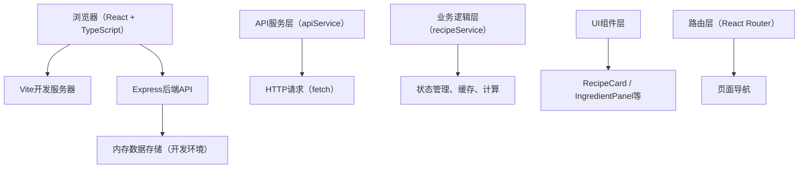
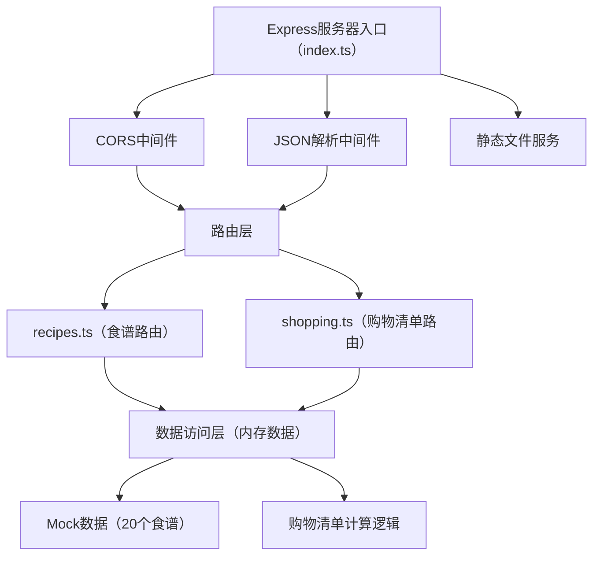
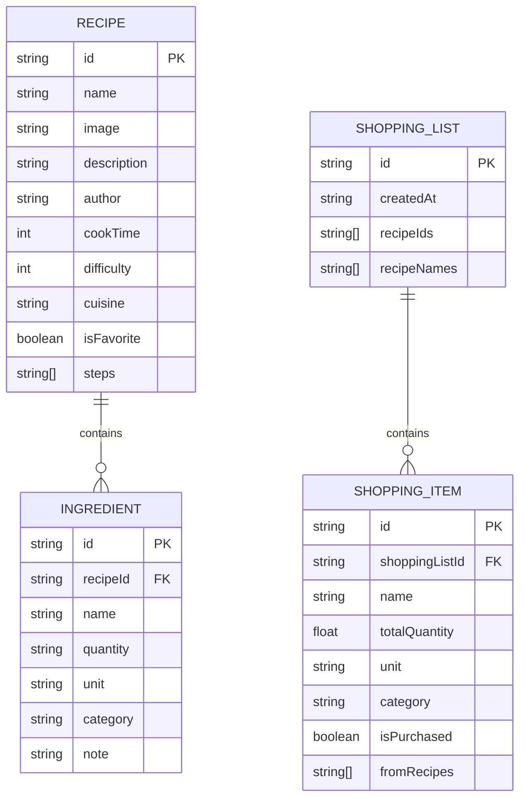

## 1. 架构设计



## 2. 技术描述

- **前端框架**：React@18 + TypeScript@5 + Vite@5
- **构建工具**：Vite@5 + @vitejs/plugin-react@4
- **路由管理**：React Router@6（客户端路由）
- **状态管理**：React useState + useContext + 本地服务层
- **HTTP客户端**：原生fetch API封装
- **后端框架**：Express@4 + TypeScript@5
- **跨域处理**：cors@2
- **唯一ID生成**：uuid@9
- **数据库**：内存数据存储（开发环境，持久化到JSON文件）
- **样式方案**：CSS Modules + CSS Variables
- **图标方案**：内联SVG图标组件

## 3. 路由定义

| 前端路由 | 页面用途 |
|---------|---------|
| / | 首页 - 食谱列表展示、搜索、筛选 |
| /recipe/:id | 食谱详情页 - 展示完整食谱信息 |
| /favorites | 收藏夹页面 - 展示已收藏食谱 |
| /shopping-list | 购物清单页面 - 展示按品类分组的购物清单 |
| /profile | 个人中心页面 - 用户信息、统计、历史记录 |

| 后端API路由 | 方法 | 用途 |
|------------|------|------|
| /api/recipes | GET | 获取所有食谱列表 |
| /api/recipes/:id | GET | 获取单个食谱详情 |
| /api/recipes/:id/favorite | POST | 切换食谱收藏状态 |
| /api/shopping-list | POST | 根据食谱ID列表生成购物清单 |

## 4. API定义

### 4.1 数据类型定义

```typescript
interface Ingredient {
  id: string;
  name: string;
  quantity: string;
  unit: string;
  category: string;
  note?: string;
}

interface Recipe {
  id: string;
  name: string;
  image: string;
  description: string;
  author: string;
  cookTime: number;
  difficulty: 1 | 2 | 3;
  cuisine: string;
  isFavorite: boolean;
  ingredients: Ingredient[];
  steps: string[];
}

interface ShoppingListItem {
  ingredientId: string;
  name: string;
  totalQuantity: number;
  unit: string;
  category: string;
  isPurchased: boolean;
  fromRecipes: string[];
}

interface ShoppingList {
  id: string;
  createdAt: string;
  recipeIds: string[];
  recipeNames: string[];
  items: ShoppingListItem[];
}

interface ShoppingListHistory {
  id: string;
  createdAt: string;
  recipeNames: string[];
}
```

### 4.2 请求/响应模式

#### GET /api/recipes
- **响应**：`{ recipes: Recipe[] }`

#### GET /api/recipes/:id
- **响应**：`{ recipe: Recipe }`

#### POST /api/recipes/:id/favorite
- **请求体**：`{ isFavorite: boolean }`
- **响应**：`{ recipe: Recipe }`

#### POST /api/shopping-list
- **请求体**：`{ recipeIds: string[] }`
- **响应**：`{ shoppingList: { [category: string]: ShoppingListItem[] } }`

## 5. 服务器架构图



## 6. 数据模型

### 6.1 数据模型关系图



### 6.2 食材品类分类

系统将食材分为以下品类：
- `vegetables` - 蔬菜类
- `meat` - 肉类
- `seafood` - 海鲜类
- `dairy` - 乳制品
- `grains` - 谷物类
- `seasonings` - 调料类
- `fruits` - 水果类
- `others` - 其他

### 6.3 Mock数据规范

- 预置20个食谱数据，涵盖川菜、粤菜、湘菜、家常菜等多个菜系
- 每个食谱包含5-15个食材，3-8个烹饪步骤
- 图片使用提供的API生成，根据食谱名称生成对应美食图片
- 难度等级分布：简单（1）30%、中等（2）50%、困难（3）20%
